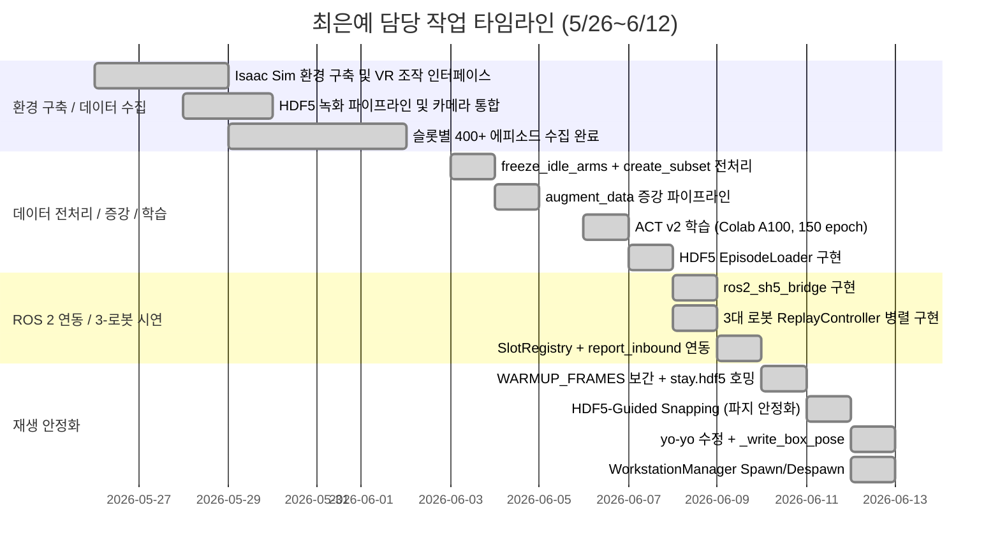

# 📋 은예 담당 작업 타임라인 및 기여 정리

> **기간**: 2026년 5월 26일 ~ 2026년 6월 12일  
> **역할**: SH5 Isaac Sim 시뮬레이션 / 모방학습 데이터 파이프라인 / 3대 로봇 물류 자동화  
> **주의**: Isaac Sim 기반 SH5 쌍팔 로봇의 물류 자동화 전체 파이프라인(데이터 수집 → 전처리 → 학습 → 재생 시연)을 설계하고 구현함

---

<h2>은예 담당 작업 타임라인 (데이터 수집 및 환경 구축)</h2>

<table>
  <thead>
    <tr>
      <th nowrap>작업명</th>
      <th nowrap>날짜</th>
      <th nowrap>담당자</th>
      <th nowrap>파트</th>
      <th nowrap>단계</th>
      <th nowrap>완료 여부</th>
    </tr>
  </thead>
  <tbody>
    <tr><td nowrap>Isaac Sim + SH5 USD 로봇 스폰 환경 구축 (finalfac.usd)</td><td nowrap>5월 26일</td><td nowrap>최은예</td><td nowrap>환경 구축</td><td nowrap>씬 세팅</td><td nowrap>완료</td></tr>
    <tr><td nowrap>VR 컨트롤러 기반 SH5 양팔 원격 조작 인터페이스 구현</td><td nowrap>5월 27일</td><td nowrap>최은예</td><td nowrap>데이터 수집</td><td nowrap>조작 인터페이스</td><td nowrap>완료</td></tr>
    <tr><td nowrap>HDF5 에피소드 녹화 파이프라인 구현 (VRDemonstrationLogger)</td><td nowrap>5월 28일</td><td nowrap>최은예</td><td nowrap>데이터 수집</td><td nowrap>녹화 시스템</td><td nowrap>완료</td></tr>
    <tr><td nowrap>카메라 어노테이터 통합 (Left/Right/TopView RGB 160×120 동시 저장)</td><td nowrap>5월 28일</td><td nowrap>최은예</td><td nowrap>데이터 수집</td><td nowrap>비전 데이터 수집</td><td nowrap>완료</td></tr>
    <tr><td nowrap>슬롯별(1~4) HDF5 데이터 분리 저장 구조 설계</td><td nowrap>5월 29일</td><td nowrap>최은예</td><td nowrap>데이터 수집</td><td nowrap>데이터 구조화</td><td nowrap>완료</td></tr>
    <tr><td nowrap>Magic Snapping 파지 보조 로직 구현 (데이터 수집 중 파지 정확도 향상)</td><td nowrap>5월 30일</td><td nowrap>최은예</td><td nowrap>데이터 수집</td><td nowrap>파지 보조</td><td nowrap>완료</td></tr>
    <tr><td nowrap>슬롯 1~4 각 100+ 에피소드 수집 완료 (총 400+ 에피소드)</td><td nowrap>6월 1일</td><td nowrap>최은예</td><td nowrap>데이터 수집</td><td nowrap>에피소드 수집</td><td nowrap>완료</td></tr>
    <tr><td nowrap>TopView QR 카메라 기반 상자 위치 인식 및 좌표 변환 구현</td><td nowrap>6월 2일</td><td nowrap>최은예</td><td nowrap>비전 연동</td><td nowrap>QR 로컬라이제이션</td><td nowrap>완료</td></tr>
  </tbody>
</table>

---

<h2>은예 담당 작업 타임라인 (데이터 전처리 및 증강)</h2>

<table>
  <thead>
    <tr>
      <th nowrap>작업명</th>
      <th nowrap>날짜</th>
      <th nowrap>담당자</th>
      <th nowrap>파트</th>
      <th nowrap>단계</th>
      <th nowrap>완료 여부</th>
    </tr>
  </thead>
  <tbody>
    <tr><td nowrap>freeze_idle_arms.py: 비동작 팔 방해 제거 전처리 구현</td><td nowrap>6월 3일</td><td nowrap>최은예</td><td nowrap>데이터 전처리</td><td nowrap>팔 고정 처리</td><td nowrap>완료</td></tr>
    <tr><td nowrap>create_subset.py: frozen_set 서브셋 추출 (학습/재생용 정제 데이터)</td><td nowrap>6월 3일</td><td nowrap>최은예</td><td nowrap>데이터 전처리</td><td nowrap>서브셋 추출</td><td nowrap>완료</td></tr>
    <tr><td nowrap>augment_data.py: 좌우 미러링 + 관절 노이즈 데이터 증강 구현</td><td nowrap>6월 4일</td><td nowrap>최은예</td><td nowrap>데이터 증강</td><td nowrap>증강 파이프라인</td><td nowrap>완료</td></tr>
    <tr><td nowrap>augment_slot3_to_slot4.py: 슬롯 3→4 변환 증강 (좌우 반전)</td><td nowrap>6월 4일</td><td nowrap>최은예</td><td nowrap>데이터 증강</td><td nowrap>슬롯 변환</td><td nowrap>완료</td></tr>
    <tr><td nowrap>filter_dataset.py: 실패 에피소드 필터링 (trajectory 품질 기준)</td><td nowrap>6월 5일</td><td nowrap>최은예</td><td nowrap>데이터 전처리</td><td nowrap>품질 필터링</td><td nowrap>완료</td></tr>
    <tr><td nowrap>Google Colab A100 환경에서 train_act_v2.py 150 epoch 학습 완료</td><td nowrap>6월 6일</td><td nowrap>최은예</td><td nowrap>모방 학습</td><td nowrap>ACT 학습</td><td nowrap>완료</td></tr>
    <tr><td nowrap>HDF5 EpisodeLoader 구현: 슬롯별 랜덤 에피소드 로드 및 offset 보정</td><td nowrap>6월 7일</td><td nowrap>최은예</td><td nowrap>재생 시스템</td><td nowrap>에피소드 로더</td><td nowrap>완료</td></tr>
  </tbody>
</table>

---

<h2>은예 담당 작업 타임라인 (ROS 2 연동 및 다중 로봇 시연)</h2>

<table>
  <thead>
    <tr>
      <th nowrap>작업명</th>
      <th nowrap>날짜</th>
      <th nowrap>담당자</th>
      <th nowrap>파트</th>
      <th nowrap>단계</th>
      <th nowrap>완료 여부</th>
    </tr>
  </thead>
  <tbody>
    <tr><td nowrap>ros2_sh5_bridge.py: ROS 2 ↔ Isaac Sim 파일큐 브릿지 구현</td><td nowrap>6월 8일</td><td nowrap>최은예</td><td nowrap>ROS 2 연동</td><td nowrap>브릿지 구현</td><td nowrap>완료</td></tr>
    <tr><td nowrap>sh5_bringup_ros2_3robot.py: 3대 로봇 독립 상태머신 병렬 운영 구현</td><td nowrap>6월 8일</td><td nowrap>최은예</td><td nowrap>시뮬레이션</td><td nowrap>3-로봇 시스템</td><td nowrap>완료</td></tr>
    <tr><td nowrap>SlotRegistry: 고객별 슬롯 유지 할당 (같은 고객 → 항상 같은 슬롯)</td><td nowrap>6월 9일</td><td nowrap>최은예</td><td nowrap>시뮬레이션</td><td nowrap>슬롯 관리</td><td nowrap>완료</td></tr>
    <tr><td nowrap>report_inbound_progress: 입고 완료 보고 서비스 연동</td><td nowrap>6월 9일</td><td nowrap>최은예</td><td nowrap>ROS 2 연동</td><td nowrap>입고 보고</td><td nowrap>완료</td></tr>
    <tr><td nowrap>WARMUP_FRAMES=30: 텔레포트 제거 — 현재 자세→첫 프레임 선형 보간</td><td nowrap>6월 10일</td><td nowrap>최은예</td><td nowrap>재생 안정화</td><td nowrap>자세 보간</td><td nowrap>완료</td></tr>
    <tr><td nowrap>stay.hdf5 호밍: 복귀 시 쓰러짐 방지 안전 자세 적용</td><td nowrap>6월 10일</td><td nowrap>최은예</td><td nowrap>재생 안정화</td><td nowrap>안전 호밍</td><td nowrap>완료</td></tr>
    <tr><td nowrap>frozen_set 에피소드 사용: 방해 팔이 제거된 데이터로 재생 교체</td><td nowrap>6월 10일</td><td nowrap>최은예</td><td nowrap>재생 안정화</td><td nowrap>에피소드 교체</td><td nowrap>완료</td></tr>
  </tbody>
</table>

---

<h2>은예 담당 작업 타임라인 (파지 안정화 및 Spawn/Despawn)</h2>

<table>
  <thead>
    <tr>
      <th nowrap>작업명</th>
      <th nowrap>날짜</th>
      <th nowrap>담당자</th>
      <th nowrap>파트</th>
      <th nowrap>단계</th>
      <th nowrap>완료 여부</th>
    </tr>
  </thead>
  <tbody>
    <tr><td nowrap>HDF5-Guided Snapping: box_trajectory 기반 파지 링크 자동 선택</td><td nowrap>6월 11일</td><td nowrap>최은예</td><td nowrap>파지 안정화</td><td nowrap>HDF5 가이드 스냅</td><td nowrap>완료</td></tr>
    <tr><td nowrap>ATTACH_FACTOR=1.0, MAX_BOX_STEP=3.0: 딜레이 없는 즉시 부착 구현</td><td nowrap>6월 11일</td><td nowrap>최은예</td><td nowrap>파지 안정화</td><td nowrap>파라미터 튜닝</td><td nowrap>완료</td></tr>
    <tr><td nowrap>yo-yo 현상 원인 분석: kinematic 박스에 velocity 설정 → PhysX 에러 누적</td><td nowrap>6월 12일</td><td nowrap>최은예</td><td nowrap>물리 안정화</td><td nowrap>버그 분석</td><td nowrap>완료</td></tr>
    <tr><td nowrap>_write_box_pose() 구현: write_root_pose_to_sim / USD XFormable 직접 쓰기</td><td nowrap>6월 12일</td><td nowrap>최은예</td><td nowrap>물리 안정화</td><td nowrap>velocity 차단</td><td nowrap>완료</td></tr>
    <tr><td nowrap>WorkstationManager: 작업대 RACK prim 실시간 Despawn/Spawn</td><td nowrap>6월 12일</td><td nowrap>최은예</td><td nowrap>작업대 관리</td><td nowrap>Spawn/Despawn</td><td nowrap>완료</td></tr>
    <tr><td nowrap>WS_LOCATION_TO_RACK 매핑 확정: RACK_02~04 = sg2_in_01~03 라인</td><td nowrap>6월 12일</td><td nowrap>최은예</td><td nowrap>작업대 관리</td><td nowrap>prim 경로 매핑</td><td nowrap>완료</td></tr>
  </tbody>
</table>

---

## 📊 타임라인

---

## 🔑 핵심 전환점

| # | 전환점 | 관련 내용 | 날짜 |
|---|--------|----------|------|
| 1 | HDF5 녹화 파이프라인 구축 | VR 조작 데이터를 joint/box/image 모두 동시 저장하는 완전한 녹화 시스템 완성 | 5월 28일 |
| 2 | 방해 팔 전처리 도입 | freeze_idle_arms로 비동작 팔 궤적을 stay 자세로 오버라이드 → 학습 품질 개선 | 6월 3일 |
| 3 | 3대 로봇 병렬 시연 | 독립 ReplayController 3개를 병렬로 운영, 각 라인이 독립적으로 pick & place 수행 | 6월 8일 |
| 4 | 워밍업 보간 도입 | 첫 프레임 텔레포트 제거 — 30프레임 선형 보간으로 자연스러운 시작 동작 구현 | 6월 10일 |
| 5 | HDF5-Guided Snapping | box_trajectory로 파지 링크를 자동 선택, 왼/오른손 오류 완전 해결 | 6월 11일 |
| 6 | yo-yo 현상 원인 규명 및 수정 | kinematic 박스의 velocity 설정이 PhysX 에러 누적 → 시뮬 종료 문제 완전 해결 | 6월 12일 |
| 7 | 작업대 실시간 Spawn/Despawn | WorkstationManager로 AMR 이동 시 RACK prim을 즉시 화면에서 제거/복원 | 6월 12일 |

---

## 🧩 담당 역할 요약

최은예는 SNFC 프로젝트에서 'SH5 Isaac Sim 물류 자동화' 파트를 전담하여, Isaac Sim 기반 SH5 쌍팔 로봇의 물류 자동화 전체 파이프라인을 설계하고 구현하였다.

5월 26일부터 6월 초까지는 Isaac Sim 환경 구축, VR 조작 인터페이스, HDF5 녹화 파이프라인을 구현하고 슬롯 1~4에 걸쳐 400여 개의 고품질 시연 데이터를 직접 수집하였다. freeze_idle_arms, create_subset, augment_data 등 전처리 및 증강 파이프라인을 구축하여 학습 데이터 품질을 최적화하고, Google Colab A100 환경에서 Vision-ACT 모델을 150 epoch 학습하였다.

6월 8일 이후에는 ROS 2 브릿지 및 3대 로봇 병렬 시연 시스템을 구현하고, 워밍업 보간·stay.hdf5 호밍·frozen_set 에피소드 등 재생 안정화 기법을 순차적으로 적용하였다.

6월 12일에는 yo-yo 현상의 근본 원인(kinematic 바디 velocity 설정 금지)을 규명하고 `_write_box_pose()` 헬퍼로 완전히 해결하였으며, 작업대 Spawn/Despawn 기능(`WorkstationManager`)을 완성하여 관제탑과의 실시간 연동을 완성하였다.

---

## ✅ 최종 정리

최은예의 주요 기여는 데이터 수집부터 전처리, 학습, Isaac Sim 시뮬레이션 재생 시연에 이르는 전체 모방학습 파이프라인의 설계와 구현에 있다.

특히, HDF5 guided snapping으로 왼/오른손 자동 선택을 구현하고, kinematic 물리 버그를 직접 분석·해결하여 yo-yo 현상 없는 안정적인 파지를 달성하였다. 3대 로봇이 독립적으로 pick & place를 수행하는 병렬 시연 시스템과 작업대 실시간 Spawn/Despawn 기능으로 관제탑과의 완전한 실시간 연동 인프라를 완성하였다. 자세한 디버깅 이력은 [DEBUGGING.md](DEBUGGING.md) 파일에서 확인할 수 있다.
