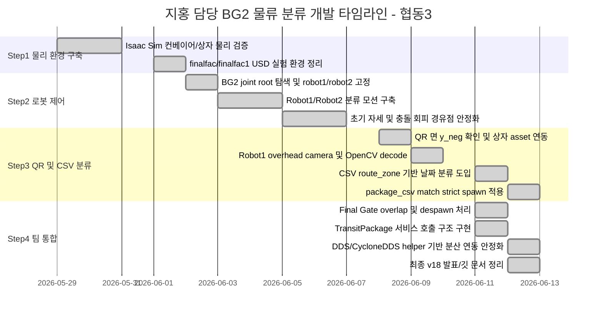

# 📋 지홍 담당 작업 타임라인 및 기여 정리 (Isaac Sim BG2 물류 분류 / QR·CSV 라우팅 / ROS2 통합) - 협동3

> **기간**: 2026년 5월 말 ~ 2026년 6월 12일  
> **발표일**: 2026년 6월 12일  
> **담당 역할**: 물류창고 입고 분류 셀 개발 / Isaac Sim 컨베이어 기반 BG2 이중 로봇 분류 시뮬레이션 / QR 상자 인식 / CSV `route_zone` 기반 날짜 분류 / day1·day2·day3 라인 분류 / ROS2 `TransitPackage` 서비스 연동 / 보관 부서로 분류 완료 상태 보고  
> **최종 기준 버전**: `Step4_Stage1_01_finalfac1_two_robot_sort_v18.py`  
> **프로젝트 개요**: 협동3 프로젝트에서 본 파트는 입고 컨베이어로 들어오는 물류 상자를 QR 및 CSV 작업 지시 데이터 기반으로 판독하고, BG2 양팔 로봇 2대를 활용하여 `today`, `day2`, `day3` 라인으로 자동 분류한 뒤, 분류 완료 정보를 보관/후속 공정에 ROS2 서비스로 전달하는 **물류 분류 게이트웨이** 역할을 수행한다.

---

## 🧩 담당 역할 요약

본 담당 파트는 전체 물류 자동화 시스템에서 **입고 물류 분류 담당**에 해당한다.

- 컨베이어로 공급되는 상자를 Isaac Sim 물리 환경에서 생성 및 이동시킨다.
- 상자 QR을 Robot1 상단 카메라로 판독한다.
- QR 문자열은 날짜가 아니라 `qr_id`로 취급한다.
- 당일 CSV 파일에서 `qr_id`와 매칭되는 행을 찾고, 해당 행의 `route_zone` 값을 기준으로 날짜 분류를 수행한다.
- 기준일(`today-date`)과 `route_zone`의 차이를 계산하여 다음과 같이 target을 결정한다.

| route_zone 기준 | target | 후속 라인 |
| :--- | :--- | :--- |
| 기준일 + 0일 | `today` | `sg2_in_01` |
| 기준일 + 1일 | `day2` | `sg2_in_02` |
| 기준일 + 2일 | `day3` | `sg2_in_03` |

이후 Robot1이 1차 분류를 수행하고, `day2`, `day3` 물류는 Robot2가 2차 분류를 수행한다. 상자가 최종 목적지 라인에 도착하면 `TransitPackage` 서비스를 호출하여 `package_id`와 `target_line`을 보관 부서 시스템에 전달한다.

---

## 🏗️ v18 기준 시스템 아키텍처

```mermaid
flowchart LR
    A[box_assets.zip<br/>QR 부착 상자 USD] --> B[Isaac Sim finalfac1.usd]
    C[packages_2026-06-08.csv<br/>package_id, customer_name,<br/>route_zone, qr_id] --> D[CSV Route DB]

    B --> E[Conveyor Spawn<br/>CSV match 상자만 공급]
    E --> F[Robot1 QR Camera<br/>OpenCV QR decode]
    F --> G[qr_id 추출]
    G --> D
    D --> H[route_zone 기준<br/>today/day2/day3 분류]

    H --> I{target}
    I -->|today| J[Robot1 today route<br/>1차 분류 후 최종 today 라인]
    I -->|day2/day3| K[Robot1 not_today route<br/>Robot2 구역으로 전달]

    K --> L{Robot2 분류}
    L -->|day2| M[Robot2 today route<br/>day2 라인]
    L -->|day3| N[Robot2 not_today route<br/>day3 라인]

    J --> O[Final Gate overlap check]
    M --> O
    N --> O

    O --> P[ARRIVED BOX LOG]
    P --> Q[External rclpy helper]
    Q --> R[/sim/transit_package<br/>TransitPackage.srv]
    R --> S[보관/후속 공정<br/>sg2_in_01~03 소환 이벤트]
```

---

## 📦 최종 v18 핵심 기능

| 구분 | 구현 내용 | 최종 상태 |
| :--- | :--- | :--- |
| 상자 공급 | `box_assets.zip` 내 QR 부착 USD 상자를 Isaac Sim에 동적 spawn | 완료 |
| QR 방향 고정 | box asset의 QR 면이 local `-Y`임을 확인하고 `y_neg` face-up으로 고정 | 완료 |
| QR 판독 | Robot1 overhead camera + OpenCV `QRCodeDetector` 기반 실제 QR decode | 완료 |
| CSV 매칭 | `qr_id`를 키로 CSV 행 검색 | 완료 |
| 날짜 판단 | QR 날짜가 아니라 CSV `route_zone` 기준으로 target 산출 | 완료 |
| Strict Spawn | `package_csv`에 match된 상자만 spawn catalog에 등록 | 완료 |
| Robot1 분류 | `today`와 `not_today` 1차 분류 | 완료 |
| Robot2 분류 | `day2`, `day3` 2차 분류 | 완료 |
| Final Gate | bbox center가 아닌 overlap 기반 목적지 도착 판정 | 완료 |
| Despawn | 도착 후 3초 대기 뒤 `stage.RemovePrim()`으로 hard delete | 완료 |
| ROS2 통합 | `/sim/transit_package` 서비스 호출로 후속 공정에 전달 | 완료 |
| DDS 환경 | `ROS_DOMAIN_ID=119`, CycloneDDS 설정 전달 | 완료 |

---

<h2>지홍 담당 작업 타임라인 (Step1 - 기본 시뮬레이션 및 물리 환경 구축)</h2>

<table>
  <thead>
    <tr>
      <th nowrap>작업명</th>
      <th nowrap>시기</th>
      <th nowrap>담당자</th>
      <th nowrap>파트</th>
      <th nowrap>단계</th>
      <th nowrap>완료 여부</th>
    </tr>
  </thead>
  <tbody>
    <tr><td nowrap>Isaac Sim 기반 컨베이어/상자 이동 구조 검토</td><td nowrap>Step1</td><td nowrap>지홍</td><td nowrap>시뮬레이션/물리</td><td nowrap>환경 분석</td><td nowrap>완료</td></tr>
    <tr><td nowrap>컨베이어 벨트 Utility 및 ConveyorNode 동작 방식 파악</td><td nowrap>Step1</td><td nowrap>지홍</td><td nowrap>컨베이어</td><td nowrap>기능 검증</td><td nowrap>완료</td></tr>
    <tr><td nowrap>상자 rigid body, collision, mass 설정 및 낙하/이동 검증</td><td nowrap>Step1</td><td nowrap>지홍</td><td nowrap>PhysX</td><td nowrap>물리 안정화</td><td nowrap>완료</td></tr>
    <tr><td nowrap>finalfac/finalfac1 USD 기반 실험 환경 로드 및 경로 정리</td><td nowrap>Step1</td><td nowrap>지홍</td><td nowrap>USD Stage</td><td nowrap>월드 구성</td><td nowrap>완료</td></tr>
  </tbody>
</table>

---

<h2>지홍 담당 작업 타임라인 (Step2 - BG2 로봇 제어 및 분류 모션 구축)</h2>

<table>
  <thead>
    <tr>
      <th nowrap>작업명</th>
      <th nowrap>시기</th>
      <th nowrap>담당자</th>
      <th nowrap>파트</th>
      <th nowrap>단계</th>
      <th nowrap>완료 여부</th>
    </tr>
  </thead>
  <tbody>
    <tr><td nowrap>BG2 로봇 joint root 자동 탐색 및 고정 매핑</td><td nowrap>Step2</td><td nowrap>지홍</td><td nowrap>로봇 제어</td><td nowrap>Joint Discovery</td><td nowrap>완료</td></tr>
    <tr><td nowrap>Robot1=/World/FFW_BG2, Robot2=/World/FFW_BG2_01 역할 고정</td><td nowrap>Step2</td><td nowrap>지홍</td><td nowrap>로봇 매핑</td><td nowrap>역할 분리</td><td nowrap>완료</td></tr>
    <tr><td nowrap>Robot1 today/not_today 1차 분류 모션 구성</td><td nowrap>Step2</td><td nowrap>지홍</td><td nowrap>분류 모션</td><td nowrap>1차 분류</td><td nowrap>완료</td></tr>
    <tr><td nowrap>Robot2 day2/day3 2차 분류 모션 구성</td><td nowrap>Step2</td><td nowrap>지홍</td><td nowrap>분류 모션</td><td nowrap>2차 분류</td><td nowrap>완료</td></tr>
    <tr><td nowrap>init1 → init2 → init3 단계적 초기 자세 전환 구현</td><td nowrap>Step2</td><td nowrap>지홍</td><td nowrap>충돌 회피</td><td nowrap>초기화 안정화</td><td nowrap>완료</td></tr>
    <tr><td nowrap>drag-only full motion 기반 반복 가능 분류 동작 확립</td><td nowrap>Step2</td><td nowrap>지홍</td><td nowrap>모션 안정화</td><td nowrap>반복 검증</td><td nowrap>완료</td></tr>
  </tbody>
</table>

---

<h2>지홍 담당 작업 타임라인 (Step3 - QR 인식, 상자 에셋, 날짜 분류 로직 통합)</h2>

<table>
  <thead>
    <tr>
      <th nowrap>작업명</th>
      <th nowrap>시기</th>
      <th nowrap>담당자</th>
      <th nowrap>파트</th>
      <th nowrap>단계</th>
      <th nowrap>완료 여부</th>
    </tr>
  </thead>
  <tbody>
    <tr><td nowrap>상자 USD 내 QR 부착면 확인 및 y_neg face-up 고정</td><td nowrap>Step3</td><td nowrap>지홍</td><td nowrap>QR Asset</td><td nowrap>QR 시인성 확보</td><td nowrap>완료</td></tr>
    <tr><td nowrap>Robot1 상단 QR 카메라 생성 및 zoom/focal 설정 조정</td><td nowrap>Step3</td><td nowrap>지홍</td><td nowrap>비전 카메라</td><td nowrap>카메라 구성</td><td nowrap>완료</td></tr>
    <tr><td nowrap>OpenCV QRCodeDetector 기반 실제 QR decode 시도</td><td nowrap>Step3</td><td nowrap>지홍</td><td nowrap>비전 인식</td><td nowrap>QR 판독</td><td nowrap>완료</td></tr>
    <tr><td nowrap>decode 실패 시 user:qr_payload fallback 구조 구현</td><td nowrap>Step3</td><td nowrap>지홍</td><td nowrap>예외 처리</td><td nowrap>운영 안정화</td><td nowrap>완료</td></tr>
    <tr><td nowrap>CSV route_zone 기반 날짜 판단 구조 도입</td><td nowrap>Step3</td><td nowrap>지홍</td><td nowrap>분류 로직</td><td nowrap>v17</td><td nowrap>완료</td></tr>
    <tr><td nowrap>package_csv match 상자만 spawn하는 strict catalog 구조 구현</td><td nowrap>Step3</td><td nowrap>지홍</td><td nowrap>공급 필터링</td><td nowrap>v18</td><td nowrap>완료</td></tr>
  </tbody>
</table>

---

<h2>지홍 담당 작업 타임라인 (Step4 - 팀 통합, ROS2 서비스, 최종 v18)</h2>

<table>
  <thead>
    <tr>
      <th nowrap>작업명</th>
      <th nowrap>시기</th>
      <th nowrap>담당자</th>
      <th nowrap>파트</th>
      <th nowrap>단계</th>
      <th nowrap>완료 여부</th>
    </tr>
  </thead>
  <tbody>
    <tr><td nowrap>Final Gate overlap 기반 최종 목적지 도착 판정 구현</td><td nowrap>Step4</td><td nowrap>지홍</td><td nowrap>상태 판정</td><td nowrap>도착 검증</td><td nowrap>완료</td></tr>
    <tr><td nowrap>ARRIVED BOX LOG 및 ITEM STATUS 기반 진행 상태 출력</td><td nowrap>Step4</td><td nowrap>지홍</td><td nowrap>로그/보고</td><td nowrap>상태 추적</td><td nowrap>완료</td></tr>
    <tr><td nowrap>도착 후 3초 대기 및 stage.RemovePrim hard delete despawn 구현</td><td nowrap>Step4</td><td nowrap>지홍</td><td nowrap>물리 객체 관리</td><td nowrap>Spawn/Despawn</td><td nowrap>완료</td></tr>
    <tr><td nowrap>TransitPackage.srv 기반 /sim/transit_package 서비스 연동</td><td nowrap>Step4</td><td nowrap>지홍</td><td nowrap>ROS2 통합</td><td nowrap>서비스 호출</td><td nowrap>완료</td></tr>
    <tr><td nowrap>Isaac Python 3.11과 ROS Humble rclpy ABI 충돌 해결</td><td nowrap>Step4</td><td nowrap>지홍</td><td nowrap>환경 통합</td><td nowrap>external helper</td><td nowrap>완료</td></tr>
    <tr><td nowrap>CycloneDDS 환경변수 전달 및 ROS_DOMAIN_ID=119 통신 정합성 확보</td><td nowrap>Step4</td><td nowrap>지홍</td><td nowrap>DDS 통신</td><td nowrap>분산 연동</td><td nowrap>완료</td></tr>
  </tbody>
</table>

---

## 📊 개발 타임라인



---

## 🔑 핵심 전환점

| # | 전환점 | 변경 전 | 변경 후 |
| :--- | :--- | :--- | :--- |
| 1 | 상자 분류 기준 변경 | QR 문자열 내부 날짜를 직접 해석 | QR은 `qr_id`, 실제 날짜는 CSV `route_zone` |
| 2 | 상자 공급 정책 변경 | box_assets 전체에서 순환 spawn | CSV에 match된 `qr_id` 상자만 spawn |
| 3 | QR 시인성 문제 해결 | QR 면 방향 불명확 | local `-Y` 면을 위로 올리는 `y_neg` 고정 |
| 4 | 로봇 모션 안정화 | 중간 성공 판정 및 충돌 위험 존재 | drag-only full motion + Final Gate 판정 |
| 5 | 최종 도착 판정 개선 | box center가 gate 안에 들어와야 성공 | bbox overlap이면 도착 인정 |
| 6 | ROS2 서비스 호출 구조 개선 | Isaac 내부 `rclpy` 직접 import 시도 | 외부 `/usr/bin/python3` helper에서 rclpy client 실행 |
| 7 | DDS discovery 문제 해결 | domain만 설정하여 서비스 미발견 | `RMW_IMPLEMENTATION`, `CYCLONEDDS_URI`까지 helper에 전달 |
| 8 | 팀 통합 보고 완성 | 로컬 로그 중심 | `/sim/transit_package`로 package 상태 전달 |

---

## ⚙️ 실행 방법

### 1. ROS2 서비스 서버 실행

```bash
cd ~/cobot3_ws
source install/setup.bash

export ROS_DOMAIN_ID=119
export ROS_LOCALHOST_ONLY=0
export RMW_IMPLEMENTATION=rmw_cyclonedds_cpp
export CYCLONEDDS_URI=file:///home/rokey/.ros/cyclonedds_wifi.xml

ros2 run cobot3 sim_sync_node
```

### 2. helper 파일 준비

```bash
cd /home/rokey/dev_ws/isaac_sim/isaac_step4
chmod +x transit_package_client_helper.py
```

### 3. Isaac Sim v18 실행

```bash
cd /home/rokey/dev_ws/isaac_sim/isaacsim/_build/linux-x86_64/release

ROS_DOMAIN_ID=119 \
ROS_LOCALHOST_ONLY=0 \
RMW_IMPLEMENTATION=rmw_cyclonedds_cpp \
CYCLONEDDS_URI=file:///home/rokey/.ros/cyclonedds_wifi.xml \
./python.sh /home/rokey/dev_ws/isaac_sim/isaac_step4/Step4_Stage1_01_finalfac1_two_robot_sort_v18.py \
  --usd /home/rokey/dev_ws/isaac_sim/isaac_step4/finalfac1.usd \
  --max-boxes 60 \
  --spawn-interval 1 \
  --robot1-start-delay-after-spawn 3.0 \
  --stage2-delay-after-robot1 2.0 \
  --final-gate-hit-mode overlap \
  --final-gate-max-wait-sec 1.0 \
  --despawn-after-final-gate-sec 3.0 \
  --package-csv /home/rokey/dev_ws/isaac_sim/isaac_step4/packages_2026-06-08.csv \
  --today-date 2026-06-08 \
  --transit-service-enabled \
  --transit-service-name /sim/transit_package \
  --transit-ros-domain-id 119 \
  --transit-ros-localhost-only 0 \
  --transit-rmw-implementation rmw_cyclonedds_cpp \
  --transit-cyclonedds-uri file:///home/rokey/.ros/cyclonedds_wifi.xml \
  --transit-service-timeout-sec 5.0 \
  --robot1-camera-enabled \
  --qr-real-decode \
  --no-sort-start-trigger-visual
```

---

## 📄 입력 CSV 형식

```csv
package_id,customer_name,route_zone,qr_id
PKG_20260608_001,서도윤,2026-06-08,QR_20260608_001
PKG_20260608_002,김민준,2026-06-09,QR_20260608_002
PKG_20260608_003,이서연,2026-06-10,QR_20260608_003
```

| 컬럼 | 의미 |
| :--- | :--- |
| `package_id` | 후속 시스템에 전달되는 실제 물류 ID |
| `customer_name` | 수령인 이름 |
| `route_zone` | 실제 분류 기준 날짜 |
| `qr_id` | 상자 QR에 기록된 식별자 |

---

## ✅ 정상 동작 로그 예시

```text
[PACKAGE CSV] loaded=20 file=/home/rokey/dev_ws/isaac_sim/isaac_step4/packages_2026-06-08.csv today_date=2026-06-08 target_counts=today:7 day2:7 day3:6
[QR CATALOG] total_spawnable=20 skipped_csv_miss=120 strict_csv_spawn=1
[PACKAGE CSV SPAWN SELECT] mode=target_sequence requested_target=day2 qr_id=QR_20260608_002 package_id=PKG_20260608_002 route_zone=2026-06-09 target=day2
[SPAWN ASSET] /World/Step4FinalfacIntegration/Boxes/BOX_0002_day2 asset=PKG_20260608_002.usd qr=QR_20260608_002 package_id=PKG_20260608_002 route_zone=2026-06-09 expected_target=day2 csv_matched=1
[QR CAMERA READ] item=2 box=BOX_0002 payload=QR_20260608_002 package_id=PKG_20260608_002 route_zone=2026-06-09 ship_date=2026-06-09 target=day2 source=opencv_qrcode_detector real_decode_ok=1
[ROBOT MOTION DONE] robot_slot1_stage1 route=not_today completed_full_drag_only
[ROBOT MOTION DONE] robot_slot2_stage2 route=today completed_full_drag_only
[FINAL GATE FAST PROCEED] BOX_0002 target=day2 elapsed=1.01s track=ConveyorTrack_12
[ARRIVED BOX LOG] item=2 box=BOX_0002 ship_date=2026-06-09 target=day2 final_success=1
[TRANSIT PACKAGE SERVICE CALL] package_id=PKG_20260608_002 target_line=sg2_in_02 service=/sim/transit_package
[TRANSIT PACKAGE HELPER OK] package_id=PKG_20260608_002 target_line=sg2_in_02
[ARRIVED BOX DESPAWN] box=BOX_0002 removed=1
```

---

## 🧠 최종 정리

본 파트의 핵심 기여는 **물리 시뮬레이션과 데이터 기반 물류 분류 로직을 하나의 자동화 파이프라인으로 결합한 것**이다.

최종 v18에서는 다음 조건을 모두 만족한다.

1. CSV 작업 지시서에 존재하는 상자만 공급한다.
2. QR은 날짜가 아니라 식별자(`qr_id`)로만 사용한다.
3. 실제 분류 날짜는 CSV의 `route_zone`으로 결정한다.
4. Robot1/Robot2가 `today`, `day2`, `day3` 라인을 물리적으로 분류한다.
5. Final Gate 도착 후 상자를 despawn하고, 보관 부서에 `TransitPackage` 서비스로 보고한다.
6. Isaac Sim과 ROS2 Humble의 Python ABI 충돌을 외부 helper 구조로 우회했다.
7. CycloneDDS 및 ROS_DOMAIN_ID=119 환경에서 분산 시뮬레이션 동기화를 완성했다.

결과적으로 이 파트는 협동3 시스템에서 **입고 물류의 날짜별 분류를 담당하는 실시간 물류 분류 게이트웨이**로 완성되었다.
