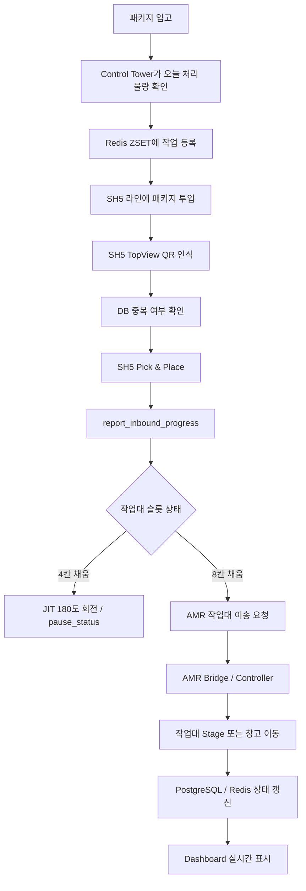
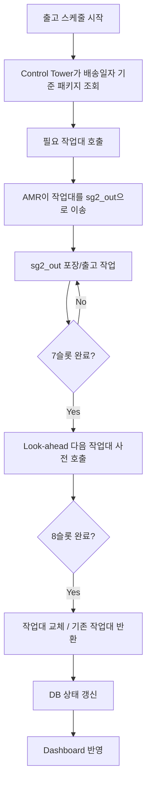
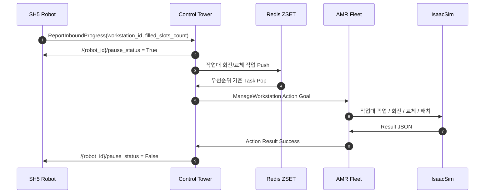
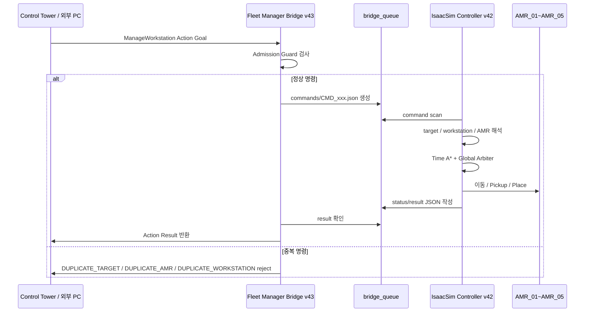
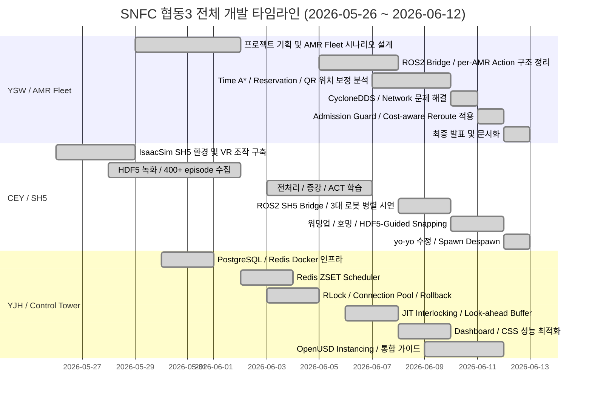

# SNFC

<p align="center">
  <b>IsaacSim 기반 AMR Fleet · SH5 Manipulator · Control Tower 통합 물류 자동화 시스템</b><br>
  ROS 2 Humble · NVIDIA Isaac Sim · AMR Global Arbiter · SH5 HDF5/ACT · PostgreSQL · Redis · FastAPI Dashboard
</p>

<p align="center">
  
  
  
  
  
  
</p>

<p align="center">
  <a href="#0-프로젝트-한-줄-요약">요약</a> ·
  <a href="#3-주요-기능">주요 기능</a> ·
  <a href="#4-시스템-설계">시스템 설계</a> ·
  <a href="#5-소스-코드-구성">소스 코드</a> ·
  <a href="#9-운영체제-환경">운영체제 환경</a> ·
  <a href="#10-사용한-장비-목록">장비</a> ·
  <a href="#11-의존성-requirements">의존성</a> ·
  <a href="#12-실행-순서-launch-순서-및-스크립트">실행 순서</a>
</p>

---

## 0. 프로젝트 한 줄 요약

**SNFC**는 IsaacSim 안에서 **AMR 5대**, **SH5 쌍팔 로봇 3대**, **작업대/패키지/QR 기반 창고 맵**, **Control Tower**, **PostgreSQL/Redis**, **FastAPI Dashboard**를 연결하여, 실제 창고의 입고·분류·작업대 이송·적재·출고 흐름을 통합적으로 제어하는 **다중 로봇 물류 자동화 시뮬레이션 프로젝트**입니다.

```text
Control Tower 작업 생성
→ Redis ZSET 우선순위 스케줄링
→ ROS2 Action / Service 명령 송신
→ AMR Bridge가 명령을 JSON Queue로 변환
→ IsaacSim AMR Controller가 작업대 이송 수행
→ SH5 Bridge가 패키지 투입/QR/입고 보고 연동
→ SH5 3대가 HDF5/ACT 기반 Pick & Place 수행
→ PostgreSQL/Redis 상태 갱신
→ Dashboard에서 실시간 모니터링
```

---

## 1. 프로젝트 개요

SNFC는 단순히 로봇을 IsaacSim 안에서 움직이는 데모가 아니라, **창고 운영 알고리즘 자체를 직접 설계하고 검증하는 것**을 목표로 진행했습니다.

기존의 단순 공장 자동화 방식은 고정 루트, FIFO 대기열, 단일 로봇 기준 스케줄링, 정적인 충돌 회피에 의존하는 경우가 많습니다. 이런 방식은 로봇 수가 늘어나거나 작업대가 동시에 교체되거나, 입고/출고 작업이 동시에 발생하면 병목과 유휴 시간이 쉽게 증가합니다.

이번 프로젝트에서는 기존 공장 알고리즘을 그대로 따라가기보다, 직접 설계한 알고리즘으로 더 최적화된 물류 흐름을 만들고자 했습니다. 이를 위해 다음 세 가지 축을 중심으로 시스템을 구성했습니다.

| 축 | 핵심 내용 | 목적 |
|---|---|---|
| AMR Fleet 최적화 | Time A*, Reservation Table, Global Arbiter, Cost-aware Reroute | 다중 AMR 충돌 회피와 병목 우회 |
| SH5 물류 자동화 | HDF5 시연 데이터, ACT 학습, HDF5-Guided Snapping, 3대 병렬 SH5 | 패키지 적재 자동화와 파지 안정화 |
| Control Tower | PostgreSQL/Redis, ZSET Scheduler, JIT Interlocking, Look-ahead Buffer | 전체 창고 작업 스케줄링과 데이터 정합성 보장 |

---

## 2. 개발 동기

### 2.1 기존 공장 알고리즘의 한계

| 기존 방식 | 한계 |
|---|---|
| FIFO 기반 단순 작업 큐 | 급한 작업과 병목 작업을 우선 처리하기 어려움 |
| 고정 경로 기반 AMR 운행 | 다른 AMR이나 작업대가 막으면 대기 시간이 길어짐 |
| 로봇 팔과 AMR의 독립 제어 | 작업대 교체 시 로봇 팔과 AMR이 같은 공간에 진입할 수 있음 |
| 단일 작업대 기준 로직 | 여러 작업대/여러 로봇이 동시에 움직일 때 상태 정합성 관리가 어려움 |
| 단순 시뮬레이션 연동 | DB, 대시보드, 시뮬레이터, ROS2 명령이 분리되어 전체 흐름 검증이 어려움 |

### 2.2 SNFC의 접근

SNFC는 “공장에서 흔히 쓰는 단순한 순차 처리 알고리즘”이 아니라, 직접 작성한 제어 알고리즘을 IsaacSim 환경에서 검증하는 방향으로 설계했습니다.

```text
1. AMR은 Global Arbiter가 tick 단위로 이동을 승인한다.
2. 막힌 경우 무조건 기다리지 않고 wait_cost와 detour_cost를 비교한다.
3. Control Tower는 Redis ZSET으로 작업 우선순위를 관리한다.
4. 작업대 교체 순간에는 JIT Interlocking으로 SH5를 일시정지한다.
5. SH5는 HDF5 시연 궤적과 box trajectory를 이용해 파지 링크를 자동 선택한다.
6. 모든 상태는 PostgreSQL/Redis와 Dashboard에서 확인 가능하게 만든다.
```

---

## 3. 주요 기능

### 3.1 AMR Fleet 작업대 이송

AMR 파트는 IsaacSim stage에 배치된 AMR 5대가 작업대를 픽업하고, SG 입구/출구 또는 Stage 구역으로 이동한 뒤 복귀하는 구조입니다.

| 기능 | 설명 | 담당 |
|---|---|---|
| AMR 5대 동시 운용 | `AMR_01` ~ `AMR_05`를 동시에 제어 | 윤성웅(YSW) |
| 작업대 픽업/운반/배치 | WS/RACK prim을 AMR이 들어올리고 목표 위치에 배치 | 윤성웅(YSW) |
| per-AMR Action | `/amr_01/manage_workstation` 등 특정 AMR 지정 가능 | 윤성웅(YSW) |
| Bridge Queue | ROS2와 IsaacSim을 JSON 파일 큐로 분리 | 윤성웅(YSW) |
| QR 위치 인식 | AMR 하단 카메라와 바닥 QR 기반 cell 보정 | 윤성웅(YSW) |

작업 phase는 다음과 같습니다.

```text
TO_RACK
→ LIFTING
→ TO_TARGET / LOCAL_ENTRY
→ PLACING
→ LOCAL_EXIT
→ RETURN_HOME
```

### 3.2 Time A* + Reservation Table

일반 A*는 “현재 지도에서 최단 경로”만 계산하지만, SNFC의 AMR Controller는 시간축을 포함한 경로계획을 사용합니다.

```text
state = (cell_x, cell_y, time_step)
```

| 요소 | 설명 |
|---|---|
| 현재 cell | AMR이 현재 점유한 grid cell |
| 목표 cell | target_location 또는 target_xy에서 변환된 목적지 cell |
| time_step | 미래 이동 시점 |
| reservation | 다른 AMR이 미래에 점유할 cell |
| edge swap | 서로 마주보고 cell을 교환하는 충돌 차단 |
| footprint | 작업대 운반 중 차지하는 공간 고려 |

### 3.3 Global Arbiter

Global Arbiter는 각 AMR이 계산한 다음 이동 후보를 바로 실행하지 않고, 전체 AMR의 이동 후보를 한 번 더 비교하는 전역 승인 계층입니다.

검사 항목:

```text
1. 같은 cell 동시 점유 여부
2. edge swap 충돌 여부
3. 작업대 footprint 충돌 여부
4. tail-release 가능 여부
5. carrying AMR 우선순위
6. return-home AMR 양보 여부
7. SG 진입 병목 충돌 여부
```

의미:

```text
A* 경로가 있어도 현재 tick에서 위험하면 WAIT 처리한다.
no_path는 경로계획 실패이고, wait는 Global Arbiter가 현재 이동을 보류한 상태이다.
```

### 3.4 Cost-aware Global Reroute

기존 방식은 AMR이 막히면 대부분 기다리는 구조였습니다. SNFC에서는 Global Arbiter가 첫 이동을 reject했을 때, 기다리는 비용과 우회 비용을 비교하도록 개선했습니다.

```text
Global Arbiter reject
→ rejected first cell을 temporary blocked cell로 설정
→ Detour A* 재계산
→ wait_cost 계산
→ detour_cost 계산
→ WAIT 또는 REROUTE 결정
```

| 결정 | 조건 | 의미 |
|---|---|---|
| WAIT | `wait_cost <= detour_cost` | 기다리는 것이 더 유리함 |
| REROUTE | `detour_cost < wait_cost` | 돌아가는 것이 더 유리함 |

운반 AMR은 작업대 footprint가 크므로 빈 AMR보다 우회 허용 거리를 더 보수적으로 설정했습니다.

```bash
AMR_COST_AWARE_REROUTE_MAX_EXTRA_CELLS_EMPTY=5.0
AMR_COST_AWARE_REROUTE_MAX_EXTRA_CELLS_CARRY=3.0
```

### 3.5 Bridge Admission Guard

잘못된 명령이 Controller로 들어간 뒤 AMR이 멈추는 것을 막기 위해, Bridge 단계에서 중복 명령을 사전 차단했습니다.

차단 조건:

```text
DUPLICATE_WORKSTATION: 같은 작업대에 중복 명령
DUPLICATE_TARGET: 같은 목적지에 중복 명령
DUPLICATE_AMR: 이미 작업 중인 AMR에 중복 명령
```

실제 문제 예시:

```text
WS05 → sg2_in_03_B
WS06 → sg2_in_03_B

두 작업대가 같은 target_cell=(4,-5)에 들어가려고 하면서 AMR 대기 및 no_path 증가
```

개선 후:

```text
Bridge v43 admission guard에서 중복 target을 즉시 reject
Controller는 물리적으로 불가능한 명령을 받지 않음
```

### 3.6 SH5 3대 병렬 Pick & Place

CEY 파트는 조의연이 담당했으며, IsaacSim 기반 SH5 쌍팔 로봇의 물류 자동화 파이프라인을 구성했습니다.

| 기능 | 설명 | 담당 |
|---|---|---|
| SH5 3대 병렬 운용 | `sg2_in_01`, `sg2_in_02`, `sg2_in_03` 3개 라인 동시 Pick & Place | 조의연(CEY) |
| VR 조작 데이터 수집 | VR Controller로 SH5 양팔을 조작하여 시연 데이터 수집 | 조의연(CEY) |
| HDF5 Episode 저장 | joint, box, robot, camera 데이터를 episode 단위로 저장 | 조의연(CEY) |
| ACT 모방학습 | Google Colab A100 환경에서 Vision-ACT 150 epoch 학습 | 조의연(CEY) |
| HDF5 Replay | 수집된 시연 궤적을 IsaacSim에서 재생 | 조의연(CEY) |
| HDF5-Guided Snapping | box_trajectory 기반 왼손/오른손 파지 링크 자동 선택 | 조의연(CEY) |
| WorkstationManager | AMR 이송에 따라 RACK prim Spawn/Despawn | 조의연(CEY) |

SH5 상태머신:

```text
IDLE
→ SCANNING
→ WAITING_DB
→ REPLAYING
→ HOMING
→ DONE
→ IDLE
```

파일 큐 인터페이스:

| 파일 | 방향 | 내용 |
|---|---|---|
| `/tmp/sh5_queue.jsonl` | Bridge → Isaac | 패키지 투입 트리거 |
| `/tmp/sh5_qr_req.jsonl` | Isaac → Bridge | QR DB 확인 요청 |
| `/tmp/sh5_qr_result.jsonl` | Bridge → Isaac | DB 중복 체크 결과 |
| `/tmp/sh5_report_req.jsonl` | Isaac → Bridge | 입고 완료 보고 |
| `/tmp/sh5_pause.json` | Bridge → Isaac | 일시정지 신호 |
| `/tmp/sh5_ws_trigger.jsonl` | Bridge → Isaac | 작업대 Spawn/Despawn |

### 3.7 Control Tower / Backend / Dashboard

YJH 파트는 윤재현이 담당했으며, 전체 물류 시스템의 중앙 관제탑과 DB/대시보드 구조를 구성했습니다.

| 기능 | 설명 | 담당 |
|---|---|---|
| Control Tower | 전체 작업 스케줄링 및 AMR/SH5 명령 발행 | 윤재현(YJH) |
| PostgreSQL | WMS 영속 데이터 저장 | 윤재현(YJH) |
| Redis | 실시간 상태 캐시 및 ZSET 작업 큐 | 윤재현(YJH) |
| ZSET Scheduler | FIFO 대신 우선순위 기반 작업 분배 | 윤재현(YJH) |
| JIT Interlocking | 작업대 교체/회전 시 SH5 pause_status 제어 | 윤재현(YJH) |
| Look-ahead Buffer | 다음 작업대를 미리 준비해 로봇 유휴 시간 감소 | 윤재현(YJH) |
| Dashboard Server | FastAPI 기반 관제 화면 제공 | 윤재현(YJH) |
| OpenUSD Instancing | QR/바닥 렌더링 부하 최적화 | 윤재현(YJH) |

---

## 4. 시스템 설계

### 4.1 전체 시스템 아키텍처

```mermaid
flowchart LR
    User[사용자 / Dashboard] --> Dash[FastAPI Dashboard Server]
    Dash <--> PG[(PostgreSQL 15)]
    Dash <--> Redis[(Redis 7.0)]

    CT[Control Tower Node] <--> PG
    CT <--> Redis

    CT -->|ManageWorkstation Action| AMRBridge[ROS2 AMR Fleet Bridge v43]
    AMRBridge -->|command JSON| AMRQueue[bridge_queue/commands]
    AMRQueue --> AMRCtrl[IsaacSim AMR Controller v42]
    AMRCtrl --> Arbiter[Global Arbiter]
    Arbiter --> Planner[Time A* / Reservation Table / Cost-aware Reroute]
    Planner --> AMR[AMR_01 ~ AMR_05]
    AMRCtrl -->|status/result JSON| AMRBridge
    AMRBridge -->|Action Feedback/Result| CT

    CT -->|Package / Pause / WS Trigger| SH5Bridge[ROS2 SH5 Bridge]
    SH5Bridge --> SH5Queue[/tmp/sh5_*.jsonl]
    SH5Queue --> SH5Ctrl[IsaacSim SH5 3-Robot Controller]
    SH5Ctrl --> SH5[SH5 sg2_in_01~03]
    SH5Ctrl -->|QR / Report| SH5Bridge
    SH5Bridge --> CT
```

### 4.2 입고 파이프라인 플로우차트



### 4.3 출고 파이프라인 플로우차트



### 4.4 JIT Interlocking 시퀀스



### 4.5 AMR Bridge Queue 데이터 흐름



---

## 5. 소스 코드 구성

```text
SNFC
├── CEY
│   ├── README.md
│   ├── DEBUGGING.md
│   ├── assets
│   │   ├── box_assets/PKG_20260606_001.usd
│   │   ├── box_assets/PKG_20260606_002.usd
│   │   ├── box_assets/PKG_20260606_003.usd
│   │   └── scene/finalfac.usd, RACK.usd
│   └── scripts
│       ├── sh5_bringup_ros2_3robot.py
│       ├── ros2_sh5_bridge.py
│       ├── coupang_sh5_bringup_v.py
│       ├── hdf5_replay_player.py
│       ├── train_act_v2.py
│       ├── evaluate_test_vision.py
│       ├── augment_data.py
│       ├── augment_slot3_to_slot4.py
│       ├── freeze_idle_arms.py
│       ├── freeze_right_arm.py
│       ├── create_subset.py
│       ├── filter_dataset.py
│       ├── send_packages.sh
│       └── test_trigger.sh
│
├── YJH
│   ├── README.md
│   ├── DEBUGGING.md
│   ├── docker
│   │   ├── docker-compose.yml
│   │   ├── init.sql
│   │   └── init_june_8th_state.py
│   ├── docs
│   │   ├── CONTROL_TOWER_ARCHITECTURE.md
│   │   └── HANDOFF_INTEGRATION_GUIDE.md
│   └── scratch
│       ├── dashboard_server.py
│       ├── reset_db.py
│       └── cyclonedds_wifi_config.xml
│
├── YSW
│   ├── README.md
│   ├── DEBUGGING.md
│   ├── system_design.md
│   ├── feature_operation.md
│   ├── equipment_list.md
│   ├── requirements.md
│   ├── execution_guide.md
│   ├── troubleshooting.md
│   ├── AMR.usd
│   └── Final_Factory.usd
│
├── README.md
└── requirements.txt
```

---

## 6. 주요 파일 설명

### 6.1 윤성웅 / YSW / AMR Fleet

| 파일 | 설명 |
|---|---|
| `YSW/README.md` | 성웅 담당 작업 타임라인 및 기여 정리 |
| `YSW/DEBUGGING.md` | AMR Fleet, Bridge, Controller, Global Arbiter, Cost-aware Reroute 디버깅 문서 |
| `YSW/system_design.md` | AMR Fleet 전체 시스템 설계 문서 |
| `YSW/feature_operation.md` | 주요 기능별 실행 흐름 정리 |
| `YSW/equipment_list.md` | AMR/작업대/SG/QR/PC 환경 정리 |
| `YSW/requirements.md` | AMR 파트 의존성 및 환경변수 정리 |
| `YSW/execution_guide.md` | AMR Controller와 Bridge 실행 순서 |
| `YSW/troubleshooting.md` | CycloneDDS, Action Server, wait/no_path 문제 해결 |
| `AMR.usd` | AMR 시뮬레이션 에셋 |
| `Final_Factory.usd` | 최종 창고 시뮬레이션 에셋 |

외부 작업 경로 기준 주요 실행 파일:

| 파일 | 역할 |
|---|---|
| `fleet_manager_bridge_node_gpu_v43_guarded_actions.py` | ROS2 Action Server, command JSON 생성, Admission Guard 수행 |
| `amr_live_existing_stage_true8_qr_camera_controller_gpu_v42_cost_aware_global.py` | IsaacSim AMR 제어, Time A*, Global Arbiter, Cost-aware Reroute 수행 |
| `run_bridge_gpu.sh` | Bridge 실행 스크립트 |
| `bridge_queue/` | commands/status/results/cancel/done 파일 기반 비동기 queue |

### 6.2 조의연 / CEY / SH5

| 파일 | 설명 |
|---|---|
| `CEY/scripts/sh5_bringup_ros2_3robot.py` | 3대 SH5 병렬 Pick & Place 메인 시연 스크립트 |
| `CEY/scripts/ros2_sh5_bridge.py` | ROS2 ↔ IsaacSim 파일큐 브릿지 |
| `CEY/scripts/coupang_sh5_bringup_v.py` | VR 조작 기반 HDF5 시연 데이터 수집 |
| `CEY/scripts/hdf5_replay_player.py` | HDF5 episode replay loader |
| `CEY/scripts/train_act_v2.py` | ACT v2 모방학습 학습 스크립트 |
| `CEY/scripts/evaluate_test_vision.py` | Vision-ACT 추론 평가 |
| `CEY/scripts/freeze_idle_arms.py` | 비동작 팔 trajectory를 stay 자세로 고정 |
| `CEY/scripts/create_subset.py` | 학습/재생용 subset 추출 |
| `CEY/scripts/augment_data.py` | 좌우 미러링 및 노이즈 기반 데이터 증강 |
| `CEY/scripts/augment_slot3_to_slot4.py` | slot3 데이터를 slot4 기준으로 변환 증강 |
| `CEY/scripts/filter_dataset.py` | 실패 episode 필터링 |
| `CEY/assets/scene/finalfac.usd` | SH5 물류 창고 시뮬레이션 stage |
| `CEY/assets/scene/RACK.usd` | 작업대 USD 모델 |
| `CEY/assets/box_assets/PKG_*.usd` | 패키지 USD 모델 |

### 6.3 윤재현 / YJH / Control Tower

| 파일 | 설명 |
|---|---|
| `YJH/docker/docker-compose.yml` | PostgreSQL 15, Redis 7, Adminer, Redis Commander 실행 구성 |
| `YJH/docker/init.sql` | WMS 테이블 및 인덱스 초기화 SQL |
| `YJH/docker/init_june_8th_state.py` | 6월 8일 기준 초기 상태 주입 스크립트 |
| `YJH/scratch/dashboard_server.py` | FastAPI 기반 Control Tower Dashboard 서버 |
| `YJH/scratch/reset_db.py` | DB/Redis 초기화 스크립트 |
| `YJH/scratch/cyclonedds_wifi_config.xml` | Wi-Fi 기반 CycloneDDS 설정 예시 |
| `YJH/docs/CONTROL_TOWER_ARCHITECTURE.md` | Control Tower 노드 토폴로지 및 파이프라인 설계 |
| `YJH/docs/HANDOFF_INTEGRATION_GUIDE.md` | 워크스페이스 통합용 ROS2 인터페이스/노드/DB 가이드 |
| `YJH/start_control_tower_only.sh` | Control Tower 단독 실행 스크립트 |

---

## 7. ROS 2 인터페이스

### 7.1 Action

| Action | 용도 | 사용 주체 |
|---|---|---|
| `ManageWorkstation.action` | 작업대 DEPLOY / RETRIEVE / ROTATE / 이동 명령 | Control Tower → AMR Bridge / AMR |
| `MovePackage.action` | 긴급 패키지 직송 명령 | Control Tower → AMR |
| `StartPackaging.action` | 출고 포장 로봇 작업 시작 | Control Tower → sg2_out |

AMR Action Server 예시:

```text
/manage_workstation
/amr_01/manage_workstation
/amr_02/manage_workstation
/amr_03/manage_workstation
/amr_04/manage_workstation
/amr_05/manage_workstation
```

### 7.2 Service

| Service | 용도 |
|---|---|
| `CheckWarehouseStatus.srv` | 패키지가 이미 창고 직송 처리되었는지 확인 |
| `ReportInboundProgress.srv` | SH5가 작업대 슬롯 적재 완료 상황을 관제탑에 보고 |
| `TransitPackage.srv` | 분산 시뮬레이션 간 패키지 소멸/소환 정보 전달 |
| `GetDailyPackageList.srv` | 당일 처리할 패키지 목록 조회 |

### 7.3 Topic / Message

| Topic / Message | 용도 |
|---|---|
| `/{robot_id}/pause_status` | JIT Interlocking용 SH5 일시정지/재개 신호 |
| `/sim/sg2_workstation_trigger` | 작업대 Spawn/Despawn 트리거 |
| `/sim/sg2_spawn_trigger` | 분산 시뮬레이션 패키지 spawn 트리거 |
| `/fleet/task_events` | 관제탑이 배정한 task event 모니터링 |
| `WorkstationSimTrigger.msg` | IsaacSim 작업대 생성/삭제 연동 메시지 |

---

## 8. 데이터베이스 구조

### 8.1 PostgreSQL

PostgreSQL은 영속성이 필요한 WMS 데이터를 저장합니다.

| 테이블 | 역할 |
|---|---|
| `robots` | AMR 및 로봇 상태 관리 |
| `workstations` | 작업대 현재 위치, 상태, slot 상태 관리 |
| `warehouse_locations` | 창고 주차 스팟 및 보관 위치 관리 |
| `packages` | 패키지 ID, 배송일, route zone, workstation/slot 관계 관리 |
| `floor_qr_map` | 1.5m 간격 바닥 QR grid map 및 위치명 관리 |

### 8.2 Redis

Redis는 실시간성과 큐 성능이 필요한 데이터를 담당합니다.

| Redis Key | 자료구조 | 역할 |
|---|---|---|
| `system:today_date` | String | 현재 영업일 기준 날짜 |
| `system:inbound_started` | String/Bool | 입고 작업 시작 여부 |
| `amr:<amr_name>` | Hash | AMR 현재 위치, 상태, 배터리, 목표 위치 |
| `fleet_tasks` | Sorted Set | 우선순위 기반 작업 큐 |
| `pause_status` 관련 key | String/Bool | 로봇 팔 일시정지 상태 동기화 |

### 8.3 bridge_queue

```text
bridge_queue/
├── commands/   # Bridge가 생성한 명령 JSON
├── status/     # Controller가 갱신하는 진행 상태
├── results/    # Controller가 작성하는 최종 결과
├── cancel/     # Action cancel 요청
└── done/       # 완료 command marker
```

### 8.4 SH5 파일 Queue

```text
/tmp/sh5_queue.jsonl
/tmp/sh5_qr_req.jsonl
/tmp/sh5_qr_result.jsonl
/tmp/sh5_report_req.jsonl
/tmp/sh5_pause.json
/tmp/sh5_ws_trigger.jsonl
```

---

## 9. 운영체제 환경

| 구분 | 기준 |
|---|---|
| OS | Ubuntu 22.04 LTS |
| ROS | ROS 2 Humble |
| Python | Python 3.10 |
| DDS | CycloneDDS |
| RMW | `rmw_cyclonedds_cpp` |
| ROS_DOMAIN_ID | `119` |
| Simulation | NVIDIA Isaac Sim / Isaac Lab |
| Database | PostgreSQL 15, Redis 7.0 |
| Backend | FastAPI, Uvicorn |
| Dashboard | HTML, CSS, JavaScript, FastAPI response 기반 |
| Network | Wi-Fi 기반 ROS2 DDS 통신 |
| GPU | NVIDIA GPU 권장 |

---

## 10. 사용한 장비 목록

### 10.1 물리 장비

| 구분 | 장비 | 용도 |
|---|---|---|
| 메인 PC | IsaacSim 실행 PC | AMR/SH5/창고 시뮬레이션 실행 |
| 상대 PC | Control Tower 또는 ROS2 명령 송신 PC | Action goal 송신 및 관제 |
| GPU | NVIDIA GPU | IsaacSim 렌더링, 시뮬레이션 가속 |
| 네트워크 | Wi-Fi | ROS2 DDS 통신 |
| VR Controller | VR 조작 장치 | SH5 HDF5 시연 데이터 수집 |

### 10.2 시뮬레이션 장비

| 구분 | 수량 | 설명 |
|---|---:|---|
| AMR | 5대 | `AMR_01` ~ `AMR_05` |
| SH5 쌍팔 로봇 | 3대 | `sg2_in_01`, `sg2_in_02`, `sg2_in_03` |
| 작업대 / Workstation | 10개 이상 | WS01 ~ WS10 / RACK prim |
| 패키지 | 다수 | PKG USD 모델 및 DB package row |
| SG 입력 슬롯 | 3개 | `sg2_in_01_B`, `sg2_in_02_B`, `sg2_in_03_B` |
| SG 출력 슬롯 | 2개 이상 | `sg2_out_00_A`, `sg2_out_00_B` |
| QR Marker | 다수 | 바닥 grid 위치 인식 |
| Downward Camera | AMR별 1개 | QR 인식용 |
| TopView Camera | SH5 라인별 | 상자 QR / 위치 인식용 |

### 10.3 주요 좌표

AMR 초기 위치:

| AMR | Cell | World 좌표 |
|---|---:|---:|
| AMR_01 | `(-4, -6)` | `(-6.0, -9.0)` |
| AMR_02 | `(-4, -5)` | `(-6.0, -7.5)` |
| AMR_03 | `(-4, -4)` | `(-6.0, -6.0)` |
| AMR_04 | `(-4, -3)` | `(-6.0, -4.5)` |
| AMR_05 | `(-4, -2)` | `(-6.0, -3.0)` |

SG Target:

| Target | World 좌표 | Cell |
|---|---:|---:|
| `sg2_in_01_B` | `(6.0, 1.5)` | `(4, 1)` |
| `sg2_in_02_B` | `(6.0, -3.0)` | `(4, -2)` |
| `sg2_in_03_B` | `(6.0, -7.5)` | `(4, -5)` |
| `sg2_out_00_A` | `(-4.5, 9.0)` | `(-3, 6)` |
| `sg2_out_00_B` | `(-4.5, 7.5)` | `(-3, 5)` |

---

## 11. 의존성 requirements

### 11.1 Python requirements

```txt
numpy
opencv-python
h5py
torch
torchvision
tqdm
psycopg2-binary
redis
fastapi
uvicorn
pydantic
python-multipart
```

설치 예시:

```bash
python3 -m pip install -r requirements.txt
```

### 11.2 ROS 2 / 시스템 패키지

```bash
sudo apt update
sudo apt install -y \
  ros-humble-desktop \
  ros-humble-rmw-cyclonedds-cpp \
  ros-humble-std-msgs \
  ros-humble-std-srvs \
  python3-colcon-common-extensions \
  python3-pip \
  python3-venv \
  docker.io \
  docker-compose-plugin
```

### 11.3 IsaacSim / Isaac Lab 관련

```text
isaacsim
isaaclab
omni
pxr
robotis_lab
robotis_dds_python
```

> 위 모듈은 pip로 단순 설치하는 패키지가 아니라, IsaacSim / Isaac Lab / 프로젝트 환경에서 제공되는 모듈입니다.

---

## 12. 실행 순서 launch 순서 및 스크립트

### 12.1 저장소 클론

```bash
git clone <YOUR_REPOSITORY_URL>.git
cd SNFC
```

### 12.2 ROS 2 환경 설정

```bash
source /opt/ros/humble/setup.bash
export ROS_DOMAIN_ID=119
export RMW_IMPLEMENTATION=rmw_cyclonedds_cpp
export ROS_LOCALHOST_ONLY=0
```

### 12.3 CycloneDDS Wi-Fi 설정

```bash
ip -br addr
```

예시 XML:

```bash
mkdir -p ~/.ros
cat > ~/.ros/cyclonedds_wifi.xml <<'XML'
<CycloneDDS>
  <Domain id="any">
    <General>
      <Interfaces>
        <NetworkInterface name="wlp128s20f3"/>
      </Interfaces>
      <AllowMulticast>true</AllowMulticast>
    </General>
    <Discovery>
      <ParticipantIndex>auto</ParticipantIndex>
      <MaxAutoParticipantIndex>300</MaxAutoParticipantIndex>
      <Peers>
        <Peer address="192.168.10.40"/>
        <Peer address="192.168.10.19"/>
      </Peers>
    </Discovery>
  </Domain>
</CycloneDDS>
XML

export CYCLONEDDS_URI=file://$HOME/.ros/cyclonedds_wifi.xml
```

> `wlp128s20f3`, IP 주소는 각 PC 환경에 맞게 수정해야 합니다.

### 12.4 Control Tower DB 실행

```bash
cd SNFC/YJH
docker compose -f docker/docker-compose.yml up -d
python3 scratch/reset_db.py
```

확인:

```bash
docker ps
```

접속 포트:

| 서비스 | 주소 |
|---|---|
| PostgreSQL | `localhost:5432` |
| Redis | `localhost:6379` |
| Adminer | `http://localhost:8082` |
| Redis Commander | `http://localhost:8081` |

### 12.5 Dashboard 실행

```bash
cd SNFC/YJH
python3 scratch/dashboard_server.py
```

브라우저:

```text
http://localhost:8009
```

### 12.6 AMR Bridge 실행

```bash
cd ~/isaaclab_ws/isaac_aruco/amr

export ROS_DOMAIN_ID=119
export RMW_IMPLEMENTATION=rmw_cyclonedds_cpp
export CYCLONEDDS_URI=file://$HOME/.ros/cyclonedds_wifi.xml
export AMR_BRIDGE_ADMISSION_GUARD=1

./run_bridge_gpu.sh
```

Action Server 확인:

```bash
ros2 node list
ros2 action list | grep manage_workstation
```

정상 예시:

```text
/manage_workstation
/amr_01/manage_workstation
/amr_02/manage_workstation
/amr_03/manage_workstation
/amr_04/manage_workstation
/amr_05/manage_workstation
```

### 12.7 AMR IsaacSim Controller 실행

IsaacSim Script Editor에서 실행:

```python
exec(open('/home/rokey/isaaclab_ws/isaac_aruco/amr/amr_live_existing_stage_true8_qr_camera_controller_gpu_v42_cost_aware_global.py', encoding='utf-8').read())
```

queue 초기화:

```bash
cd ~/isaaclab_ws/isaac_aruco/amr
rm -f bridge_queue/commands/*.json \
      bridge_queue/status/*.json \
      bridge_queue/results/*.json \
      bridge_queue/cancel/*.json \
      bridge_queue/done/*.json 2>/dev/null
```

### 12.8 SH5 Bridge 실행

```bash
cd SNFC/CEY/scripts
source /opt/ros/humble/setup.bash
export ROS_DOMAIN_ID=119
python3 ros2_sh5_bridge.py
```

### 12.9 SH5 IsaacSim 3-Robot 실행

IsaacSim / Isaac Lab 실행 환경에서:

```bash
cd SNFC/CEY/scripts
python3 sh5_bringup_ros2_3robot.py
```

### 12.10 SH5 데이터 수집 / 학습 / 평가

VR 조작 데이터 수집:

```bash
python3 CEY/scripts/coupang_sh5_bringup_v.py
```

전처리:

```bash
python3 CEY/scripts/freeze_idle_arms.py --input datasets/train_data --output datasets/train_data/frozen_set
python3 CEY/scripts/create_subset.py --input datasets/train_data/frozen_set --output datasets/train_data/subset
python3 CEY/scripts/augment_data.py --input datasets/train_data/subset --output datasets/train_data/augmented
python3 CEY/scripts/filter_dataset.py --input datasets/train_data/augmented --output datasets/train_data/filtered
```

ACT 학습:

```bash
python3 CEY/scripts/train_act_v2.py --dataset_dir datasets/train_data/filtered --num_epochs 150
```

평가:

```bash
python3 CEY/scripts/evaluate_test_vision.py --ckpt <checkpoint_path>
```

### 12.11 통합 시나리오 실행 순서

```text
1. PostgreSQL / Redis Docker 실행
2. reset_db.py로 초기 상태 구성
3. dashboard_server.py 실행
4. AMR Bridge 실행
5. IsaacSim AMR Controller 실행
6. SH5 Bridge 실행
7. IsaacSim SH5 3-Robot Controller 실행
8. Control Tower에서 입고/출고 작업 시작
9. Dashboard에서 AMR/작업대/패키지 상태 확인
```

---

## 13. 팀원별 주요 담당 영역

| 이름 | 폴더 | 담당 영역 | 주요 기여 |
|---|---|---|---|
| 윤성웅 | `YSW` | 팀장 / AMR Fleet / ROS2 Bridge / 문서화 | AMR 5대 운영 시나리오, Bridge v43, Admission Guard, Global Arbiter, Cost-aware Reroute, QR 위치 보정, CycloneDDS 디버깅, README/PPT 정리 |
| 조의연 | `CEY` | SH5 IsaacSim / HDF5 / ACT / 3대 로봇 시연 | VR 조작 데이터 수집, HDF5 episode 저장, 데이터 전처리·증강, ACT 학습, 3대 SH5 ReplayController, HDF5-Guided Snapping, WorkstationManager |
| 윤재현 | `YJH` | Control Tower / Backend / DB / Dashboard | PostgreSQL/Redis 인프라, Redis ZSET Scheduler, JIT Interlocking, Look-ahead Buffer, FastAPI Dashboard, OpenUSD/CSS 성능 최적화, 통합 가이드 |

---

## 14. 개발 타임라인



---

## 15. 디버깅 및 설계 개선 요약

| 구분 | 문제 | 원인 | 해결 |
|---|---|---|---|
| ROS2 Network | 상대 PC에서 Action Server가 보이지 않음 | CycloneDDS가 thunderbolt0에 고정 | Wi-Fi interface `wlp128s20f3` 및 peer IP 설정 |
| Bridge | 같은 target_location 중복 명령 | 외부 시나리오 중복 target 배정 | Bridge v43 Admission Guard에서 reject |
| Bridge | 같은 AMR 중복 명령 | per-AMR Action 중복 사용 | active AMR registry 적용 |
| Controller | AMR이 wait만 증가 | Arbiter reject 이후 우회 판단 없음 | Cost-aware Reroute 추가 |
| Controller | LOCAL_ENTRY 막힘 | future route의 static blocker 미검사 | Local Macro route 후보 전체 blocker 검사 |
| QR | QR MISS / cell jump | 이동 중 오인식 및 렌더링 지연 | QR Safety Gate / hold-last-cell 적용 |
| SH5 | 첫 프레임 텔레포트 | replay 시작 자세 차이 | WARMUP_FRAMES=30 보간 |
| SH5 | 왼손/오른손 파지 오류 | 단순 거리 기반 링크 선택 한계 | HDF5-Guided Snapping 적용 |
| SH5 | yo-yo 현상 | kinematic box에 velocity 설정 | `_write_box_pose()`로 root pose 직접 기록 |
| Control Tower | FIFO 지연 | 우선순위 없는 작업 큐 | Redis ZSET Scheduler 도입 |
| Control Tower | 작업대 교체 충돌 위험 | SH5와 AMR 동작 공간 중첩 | JIT `pause_status` Interlocking |
| Dashboard | 브라우저 프리징 | 720개 div 렌더링, CSS/DOM 부하 | absolute positioning 기반 UI 최적화 |
| IsaacSim | QR 143개 로드로 FPS 저하 | 중복 USD prim 로드 | Pixar OpenUSD instancing 적용 |

---

## 16. 현재 구현 상태

| 항목 | 상태 |
|---|---|
| AMR 5대 IsaacSim 제어 | 구현 완료 |
| ROS2 Action Bridge | 구현 완료 |
| per-AMR Action alias | 구현 완료 |
| Bridge Queue command/status/result | 구현 완료 |
| Bridge Admission Guard | 구현 완료 |
| Time A* 경로계획 | 구현 완료 |
| Reservation Table | 구현 완료 |
| Global Arbiter | 구현 완료 |
| Cost-aware Reroute | 구현 완료 |
| QR 기반 AMR 위치 보정 | 구현 완료 |
| SH5 VR 데이터 수집 | 구현 완료 |
| HDF5 episode 저장/재생 | 구현 완료 |
| ACT 모방학습 | 구현 완료 |
| SH5 3대 병렬 시연 | 구현 완료 |
| HDF5-Guided Snapping | 구현 완료 |
| Workstation Spawn/Despawn | 구현 완료 |
| PostgreSQL / Redis 인프라 | 구현 완료 |
| Redis ZSET Scheduler | 구현 완료 |
| JIT Interlocking | 구현 완료 |
| FastAPI Dashboard | 구현 완료 |
| OpenUSD / CSS 성능 최적화 | 구현 완료 |

---

## 17. GitHub 업로드 전 보안 주의사항

공개 저장소에 올리기 전 아래 파일은 반드시 제외합니다.

```text
.env
*.json
*.pt
*.pth
*.ckpt
*.hdf5
*.h5
__pycache__/
*.pyc
.DS_Store
```

권장 `.gitignore` 예시:

```gitignore
.env
*.json
*.pt
*.pth
*.ckpt
*.hdf5
*.h5
__pycache__/
*.pyc
.DS_Store
```

---

## 18. README 작성 항목 체크리스트

발표 자료의 README 요구 항목을 기준으로 다음 내용을 포함했습니다.

| 요구 항목 | README 반영 위치 | 상태 |
|---|---|---|
| 주요 기능 | `3. 주요 기능` | 반영 |
| 시스템 설계 / 플로우차트 그림 | `4. 시스템 설계` Mermaid diagram | 반영 |
| 운영체제 환경 | `9. 운영체제 환경` | 반영 |
| 사용한 장비 목록 | `10. 사용한 장비 목록` | 반영 |
| 의존성 requirements.txt | `11. 의존성 requirements` 및 별도 `requirements_SNFC_final.txt` | 반영 |
| 실행 순서 launch 순서 및 스크립트 | `12. 실행 순서` | 반영 |
| 소스 코드 설명 | `5. 소스 코드 구성`, `6. 주요 파일 설명` | 반영 |
| 팀원별 역할 | `13. 팀원별 주요 담당 영역` | 반영 |

---

## 19. 최종 정리

SNFC는 IsaacSim 기반 AMR Fleet, SH5 쌍팔 로봇, Control Tower, PostgreSQL/Redis, FastAPI Dashboard를 하나의 물류 자동화 흐름으로 연결한 협동3 프로젝트입니다.

가장 중요한 차별점은 단순한 공장 자동화 데모가 아니라, 직접 설계한 알고리즘을 통해 기존 공장 알고리즘보다 더 효율적인 물류 흐름을 만들고자 했다는 점입니다. AMR 파트에서는 Global Arbiter와 Cost-aware Reroute로 다중 로봇 병목을 줄였고, SH5 파트에서는 HDF5-Guided Snapping과 ACT 기반 재생으로 안정적인 적재 동작을 만들었으며, Control Tower 파트에서는 Redis ZSET Scheduler, JIT Interlocking, Look-ahead Buffer로 창고 전체 작업 흐름을 조율했습니다.

최종적으로 SNFC는 입고, 작업대 적재, 작업대 이송, 출고, 모니터링, 예외 처리까지 이어지는 다중 로봇 물류 자동화 파이프라인으로 완성되었습니다.

---

# 부록 A. 전체 디버깅 및 구현 정리

# 1. SNFC 협동3 디버깅 및 구현 정리

> **기간**: 2026년 5월 26일 ~ 2026년 6월 12일  
> **대상 프로젝트**: SNFC — IsaacSim 기반 AMR Fleet · SH5 · Control Tower 통합 물류 자동화 시스템  
> **참여 파트**: 윤성웅(YSW) / 조의연(CEY) / 윤재현(YJH)  
> **핵심 목표**: 기존 공장 알고리즘을 단순 재현하지 않고, 직접 설계한 경로계획·스케줄링·인터로킹·파지 안정화 알고리즘으로 물류 흐름을 최적화한다.

---

## 2. 문서 구조

```text
1. 전체 개요
2. 디버깅 원칙
3. 최종 시스템 구조
4. 파트별 핵심 구현
5. 날짜별 진행 타임라인
6. 주요 이슈별 디버깅 카드
7. 적용 패치 정리
8. 검증 방법
9. 최종 구현 상태
10. 성과 및 기여
```

---

## 3. 전체 개요

SNFC는 다음 세 시스템을 연결하는 통합 물류 자동화 프로젝트입니다.

```text
[Control Tower / Backend]
    PostgreSQL / Redis / Dashboard / Scheduler
        |
        | ROS2 Action / Service / Topic
        v
[AMR Fleet]
    ROS2 Bridge → bridge_queue → IsaacSim AMR Controller
        |
        | 작업대 이송 / 회전 / 배치
        v
[SH5 Manipulator]
    SH5 Bridge → /tmp/sh5_*.jsonl → IsaacSim SH5 3-Robot Controller
        |
        | 패키지 Pick & Place / 입고 보고
        v
[DB / Dashboard]
    상태 저장 / 실시간 모니터링 / 예외 처리
```

---

## 4. 디버깅 원칙

```text
1. 증상을 먼저 계층별로 나눈다.
2. Control Tower 문제인지, Bridge 문제인지, IsaacSim Controller 문제인지 분리한다.
3. 명령 충돌과 경로계획 실패를 구분한다.
4. wait와 no_path를 분리해서 해석한다.
5. 물리 시뮬레이션 오류와 알고리즘 오류를 분리한다.
6. DB 상태 고착은 롤백 가능한 구조로 처리한다.
7. 재현 가능한 로그를 남긴 뒤 패치한다.
8. 임시 우회가 아니라 재발 방지 구조를 만든다.
```

---

## 5. 최종 시스템 구조

```mermaid
flowchart LR
    Dash[Dashboard] <--> CT[Control Tower]
    CT <--> PG[(PostgreSQL)]
    CT <--> Redis[(Redis ZSET / Cache)]

    CT --> AMRBridge[AMR Bridge v43]
    AMRBridge --> Queue[bridge_queue]
    Queue --> AMRCtrl[AMR Controller v42]
    AMRCtrl --> AMRPlanner[Time A* / Reservation / Global Arbiter]
    AMRPlanner --> AMR[AMR_01~05]

    CT --> SH5Bridge[SH5 Bridge]
    SH5Bridge --> TmpQueue[/tmp/sh5_*.jsonl]
    TmpQueue --> SH5Ctrl[SH5 3-Robot Controller]
    SH5Ctrl --> SH5[sg2_in_01~03]

    AMRCtrl --> Queue
    SH5Ctrl --> SH5Bridge
    AMRBridge --> CT
    SH5Bridge --> CT
```

---

## 6. 파트별 핵심 구현

| 담당 | 폴더 | 핵심 구현 |
|---|---|---|
| 윤성웅 | `YSW` | AMR Fleet, ROS2 Bridge, Global Arbiter, Cost-aware Reroute, Admission Guard, QR 위치 보정, CycloneDDS 통신 |
| 조의연 | `CEY` | SH5 3대 병렬 시뮬레이션, VR/HDF5 데이터 수집, ACT 학습, HDF5-Guided Snapping, WorkstationManager, 파일큐 브릿지 |
| 윤재현 | `YJH` | Control Tower, PostgreSQL/Redis, Redis ZSET Scheduler, JIT Interlocking, Look-ahead Buffer, Dashboard, OpenUSD/CSS 최적화 |

---

## 7. 날짜별 진행 타임라인

### 5월 26일 ~ 5월 30일

```text
- SNFC 전체 시뮬레이션 방향 확정
- IsaacSim 기반 AMR/SH5 물류 자동화 구조 정리
- SH5 finalfac.usd 씬 및 VR 조작 환경 구축
- HDF5 녹화 파이프라인 구현
- PostgreSQL/Redis 인프라 설계 시작
- AMR Fleet 운영 시나리오 설계
```

### 6월 1일 ~ 6월 3일

```text
- SH5 slot별 HDF5 episode 수집 완료
- freeze_idle_arms 전처리 적용
- Redis ZSET 기반 우선순위 큐 구조 도입
- Control Tower DB Connection Pool / RLock 설계
- AMR Bridge / Controller 역할 분리 구조 정리
```

### 6월 4일 ~ 6월 7일

```text
- ACT 모방학습 데이터 증강 및 학습 수행
- AMR Time A* / Reservation Table 분석
- per-AMR Action 구조 정리
- Control Tower Rollback 처리 설계
- HDF5 EpisodeLoader 구현
```

### 6월 8일 ~ 6월 9일

```text
- SH5 ROS2 Bridge 구현
- SH5 3대 병렬 ReplayController 구현
- Redis ZSET Scheduler와 JIT Interlocking 연결
- Dashboard CSS/DOM 렌더링 최적화
- OpenUSD instancing으로 QR 렌더링 부하 완화
```

### 6월 10일 ~ 6월 12일

```text
- CycloneDDS Wi-Fi 통신 문제 해결
- Bridge Admission Guard 적용
- Cost-aware Global Reroute 적용
- SH5 WARMUP_FRAMES 보간 및 stay.hdf5 호밍 적용
- HDF5-Guided Snapping 적용
- yo-yo 현상 원인 규명 및 _write_box_pose 수정
- WorkstationManager Spawn/Despawn 구현
- 최종 README / DEBUGGING 문서화
```

---

# 8. 주요 이슈별 디버깅 카드

---

## ISSUE 1. 상대 PC에서 ROS2 Action Server가 보이지 않는 문제

### 증상

```bash
ros2 action list | grep manage_workstation
```

내 PC에서는 `/manage_workstation`, `/amr_01/manage_workstation` 등이 보이지만 상대 PC에서는 보이지 않았다.

### 원인

CycloneDDS XML이 실제 Wi-Fi 인터페이스가 아니라 `thunderbolt0`에 고정되어 있었다.

```text
현재 통신망: Wi-Fi 192.168.10.x
잘못된 DDS interface: thunderbolt0
```

### 해결

```xml
<NetworkInterface name="wlp128s20f3"/>
```

환경변수:

```bash
export ROS_DOMAIN_ID=119
export RMW_IMPLEMENTATION=rmw_cyclonedds_cpp
export CYCLONEDDS_URI=file://$HOME/.ros/cyclonedds_wifi.xml
```

### 결과

상대 PC에서도 Action Server discovery가 가능해졌다.

---

## ISSUE 2. 같은 target_location에 작업대 2개가 들어가는 문제

### 증상

```text
WS05 → sg2_in_03_B
WS06 → sg2_in_03_B
```

두 작업대가 같은 target_cell `(4,-5)`에 배치되려고 하면서 AMR이 멈췄다.

### 처음 의심한 원인

```text
- A* 경로계획 실패
- Reservation Table 오류
- LOCAL_ENTRY route 문제
- QR 위치 인식 오류
```

### 실제 원인

경로계획 문제가 아니라 명령 충돌 문제였다.

```text
목적지 자체가 이미 점유됨
→ 우회해도 해결 불가
→ 기다려도 비워지지 않음
→ Bridge에서 reject해야 함
```

### 해결

Bridge v43에 Admission Guard를 추가했다.

```text
DUPLICATE_WORKSTATION
DUPLICATE_TARGET
DUPLICATE_AMR
```

### 결과

물리적으로 불가능한 명령이 Controller에 들어가기 전에 차단된다.

---

## ISSUE 3. AMR이 막혔을 때 무조건 기다리는 문제

### 증상

```text
A* 경로 계산
→ 첫 이동 후보 생성
→ Global Arbiter reject
→ wait 증가
→ 다음 tick에서 같은 경로 재시도
```

### 원인

기존 구조에는 wait와 detour를 비교하는 비용 판단 계층이 없었다.

### 해결

Cost-aware Global Reroute를 추가했다.

```text
1. rejected first cell을 temporary blocked cell로 설정
2. Detour A* 재계산
3. wait_cost 계산
4. detour_cost 계산
5. WAIT / REROUTE 결정
```

### 결과

막힌 경우 무조건 기다리지 않고, 우회가 더 저렴하면 새로운 경로로 이동할 수 있게 되었다.

---

## ISSUE 4. LOCAL_ENTRY static blocker 문제

### 증상

SG 진입부에서 AMR이 작업대를 들고 LOCAL_ENTRY route를 따라가다가 정적 작업대에 막혔다.

### 원인

local macro route가 route 전체가 아니라 시작 cell 또는 다음 cell 위주로만 검사했다.

### 해결

route 후보 전체에 대해 static rack/workstation blocker를 검사하도록 수정했다.

### 결과

SG 진입 구간에서 정적 작업대를 관통하는 route가 선택되지 않게 되었다.

---

## ISSUE 5. QR MISS 및 cell jump 문제

### 증상

```text
QR MISS
QR REJECTED
QR UNMAPPED
```

AMR 하단 카메라가 QR을 놓치거나, 인접 QR을 잘못 읽으면서 current_cell이 튈 수 있었다.

### 해결

QR Safety Gate를 적용했다.

```text
1. 이동 중 QR 갱신 차단
2. LIFTING / PLACING / ROTATING 중 QR 갱신 차단
3. cell jump가 크면 reject
4. world pose와 QR pose 차이가 크면 reject
5. 안정적으로 반복 감지될 때만 accept
```

---

## ISSUE 6. SH5 첫 프레임 텔레포트 문제

### 증상

HDF5 replay 시작 시 현재 자세에서 첫 episode frame으로 순간 이동했다.

### 원인

실제 로봇 현재 joint pose와 HDF5 첫 frame joint pose가 다르기 때문이다.

### 해결

```text
WARMUP_FRAMES=30
현재 자세 → 첫 프레임까지 선형 보간
```

### 결과

재생 시작이 자연스러워졌고, box/arm 충돌 가능성이 줄었다.

---

## ISSUE 7. SH5 비동작 팔이 작업을 방해하는 문제

### 증상

한쪽 팔만 작업해야 하는 episode에서 반대쪽 팔이 원래 시연 trajectory를 따라 움직이며 작업 영역을 침범했다.

### 원인

HDF5 episode에는 양팔 joint가 모두 들어있지만, 실제 특정 slot 작업에서는 한쪽 팔만 필요한 경우가 많았다.

### 해결

```text
freeze_idle_arms.py
→ 비동작 팔 trajectory를 stay 자세로 오버라이드
```

### 결과

학습 및 재생에서 불필요한 팔 간섭이 줄었다.

---

## ISSUE 8. SH5 왼손/오른손 파지 링크 선택 오류

### 증상

박스를 잡을 때 왼손으로 잡아야 하는데 오른손 링크를 선택하거나 반대 상황이 발생했다.

### 원인

단순 현재 거리 기반 선택은 replay 중 손 위치가 교차하거나 box pose가 보간될 때 불안정하다.

### 해결

HDF5-Guided Snapping을 적용했다.

```text
box_trajectory와 양손 link trajectory를 비교
→ episode에서 실제로 box와 함께 움직인 손을 선택
→ 해당 link에 attach
```

### 결과

왼손/오른손 선택 오류가 크게 줄었다.

---

## ISSUE 9. SH5 yo-yo 현상

### 증상

box가 손에 붙었다 떨어졌다 하는 yo-yo 현상이 발생하고, 장시간 실행 시 PhysX 오류가 누적되었다.

### 원인

kinematic box에 velocity를 설정하여 물리 엔진이 box pose를 계속 보정하려 했다.

### 해결

```text
_write_box_pose()
→ write_root_pose_to_sim 또는 USD XFormable로 pose 직접 기록
→ kinematic body velocity 설정 금지
```

### 결과

box attach가 안정화되었고 시뮬레이션 종료 문제가 완화되었다.

---

## ISSUE 10. 작업대 Spawn/Despawn 동기화 문제

### 증상

AMR이 작업대를 가져갔는데 SH5 시뮬레이션 화면에는 RACK prim이 계속 남거나, 반대로 필요한 시점에 나타나지 않는 문제가 있었다.

### 해결

WorkstationManager를 구현했다.

```text
AMR / Control Tower trigger
→ /tmp/sh5_ws_trigger.jsonl
→ WorkstationManager
→ RACK prim Despawn 또는 Spawn
```

### 결과

AMR 이송 상태와 SH5 작업대 시각 상태가 동기화되었다.

---

## ISSUE 11. Control Tower FIFO 큐 지연 문제

### 증상

작업이 순서대로만 처리되면 회전/교체/긴급 이송이 늦어졌다.

### 원인

FIFO 큐는 물류 작업의 긴급도와 병목 해소 우선순위를 표현하기 어렵다.

### 해결

Redis Sorted Set 기반 Scheduler를 적용했다.

```text
ZADD fleet_tasks <priority_score> <task_uuid>
ZRANGE / ZPOPMIN 또는 우선순위 pop
```

### 결과

긴급한 작업대 교체, JIT 회전, 출고 요청을 우선 처리할 수 있게 되었다.

---

## ISSUE 12. SH5와 AMR 물리 충돌 위험

### 증상

작업대 회전 또는 교체 중 AMR이 로봇 팔 작업 공간에 들어올 수 있었다.

### 해결

JIT Interlocking을 적용했다.

```text
SH5가 4번째 또는 8번째 slot 보고
→ Control Tower가 pause_status=True 발행
→ AMR 작업대 회전/교체 수행
→ 완료 후 pause_status=False
```

### 결과

작업대 교체/회전 시 SH5와 AMR의 물리 충돌 위험을 줄였다.

---

## ISSUE 13. Dashboard 브라우저 프리징 문제

### 증상

720개 div 및 복잡한 DOM 갱신으로 브라우저 CPU 사용량이 크게 증가했다.

### 해결

CSS absolute positioning 기반으로 UI를 최적화했다.

### 결과

대시보드 렌더링 부하가 감소했고 실시간 상태 표시가 안정화되었다.

---

## ISSUE 14. IsaacSim QR 렌더링 FPS 저하

### 증상

143개 바닥 QR prim을 모두 개별 로드하면서 IsaacSim FPS가 저하되었다.

### 해결

Pixar OpenUSD instancing을 이용해 반복되는 QR/바닥 요소를 인스턴싱 처리했다.

### 결과

QR 렌더링 부하가 줄고 시뮬레이션 FPS가 회복되었다.

---

## 9. 적용 패치 정리

| 패치 | 적용 파트 | 효과 |
|---|---|---|
| Bridge v43 Admission Guard | YSW / AMR Bridge | 중복 workstation/target/AMR 명령 차단 |
| Cost-aware Global Reroute | YSW / AMR Controller | wait와 detour 비용 비교 |
| Local Macro Static Blocker Check | YSW / AMR Controller | SG 진입부 정적 작업대 충돌 방지 |
| QR Safety Gate | YSW / AMR Controller | QR 오인식으로 인한 cell jump 방지 |
| WARMUP_FRAMES | CEY / SH5 Replay | 첫 프레임 텔레포트 제거 |
| frozen_set | CEY / Dataset | 비동작 팔 간섭 제거 |
| HDF5-Guided Snapping | CEY / SH5 Grasp | 파지 링크 자동 선택 안정화 |
| _write_box_pose | CEY / IsaacSim Physics | yo-yo 현상 제거 |
| WorkstationManager | CEY / SH5 Sim | RACK Spawn/Despawn 동기화 |
| Redis ZSET Scheduler | YJH / Control Tower | 우선순위 기반 작업 분배 |
| JIT Interlocking | YJH / Control Tower | SH5/AMR 충돌 위험 감소 |
| RLock / Connection Pool | YJH / DB | 멀티스레드 DB 정합성 확보 |
| Transaction Rollback | YJH / Scheduler | 실패 작업 상태 복구 |
| OpenUSD Instancing | YJH / IsaacSim | QR 렌더링 부하 감소 |
| CSS Absolute DOM | YJH / Dashboard | 웹 렌더링 CPU 부하 감소 |

---

## 10. 검증 방법

### 10.1 AMR Bridge 검증

```bash
cd ~/isaaclab_ws/isaac_aruco/amr
python3 -m py_compile fleet_manager_bridge_node_gpu_v43_guarded_actions.py
./run_bridge_gpu.sh
ros2 action list | grep manage_workstation
```

### 10.2 AMR Controller 검증

IsaacSim Script Editor:

```python
exec(open('/home/rokey/isaaclab_ws/isaac_aruco/amr/amr_live_existing_stage_true8_qr_camera_controller_gpu_v42_cost_aware_global.py', encoding='utf-8').read())
```

로그 확인:

```text
COST_DECISION
LOCAL_MACRO
QR MISS / QR ACCEPT
DUPLICATE_TARGET
Action Result Success
```

### 10.3 Control Tower 검증

```bash
cd SNFC/YJH
docker compose -f docker/docker-compose.yml up -d
python3 scratch/reset_db.py
python3 scratch/dashboard_server.py
```

확인:

```bash
docker ps
redis-cli keys '*'
```

### 10.4 SH5 검증

```bash
cd SNFC/CEY/scripts
python3 ros2_sh5_bridge.py
python3 sh5_bringup_ros2_3robot.py
```

확인 로그:

```text
SCANNING
WAITING_DB
REPLAYING
HOMING
DONE
HDF5-Guided Snapping
_write_box_pose
WorkstationManager Spawn/Despawn
```

---

## 11. 최종 구현 상태

| 항목 | 상태 |
|---|---|
| AMR 5대 주행 | 완료 |
| 작업대 이송/배치/복귀 | 완료 |
| ROS2 AMR Bridge | 완료 |
| Bridge Admission Guard | 완료 |
| Global Arbiter | 완료 |
| Cost-aware Reroute | 완료 |
| QR 위치 보정 | 완료 |
| SH5 3대 병렬 시연 | 완료 |
| VR/HDF5 데이터 수집 | 완료 |
| ACT 학습 | 완료 |
| HDF5 Replay | 완료 |
| HDF5-Guided Snapping | 완료 |
| Workstation Spawn/Despawn | 완료 |
| PostgreSQL/Redis | 완료 |
| Redis ZSET Scheduler | 완료 |
| Dashboard | 완료 |
| JIT Interlocking | 완료 |
| OpenUSD/CSS 최적화 | 완료 |

---

## 12. 최종 결론

SNFC의 디버깅은 단순히 코드 오류를 수정하는 과정이 아니라, 다중 로봇 물류 시스템을 안정적인 구조로 재설계하는 과정이었다.

AMR 파트에서는 명령 충돌, 경로 병목, QR 위치 오인식, DDS discovery 문제를 해결했고, SH5 파트에서는 데이터 수집부터 ACT 학습, replay 안정화, 파지 링크 선택, 물리 엔진 오류까지 해결했다. Control Tower 파트에서는 작업 스케줄링, DB 정합성, 트랜잭션 롤백, JIT 인터로킹, 대시보드 성능 최적화를 수행했다.

최종적으로 SNFC는 직접 설계한 알고리즘을 기반으로 AMR·SH5·Control Tower가 하나의 흐름으로 동작하는 통합 물류 자동화 시스템으로 정리되었다.

---

# 부록 B. 통합 의존성 requirements.txt

아래 내용은 기존 `requirements.txt`에 들어가던 Python 의존성을 GitHub 메인 README에서 바로 확인할 수 있도록 통합한 것이다.

```txt
numpy
opencv-python
h5py
torch
torchvision
tqdm
psycopg2-binary
redis
fastapi
uvicorn
pydantic
python-multipart
```

---

# 부록 C. GitHub 업로드 기준

```text
루트 README.md 하나만 업로드해도 GitHub 메인 화면에서 프로젝트 개요, 주요 기능, 시스템 설계, 디버깅 기록, 의존성을 모두 확인할 수 있다.
별도 DEBUGGING.md와 requirements.txt를 유지해도 되지만, 메인 화면에 전부 보이게 하려면 이 통합 README.md를 루트에 배치하면 된다.
```
