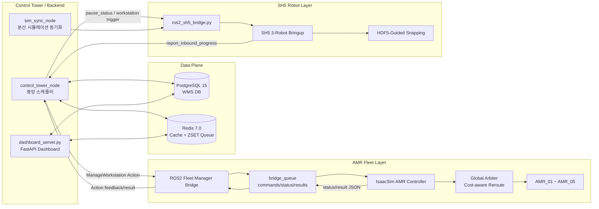
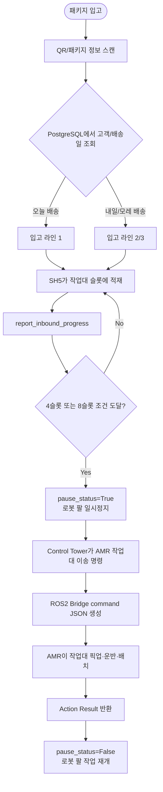
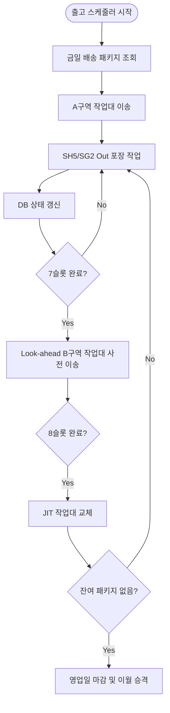

# SNFC - 협동3

<p align="center">
  <b>IsaacSim 기반 다중 AMR · SH5 · Control Tower 통합 물류 자동화 시뮬레이션</b><br>
  ROS 2 Humble · NVIDIA Isaac Sim · AMR Fleet · SH5 Dual-arm Robot · PostgreSQL · Redis · FastAPI Dashboard
</p>

<p align="center">
  
  
  
  
  
  
</p>

<p align="center">
  <a href="#0-프로젝트-한-줄-요약">요약</a> ·
  <a href="#2-프로젝트-개발-동기">개발 동기</a> ·
  <a href="#3-주요-기능">주요 기능</a> ·
  <a href="#4-시스템-설계">시스템 설계</a> ·
  <a href="#7-팀원별-담당-영역">팀 역할</a> ·
  <a href="#11-설치-및-실행-순서">실행 방법</a>
</p>

---

## 0. 프로젝트 한 줄 요약

**SNFC**는 IsaacSim 환경에서 **AMR 5대**, **SH5 쌍팔 로봇 3대**, **관제탑(Control Tower)**을 연결하여 입고·적재·작업대 이송·출고 포장 흐름을 통합한 **지능형 물류 자동화 시뮬레이션 프로젝트**입니다.

```text
Control Tower
→ PostgreSQL / Redis 기반 작업 스케줄링
→ ROS 2 Action / Service 명령 발행
→ AMR Fleet Bridge 및 IsaacSim Controller
→ Global Arbiter 기반 다중 AMR 충돌 회피
→ SH5 쌍팔 로봇 적재/포장 시뮬레이션
→ 상태 반환, DB 갱신, 웹 대시보드 모니터링
```

---

## 1. 프로젝트 개요

협동3 프로젝트는 단순히 IsaacSim 안에서 로봇을 움직이는 데모가 아니라, **공장 물류 자동화 시스템 전체의 제어 흐름**을 하나의 시뮬레이션으로 연결하는 것을 목표로 하였다.

SNFC는 다음 세 영역을 하나로 통합한다.

| 영역 | 핵심 역할 | 담당 |
|---|---|---|
| AMR Fleet / Bridge / Global Arbiter | 작업대 픽업·운반·배치, 다중 AMR 충돌 회피, ROS2-IsaacSim 브릿지 | 윤성웅(YSW) |
| SH5 Dual-arm Robot / Imitation Pipeline | HDF5 시연 데이터 수집, ACT 학습, 3대 SH5 병렬 적재/포장 시연 | 최은예(CEY) |
| Control Tower / DB / Dashboard | PostgreSQL·Redis 기반 WMS, ZSET 스케줄러, JIT 인터로킹, FastAPI 대시보드 | 윤재현(YJH) |

---

## 2. 프로젝트 개발 동기

일반적인 공장 자동화 알고리즘은 고정된 라인, 고정된 룰, 단순 FIFO 또는 단순 최단거리 배정에 의존하는 경우가 많다. 이런 구조는 구현은 단순하지만, 다중 AMR과 로봇 팔이 같은 공간에서 동시에 움직이는 상황에서는 다음 문제가 발생한다.

| 기존 방식의 한계 | 문제점 |
|---|---|
| 단순 FIFO 작업 큐 | 긴급 작업, 회전, 작업대 교체 같은 우선순위를 반영하기 어려움 |
| 단순 최단거리 AMR 배정 | 목적지 중복, 병목 구간 대기, 작업대 충돌 가능성 증가 |
| 로봇 팔과 AMR 제어 분리 | AMR이 도킹/회전하는 순간 로봇 팔과 물리 충돌 가능 |
| 시뮬레이션과 WMS 데이터 분리 | 작업 상태와 실제 로봇 상태가 어긋날 수 있음 |
| 고정형 공정 로직 | 작업대 위치, 패키지 흐름, 병목 상황 변화에 유연하게 대응하기 어려움 |

따라서 본 프로젝트는 **보통의 공장 알고리즘을 그대로 재현하는 것이 아니라, 직접 설계한 알고리즘으로 더 최적화된 물류 흐름을 만들 수 있는지 검증하는 것**을 목표로 하였다.

SNFC에서 직접 설계·적용한 핵심 최적화는 다음과 같다.

| 직접 설계한 최적화 | 설명 |
|---|---|
| Global Arbiter | 모든 AMR의 다음 이동 후보를 tick 단위로 중앙 승인하여 same-cell, edge-swap, head-on 충돌 차단 |
| Cost-aware Reroute | AMR이 막혔을 때 단순 대기하지 않고 wait cost와 detour cost를 비교하여 WAIT/REROUTE 결정 |
| Bridge Admission Guard | 같은 작업대, 같은 목적지, 같은 AMR에 중복 명령이 들어오는 것을 controller 진입 전에 차단 |
| Redis ZSET Scheduler | 작업 우선순위를 score로 관리하여 회전, 교체, 입고, 출고 작업을 우선순위 기반으로 처리 |
| JIT Interlocking | AMR이 작업대 하부에 진입하거나 회전할 때 SH5/SG2 팔을 pause_status로 일시정지 후 자동 재개 |
| Look-ahead Buffer | 작업대가 다 차기 전에 다음 작업대를 미리 예비 구역에 준비하여 로봇 팔 유휴시간 감소 |
| HDF5-Guided Snapping | 시연 데이터 기반으로 SH5의 좌/우 손 파지를 자동 선택하여 안정적인 pick & place 재생 |

---

## 3. 주요 기능

### 3.1 AMR Fleet 물류 자동화

| 기능 | 설명 |
|---|---|
| AMR 5대 운용 | `AMR_01` ~ `AMR_05`가 작업대를 픽업, 운반, 배치, 복귀 |
| 작업대 운반 | `WS_01` ~ `WS_10` 또는 `RACK_01` ~ `RACK_10` 작업대를 SG/stage 위치로 이동 |
| ROS2 Action 명령 | `/manage_workstation`, `/amr_01/manage_workstation` 등 Action으로 외부 명령 수신 |
| Bridge Queue | commands/status/results/cancel/done JSON 파일로 ROS2와 IsaacSim controller 분리 |
| QR 위치 인식 | AMR 하단 카메라가 바닥 QR을 읽고 grid cell 위치를 갱신 |
| 8-way Time A* | 빈 AMR은 8방향, 작업대 운반 AMR은 더 보수적인 이동 정책 적용 |
| Reservation Table | 시간축 cell 예약으로 다중 AMR 경로 충돌 방지 |
| Local Macro Route | SG 진입/탈출 병목 구간에서 deterministic route 사용 |
| Cost-aware Reroute | 대기와 우회를 비용으로 비교해 주행 효율 개선 |

### 3.2 Global Arbiter 기반 충돌 회피

Global Arbiter는 각 AMR이 계산한 다음 이동 후보를 그대로 실행하지 않고, **모든 AMR의 이동 후보를 한 번 모아 중앙에서 승인/거절**한다.

```text
각 AMR 경로 후보 계산
→ next_cell proposal 생성
→ Global Arbiter가 전체 AMR proposal 수집
→ same-cell / edge-swap / head-on / footprint 충돌 검사
→ 승인된 AMR만 이동
→ 거절된 AMR은 WAIT 또는 cost-aware reroute 판단
```

| 검사 항목 | 차단 대상 |
|---|---|
| same-cell conflict | 두 AMR이 같은 cell로 동시에 진입 |
| edge-swap conflict | 두 AMR이 서로의 위치를 맞교환 |
| head-on conflict | 좁은 통로에서 정면 충돌 |
| rack footprint conflict | 작업대 운반 중 작업대 footprint가 다른 AMR/작업대와 겹침 |
| static blocker | route 중간에 정적 작업대 또는 장애물이 존재 |

### 3.3 SH5 쌍팔 로봇 물류 자동화

| 기능 | 설명 |
|---|---|
| Isaac Sim SH5 환경 | `finalfac.usd` 기반 SH5 쌍팔 로봇 및 작업장 구성 |
| VR 조작 데이터 수집 | VR 컨트롤러로 SH5 양팔을 원격 조작하고 HDF5 episode 저장 |
| HDF5 데이터 구조화 | joint, box trajectory, RGB camera view, slot 정보를 episode 단위로 저장 |
| 데이터 전처리 | `freeze_idle_arms.py`, `create_subset.py`, `filter_dataset.py`로 학습 품질 개선 |
| 데이터 증강 | 좌우 미러링, 관절 노이즈, slot3→slot4 변환 증강 |
| ACT 모방학습 | Vision-ACT 계열 모델을 Colab A100 환경에서 학습 |
| 3대 로봇 병렬 시연 | `sh5_bringup_ros2_3robot.py`로 3개 라인 독립 pick & place 수행 |
| HDF5-Guided Snapping | box trajectory 기반으로 좌/우 파지 링크 자동 선택 |
| Spawn/Despawn | AMR이 작업대를 가져가거나 배치할 때 RACK prim을 실시간 제거/복원 |

### 3.4 Control Tower / WMS / Dashboard

| 기능 | 설명 |
|---|---|
| PostgreSQL WMS DB | 패키지, 작업대, AMR, 창고 위치, 이력 데이터 영속 저장 |
| Redis 실시간 캐시 | AMR 상태, 작업 큐, 실시간 위치, 작업 플래그 저장 |
| Redis ZSET Scheduler | 우선순위 score 기반 작업 분배 |
| FastAPI Dashboard | 웹소켓 기반 실시간 상태 브로드캐스트 및 모니터링 |
| JIT Interlocking | AMR 도킹·회전 시 SH5/SG2 팔을 일시정지하여 물리 충돌 방지 |
| Look-ahead Buffer | 작업대가 모두 차기 전에 다음 작업대를 미리 준비 |
| DB Rollback | AMR action 실패/timeout 시 예약 상태와 작업 상태 복구 |
| OpenUSD Instancing | 143개 QR mesh 렌더링 병목을 instanceable 구조로 최적화 |
| CSS Absolute DOM | 대시보드 DOM layout/paint 부하를 줄여 CPU 사용률 감소 |

---

## 4. 시스템 설계

### 4.1 전체 시스템 아키텍처



### 4.2 입고·적재·작업대 이송 플로우



### 4.3 출고·포장·Look-ahead 플로우



### 4.4 Bridge Queue 구조

```text
bridge_queue/
├── commands/   # Bridge가 생성한 command JSON
├── status/     # Controller가 기록한 진행 상태
├── results/    # Controller가 기록한 최종 결과
├── cancel/     # Action cancel 요청
└── done/       # 처리 완료된 command 보관
```

예시 command JSON:

```json
{
  "command_id": "CMD_f9bb42e729e8",
  "workstation_id": "WS07",
  "target_location": "sg2_in_01_B",
  "preferred_amr_name": "AMR_05",
  "require_preferred_amr": true,
  "created_at": 1781167628.6863856
}
```

---

## 5. 폴더 구조

```text
SNFC/
├── CEY/
│   ├── README.md
│   ├── DEBUGGING.md
│   ├── assets/
│   │   ├── box_assets/
│   │   └── scene/
│   │       ├── finalfac.usd
│   │       └── RACK.usd
│   └── scripts/
│       ├── sh5_bringup_ros2_3robot.py
│       ├── ros2_sh5_bridge.py
│       ├── train_act_v2.py
│       ├── hdf5_replay_player.py
│       ├── augment_data.py
│       ├── augment_slot3_to_slot4.py
│       ├── freeze_idle_arms.py
│       ├── freeze_right_arm.py
│       ├── filter_dataset.py
│       └── send_packages.sh
│
├── YJH/
│   ├── README.md
│   ├── DEBUGGING.md
│   ├── start_control_tower_only.sh
│   ├── docker/
│   │   ├── docker-compose.yml
│   │   ├── init.sql
│   │   └── init_june_8th_state.py
│   ├── docs/
│   │   ├── CONTROL_TOWER_ARCHITECTURE.md
│   │   └── HANDOFF_INTEGRATION_GUIDE.md
│   └── scratch/
│       ├── dashboard_server.py
│       ├── reset_db.py
│       └── cyclonedds_wifi_config.xml
│
├── YSW/
│   ├── README.md
│   ├── DEBUGGING.md
│   ├── AMR.usd
│   ├── Final_Factory.usd
│   ├── system_design.md
│   ├── feature_operation.md
│   ├── execution_guide.md
│   ├── equipment_list.md
│   ├── requirements.md
│   └── troubleshooting.md
│
├── README.md
└── requirements.txt
```

---

## 6. 주요 파일 설명

| 파일 | 담당 | 설명 |
|---|---|---|
| `YSW/README.md` | 윤성웅 | AMR Fleet, Bridge, Global Arbiter, cost-aware reroute, 프로젝트 총괄 기여 정리 |
| `YSW/DEBUGGING.md` | 윤성웅 | ROS2 bridge, CycloneDDS, 중복 명령, QR, target mapping, Global Arbiter 디버깅 기록 |
| `CEY/scripts/sh5_bringup_ros2_3robot.py` | 최은예 | 3대 SH5 쌍팔 로봇 병렬 pick & place 메인 시연 스크립트 |
| `CEY/scripts/ros2_sh5_bridge.py` | 최은예 | 관제탑과 IsaacSim SH5 사이 ROS2↔파일큐 브릿지 |
| `CEY/scripts/train_act_v2.py` | 최은예 | ACT 기반 모방학습 모델 학습 스크립트 |
| `CEY/DEBUGGING.md` | 최은예 | HDF5 데이터 수집, 파지 안정화, yo-yo 물리 버그, Spawn/Despawn 개발 일지 |
| `YJH/start_control_tower_only.sh` | 윤재현 | PostgreSQL/Redis, FastAPI Dashboard, Control Tower 실행 스크립트 |
| `YJH/scratch/dashboard_server.py` | 윤재현 | FastAPI 기반 실시간 대시보드 서버 |
| `YJH/docker/docker-compose.yml` | 윤재현 | PostgreSQL, Redis, Adminer, Redis Commander 인프라 구성 |
| `YJH/docs/CONTROL_TOWER_ARCHITECTURE.md` | 윤재현 | 관제탑 노드 토폴로지, 파이프라인, JIT 인터로킹 구조 문서 |
| `YJH/docs/HANDOFF_INTEGRATION_GUIDE.md` | 윤재현 | ROS2 인터페이스, 노드 병합, DB 연동 가이드 |

---

## 7. 팀원별 담당 영역

| 이름 | 폴더 | 담당 영역 | 핵심 기여 |
|---|---|---|---|
| 윤성웅 | `YSW` | 팀장 / AMR Fleet / Bridge / Global Arbiter / 문서화 | 프로젝트 기획, AMR 5대 작업대 운반 시나리오, ROS2 Action Bridge, admission guard, QR 위치 인식, Time A*, Reservation Table, cost-aware reroute, PPT 및 GitHub 문서화 |
| 최은예 | `CEY` | SH5 IsaacSim / 모방학습 / 3대 로봇 시연 | VR 조작 기반 HDF5 데이터 수집, 데이터 전처리·증강, ACT 학습, 3대 SH5 병렬 replay, HDF5-guided snapping, yo-yo 물리 버그 해결, WorkstationManager Spawn/Despawn |
| 윤재현 | `YJH` | Control Tower / Backend / DB / Dashboard | PostgreSQL·Redis 하이브리드 DB, Redis ZSET 스케줄러, JIT pause_status 인터로킹, Look-ahead buffer, FastAPI Dashboard, OpenUSD 인스턴싱, DOM 최적화, DB rollback |

<details open>
<summary><b>윤성웅(YSW) 상세 기여</b></summary>

### 담당 요약

윤성웅은 협동3 프로젝트의 팀장으로서 프로젝트 주제 선정, 실제 창고 자동화 시나리오 설계, 팀원별 구현 방향 조율, GitHub README 및 발표 자료 구성을 담당하였다. 기술적으로는 AMR Fleet와 ROS2-IsaacSim 연결부를 중심으로 구현 구조를 정리하고, 다중 AMR 주행 안정성을 개선하였다.

### 주요 구현 및 개선

| 구분 | 내용 |
|---|---|
| AMR Fleet 시나리오 | AMR 5대가 작업대를 픽업·운반·배치하고 복귀하는 물류 흐름 설계 |
| ROS2 Bridge | `/manage_workstation`, `/amr_01/manage_workstation` ~ `/amr_05/manage_workstation` Action 구조 정리 |
| Bridge Queue | command/status/result JSON 기반으로 ROS2와 IsaacSim controller 분리 |
| Admission Guard | 중복 workstation, 중복 target, 중복 AMR 명령 사전 reject |
| Global Arbiter | tick 단위 중앙 이동 승인 구조, same-cell/edge-swap/head-on 충돌 차단 |
| Cost-aware Reroute | wait cost와 detour cost 비교로 WAIT/REROUTE 판단 |
| QR 위치 인식 | QR safety gate로 이동 중 cell jump와 오인식 방지 |
| 네트워크 디버깅 | CycloneDDS interface가 thunderbolt0으로 고정된 문제를 Wi-Fi 기준으로 수정 |
| 문서화 | README, DEBUGGING, PPT, 발표 대본 및 프로젝트 흐름 정리 |

### 핵심 성과

- 단순 경로계획 문제가 아니라 **명령 충돌 문제**를 분리하여 Bridge 단계에서 차단.
- Global Arbiter와 cost-aware reroute를 결합해 다중 AMR의 대기/우회 판단 구조를 문서화.
- ROS2 Action 명령과 IsaacSim controller를 loose coupling 구조로 연결.

</details>

<details open>
<summary><b>최은예(CEY) 상세 기여</b></summary>

### 담당 요약

최은예는 SH5 IsaacSim 물류 자동화 파트를 담당하였다. VR 조작 기반 시연 데이터 수집부터 HDF5 전처리, ACT 모방학습, 3대 SH5 병렬 시연, 파지 안정화 및 작업대 Spawn/Despawn까지 SH5 로봇 파이프라인을 구축하였다.

### 주요 구현 및 개선

| 구분 | 내용 |
|---|---|
| IsaacSim 환경 | `finalfac.usd` 기반 SH5 및 물류 작업장 구성 |
| 데이터 수집 | VR controller 기반 SH5 양팔 원격 조작, HDF5 episode 저장 |
| 데이터 구조화 | Left/Right/TopView RGB, joint state, box trajectory, slot 정보 저장 |
| 전처리 | 비동작 팔 고정, 실패 episode 필터링, subset 추출 |
| 증강 | 좌우 미러링, 관절 노이즈, slot3→slot4 변환 |
| 학습 | Google Colab A100에서 Vision-ACT 모델 150 epoch 학습 |
| 3대 병렬 시연 | `sh5_bringup_ros2_3robot.py`로 3개 라인 독립 상태머신 운영 |
| 파지 안정화 | HDF5-Guided Snapping으로 box trajectory 기반 파지 링크 자동 선택 |
| 물리 버그 수정 | kinematic box velocity 문제로 발생한 yo-yo 현상 해결 |
| 작업대 연동 | WorkstationManager로 RACK prim 실시간 Spawn/Despawn 구현 |

### 핵심 성과

- 400개 이상의 HDF5 episode를 기반으로 SH5 시연 데이터 파이프라인 구축.
- 파지 링크 자동 선택과 velocity 없는 pose write로 yo-yo 현상 없는 안정적 pick & place 재생.
- AMR이 작업대를 이동할 때 SH5 시뮬레이션 화면에서도 작업대가 실시간 제거/복원되는 구조 구현.

</details>

<details open>
<summary><b>윤재현(YJH) 상세 기여</b></summary>

### 담당 요약

윤재현은 관제탑(Control Tower), 백엔드, 데이터베이스, 실시간 대시보드, 시스템 최적화를 담당하였다. PostgreSQL과 Redis를 분리한 하이브리드 데이터 구조를 만들고, Redis ZSET 기반 우선순위 스케줄링, JIT 인터로킹, Look-ahead buffer를 통해 전체 물류 흐름을 제어하였다.

### 주요 구현 및 개선

| 구분 | 내용 |
|---|---|
| Control Tower | ROS2 기반 중앙 스케줄러 및 WMS Brain 설계 |
| PostgreSQL | 패키지, 작업대, AMR, warehouse location, 작업 이력 영속 저장 |
| Redis | AMR 실시간 상태, 작업 큐, system flag, ZSET priority queue 관리 |
| ZSET Scheduler | score 기반으로 회전/작업대 공급/예비 이송/빈 작업대 회수 우선순위 처리 |
| JIT Interlocking | AMR 도킹·회전 시 `/robot_id/pause_status`로 SH5/SG2 일시정지 |
| Look-ahead Buffer | 작업대가 가득 차기 전 다음 작업대 사전 이송으로 유휴시간 최소화 |
| FastAPI Dashboard | 웹소켓 기반 실시간 관제 화면 구현 |
| DB Rollback | action 실패/timeout 시 DB 예약 상태 복구 |
| OpenUSD 최적화 | 143개 바닥 QR mesh를 instanceable 구조로 바꿔 렌더링 부하 감소 |
| DOM 최적화 | CSS absolute positioning으로 대시보드 layout/paint 부하 감소 |

### 핵심 성과

- 데이터 평면(PostgreSQL/Redis)과 제어 평면(ROS2)을 분리하여 실시간성과 데이터 무결성 동시 확보.
- JIT pause_status와 Look-ahead buffer로 AMR과 로봇 팔의 병목/충돌 문제 해결.
- Dashboard와 IsaacSim 성능 병목을 분석해 시뮬레이션과 웹 관제 성능을 개선.

</details>

---

## 8. ROS 2 인터페이스 요약

| 인터페이스 | 타입 | 사용 영역 | 설명 |
|---|---|---|---|
| `/manage_workstation` | Action | Control Tower → AMR Bridge | 작업대 이송 명령 |
| `/amr_01/manage_workstation` ~ `/amr_05/manage_workstation` | Action | 외부 PC → 특정 AMR | 특정 AMR 강제 배정 명령 |
| `ReportInboundProgress` | Service | SH5/SG2 → Control Tower | 슬롯 적재 진행률 보고 |
| `CheckWarehouseStatus` | Service | SH5/SG2 → Control Tower | 패키지/고객/창고 상태 조회 |
| `TransitPackage` | Service | Sim Sync | 분산 시뮬레이션 간 상자 이동 동기화 |
| `GetDailyPackageList` | Service | Dashboard/Control Tower | 금일 출고 대상 패키지 목록 조회 |
| `/{robot_id}/pause_status` | Topic `std_msgs/Bool` | Control Tower → SH5/SG2 | AMR 도킹·회전 중 로봇 팔 일시정지 |
| `/sim/sg2_workstation_trigger` | Topic | Control Tower → IsaacSim | 작업대 Spawn/Despawn 트리거 |
| `/sim/sg2_spawn_trigger` | Topic | Sim Sync → IsaacSim | 상자 Spawn 트리거 |

---

## 9. 개발 환경

| 구분 | 내용 |
|---|---|
| OS | Ubuntu 22.04 LTS |
| ROS | ROS 2 Humble |
| RMW | CycloneDDS 권장 |
| Language | Python 3.10 |
| Simulator | NVIDIA Isaac Sim / Isaac Lab |
| Robot Simulation | AMR 5대, SH5 Dual-arm Robot 3대 |
| DB | PostgreSQL 15, Redis 7.0 |
| Backend | FastAPI, Uvicorn, WebSocket |
| AI / Learning | PyTorch, ACT imitation learning, HDF5 dataset |
| Visualization | FastAPI Dashboard, Adminer, Redis Commander, IsaacSim Viewport |
| Container | Docker Compose |

---

## 10. 사용 장비 및 시뮬레이션 구성

| 구분 | 항목 | 설명 |
|---|---|---|
| AMR | `AMR_01` ~ `AMR_05` | 작업대 운반, stage/SG 위치 이동 |
| 작업대 | `WS_01` ~ `WS_10`, `RACK_01` ~ `RACK_10` | 패키지 적재 및 이동 대상 |
| SH5 | 3대 쌍팔 로봇 | 입고/출고 라인에서 박스 pick & place 수행 |
| Package | `PKG_YYYYMMDD_xxx.usd` | 물류 상자 에셋 |
| Warehouse | `finalfac.usd`, `Final_Factory.usd` | IsaacSim 공장/창고 환경 |
| QR Grid | 1.5m 간격 floor QR | AMR 위치 인식 및 grid cell 매핑 |
| DB Server | PostgreSQL / Redis | WMS 데이터와 실시간 상태 저장 |
| Dashboard | FastAPI + Browser | AMR, 작업대, 패키지 상태 모니터링 |

---

## 11. 설치 및 실행 순서

> 실제 실행은 각 팀원 폴더의 README/DEBUGGING을 기준으로 세부 경로를 맞춘다. 아래는 루트 README용 표준 실행 흐름이다.

### 11.1 공통 ROS2 환경

```bash
source /opt/ros/humble/setup.bash
export ROS_DOMAIN_ID=119
export RMW_IMPLEMENTATION=rmw_cyclonedds_cpp
export ROS_LOCALHOST_ONLY=0
```

멀티 PC에서 사용할 경우 CycloneDDS 설정 파일을 로드한다.

```bash
export CYCLONEDDS_URI=file://$HOME/.ros/cyclonedds_wifi_config.xml
```

### 11.2 Python 의존성 설치

```bash
python3 -m pip install -r requirements.txt
```

ROS2, IsaacSim, IsaacLab, Doosan/Robotis 관련 모듈은 pip 패키지가 아니라 각 워크스페이스 또는 시뮬레이터 환경에서 제공된다.

### 11.3 Control Tower / DB / Dashboard 실행

```bash
cd YJH
chmod +x start_control_tower_only.sh
./start_control_tower_only.sh
```

수동 실행 시:

```bash
cd YJH
docker compose -f docker/docker-compose.yml up -d
python3 scratch/reset_db.py
python3 docker/init_june_8th_state.py
python3 scratch/dashboard_server.py
```

대시보드 접속:

```text
http://localhost:8009
```

### 11.4 AMR Bridge 실행

```bash
cd ~/isaaclab_ws/isaac_aruco/amr
./run_bridge_gpu.sh
```

검증:

```bash
ros2 node list
ros2 action list | grep manage_workstation
```

정상 기준:

```text
/manage_workstation
/amr_01/manage_workstation
/amr_02/manage_workstation
/amr_03/manage_workstation
/amr_04/manage_workstation
/amr_05/manage_workstation
```

### 11.5 IsaacSim AMR Controller 실행

IsaacSim Script Editor에서 실행:

```python
exec(open('/home/rokey/isaaclab_ws/isaac_aruco/amr/amr_live_existing_stage_true8_qr_camera_controller_gpu_v42_cost_aware_global.py', encoding='utf-8').read())
```

시나리오 명령 실행:

```bash
cd ~/isaaclab_ws/isaac_aruco/amr
./send_business_open_sequence_v1.sh
```

### 11.6 SH5 3-Robot 시뮬레이션 실행

```bash
cd CEY
isaac-python scripts/sh5_bringup_ros2_3robot.py
```

ROS2 ↔ SH5 bridge:

```bash
python3 scripts/ros2_sh5_bridge.py
```

패키지 트리거 테스트:

```bash
bash scripts/send_packages.sh
```

---

## 12. 의존성

### 12.1 Python requirements 예시

```txt
numpy
opencv-python
h5py
torch
torchvision
tqdm
fastapi
uvicorn
redis
psycopg2-binary
pydantic
python-multipart
```

### 12.2 시스템 패키지 예시

```bash
sudo apt update
sudo apt install -y \
  python3-pip \
  python3-venv \
  python3-colcon-common-extensions \
  ros-humble-desktop \
  ros-humble-rmw-cyclonedds-cpp
```

Docker 기반 DB:

```bash
docker compose -f YJH/docker/docker-compose.yml up -d
```

---

## 13. 디버깅 및 설계 개선 요약

| 담당 | 문제 | 원인 | 해결 |
|---|---|---|---|
| YSW | 상대 PC에서 ROS2 Action Server가 보이지 않음 | CycloneDDS interface가 thunderbolt0으로 고정 | Wi-Fi interface 기준 CycloneDDS XML 수정 |
| YSW | `setup.bash` unbound variable 오류 | shell script의 `set -u`와 ROS setup 충돌 | ROS source 구간만 `set +u` 적용 |
| YSW | 같은 목적지에 작업대 2개가 배정됨 | 중복 target_location 명령이 controller로 전달 | Bridge admission guard에서 `DUPLICATE_TARGET` reject |
| YSW | AMR이 막혔을 때 wait만 증가 | wait/detour 비용 비교 없음 | cost-aware global reroute 적용 |
| YSW | QR MISS 또는 cell jump 가능성 | 이동 중 QR 오인식, transform과 QR 불일치 | QR safety gate 적용 |
| CEY | SH5 replay 시작 시 텔레포트 발생 | 현재 자세와 첫 HDF5 frame 차이 | `WARMUP_FRAMES=30` 선형 보간 |
| CEY | 파지 손이 잘못 선택됨 | 좌/우 손 선택 기준이 불안정 | HDF5 box trajectory 기반 guided snapping 적용 |
| CEY | yo-yo 현상과 시뮬레이션 불안정 | kinematic box에 velocity를 쓰며 PhysX 에러 누적 | `_write_box_pose()`로 velocity 없이 pose만 적용 |
| CEY | 작업대가 AMR/SH5 화면에서 동기화되지 않음 | RACK prim 상태 관리 부재 | WorkstationManager Spawn/Despawn 구현 |
| YJH | PostgreSQL에 실시간 위치 업데이트 부하 | 고주파 AMR 상태가 RDB로 직접 쓰임 | Redis Hash/ZSET으로 실시간 데이터 분리 |
| YJH | 로봇 팔과 AMR 물리 충돌 가능 | AMR 도킹/회전 시 팔 제어권이 계속 활성 | JIT `pause_status` 인터로킹 구현 |
| YJH | 작업대 교체 시 로봇 팔 유휴 대기 증가 | 다음 작업대 준비가 늦음 | Look-ahead A/B buffer 도입 |
| YJH | IsaacSim QR mesh로 FPS 저하 | 143개 개별 QR mesh draw call 병목 | OpenUSD instanceable 구조 적용 |
| YJH | Dashboard CPU 점유율 과다 | DOM layout/paint 리플로우 병목 | CSS absolute DOM 구조로 최적화 |

---

## 14. 현재 구현 상태

| 항목 | 상태 |
|---|---|
| AMR 5대 작업대 운반 시나리오 | 구현 완료 |
| ROS2 Action 기반 AMR 명령 구조 | 구현 완료 |
| Bridge Queue command/status/result 구조 | 구현 완료 |
| Global Arbiter 충돌 회피 | 구현 완료 |
| Cost-aware Reroute | 구현 완료 |
| Bridge Admission Guard | 구현 완료 |
| QR 위치 인식 및 safety gate | 구현 완료 |
| SH5 HDF5 데이터 수집 파이프라인 | 구현 완료 |
| SH5 ACT 학습 및 replay 시연 | 구현 완료 |
| SH5 3대 병렬 시연 | 구현 완료 |
| HDF5-Guided Snapping | 구현 완료 |
| Workstation Spawn/Despawn | 구현 완료 |
| PostgreSQL/Redis 하이브리드 DB | 구현 완료 |
| Redis ZSET 작업 스케줄러 | 구현 완료 |
| JIT pause_status 인터로킹 | 구현 완료 |
| Look-ahead 작업대 사전 이송 | 구현 완료 |
| FastAPI Dashboard | 구현 완료 |
| GitHub README 및 DEBUGGING 문서화 | 구현 완료 |

---

## 15. GitHub 업로드 전 보안 주의사항

공개 저장소에 올리기 전 아래 파일은 반드시 제외한다.

```gitignore
.env
*.json
*.pt
*.pth
*.hdf5
*.h5
__pycache__/
*.pyc
.DS_Store
log/
logs/
```

> DB 비밀번호, API Key, Firebase/클라우드 인증 파일, 학습 가중치, 대용량 HDF5 데이터셋은 공개 저장소에 올리지 않는다.

---

## 16. 참고 문서

| 문서 | 설명 |
|---|---|
| `YSW/README.md` | 윤성웅 AMR Fleet / Bridge / Global Arbiter 기여 정리 |
| `YSW/DEBUGGING.md` | AMR 및 Bridge 디버깅 상세 기록 |
| `CEY/README.md` | 최은예 SH5 / HDF5 / ACT / 3로봇 시연 기여 정리 |
| `CEY/DEBUGGING.md` | SH5 개발 일지 및 파지 안정화 디버깅 기록 |
| `YJH/README.md` | 윤재현 Control Tower / DB / Dashboard 기여 정리 |
| `YJH/DEBUGGING.md` | 관제탑 개선 계획, 아키텍처 변경, 개발 이력 |
| `YJH/docs/CONTROL_TOWER_ARCHITECTURE.md` | 관제탑 노드 토폴로지 및 물류 파이프라인 |
| `YJH/docs/HANDOFF_INTEGRATION_GUIDE.md` | ROS2 인터페이스 및 통합 가이드 |

---

## 17. 최종 정리

SNFC는 AMR, SH5 로봇, Control Tower를 각각 따로 만든 프로젝트가 아니라, 세 파트를 하나의 물류 자동화 시스템으로 연결한 통합 프로젝트이다.

윤성웅은 AMR Fleet와 Bridge, Global Arbiter, cost-aware reroute를 통해 **다중 AMR 주행 안정성**을 담당하였다. 최은예는 HDF5 기반 데이터 수집·전처리·ACT 학습·3대 SH5 병렬 시연을 통해 **로봇 팔 적재/포장 자동화**를 담당하였다. 윤재현은 PostgreSQL/Redis 기반 관제탑, ZSET 스케줄러, JIT 인터로킹, FastAPI Dashboard를 통해 **전체 물류 흐름의 중앙 제어와 실시간 관제**를 담당하였다.

최종적으로 SNFC는 기존 공장 자동화의 단순 고정 룰이 아니라, 직접 설계한 최적화 알고리즘을 기반으로 AMR 대기시간, 로봇 팔 유휴시간, 목적지 중복, 물리 충돌, 시뮬레이션 렌더링 병목을 줄이는 방향으로 구현되었다.
