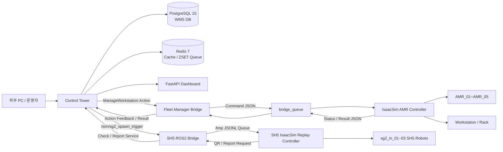
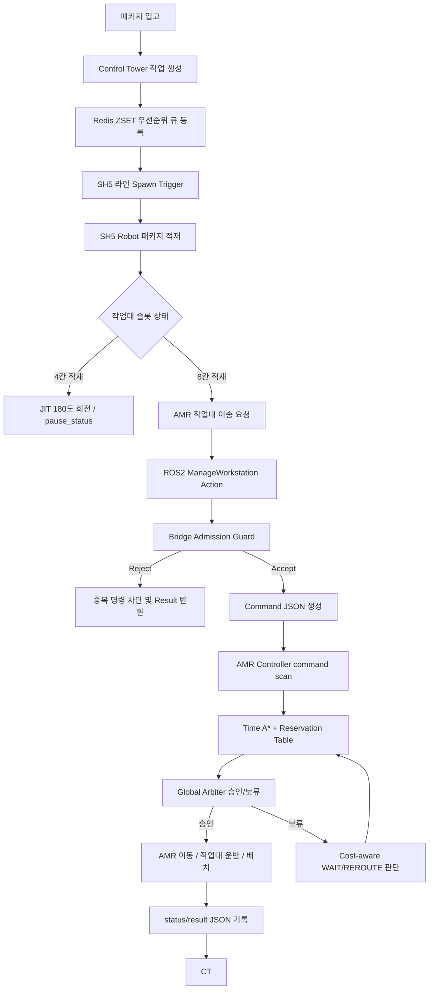
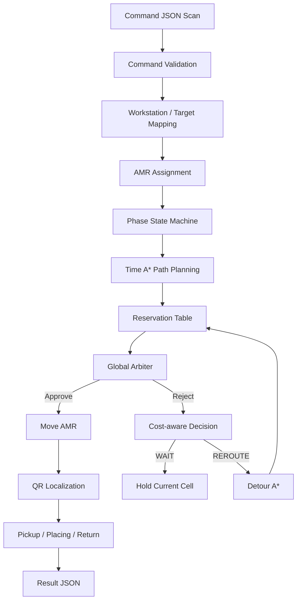

# SNFC

<p align="center">
  <b>IsaacSim 기반 다중 AMR·SH5 로봇 물류창고 최적화 시뮬레이션</b><br>
  ROS 2 Humble · NVIDIA Isaac Sim · AMR Fleet · SH5 Dual-arm Robot · PostgreSQL · Redis · FastAPI · Time A* · Global Arbiter · Cost-aware Reroute
</p>

<p align="center">
  
  
  
  
  
  
</p>

<p align="center">
  <a href="#0-프로젝트-한-줄-요약">요약</a> ·
  <a href="#2-프로젝트를-진행한-이유">개발 동기</a> ·
  <a href="#3-주요-기능">주요 기능</a> ·
  <a href="#4-시스템-설계">시스템 설계</a> ·
  <a href="#8-운영체제-및-사용-장비">실행 환경</a> ·
  <a href="#10-실행-순서">실행 순서</a>
</p>

---

## 0. 프로젝트 한 줄 요약

**SNFC**는 NVIDIA IsaacSim 환경에서 **AMR 5대**, **SH5 쌍팔 로봇 3대**, **작업대 다수**, **Control Tower**, **ROS 2 Action Bridge**, **PostgreSQL·Redis 기반 WMS**, **FastAPI Dashboard**를 연결하여 물류창고의 입고·적재·작업대 이송·출고 흐름을 시뮬레이션하고, 자체 설계한 경로계획·관제 알고리즘으로 다중 로봇 물류 효율을 최적화하는 프로젝트입니다.

```text
패키지 입고
→ Control Tower 작업 생성
→ SH5 로봇 적재 / QR 확인
→ 작업대 슬롯 상태 보고
→ AMR 작업대 이송 명령
→ ROS2 Bridge → IsaacSim Controller
→ Time A* / Reservation Table / Global Arbiter / Cost-aware Reroute
→ 작업대 배치 / 복귀 / 상태 반환
→ PostgreSQL·Redis·Dashboard 상태 동기화
```

---

## 1. 프로젝트 개요

SNFC는 단순히 IsaacSim에서 로봇을 움직이는 데모가 아니라, **제조·물류 현장에서 발생할 수 있는 다중 로봇 병목 상황을 실제 운영 구조에 가깝게 분리해 구현한 통합 시뮬레이션**입니다.

핵심 구성은 다음과 같습니다.

| 계층 | 구성 요소 | 역할 |
|---|---|---|
| Control Tower | ROS 2 관제 노드, FastAPI, PostgreSQL, Redis | 물류 작업 생성, AMR 배정, 작업대 상태 관리, 대시보드 제공 |
| AMR Fleet | AMR_01 ~ AMR_05 | 작업대 픽업, SG 구역 진입, stage/warehouse 이송, 복귀 |
| SH5 Robot | sg2_in_01 ~ sg2_in_03 | 패키지 적재, QR 확인, 작업대 슬롯 채움, 입고 보고 |
| ROS2 Bridge | Fleet Manager Bridge, SH5 Bridge | Control Tower와 IsaacSim 사이의 명령·상태 변환 |
| IsaacSim Controller | AMR Controller, SH5 Replay Controller | 실제 stage 내 로봇·작업대·패키지 제어 |
| Optimization Layer | Time A*, Reservation Table, Global Arbiter, Cost-aware Reroute | 다중 AMR 충돌 회피 및 병목 최소화 |

---

## 2. 프로젝트를 진행한 이유

일반적인 공장·물류 자동화 알고리즘은 고정 컨베이어, 정해진 라인, 단순 FIFO 큐, 정적 경로 기반 운영에 의존하는 경우가 많습니다. 이런 방식은 구조가 단순하고 안정적이지만, 다중 AMR이 같은 통로를 공유하거나 작업대가 동시에 이동해야 하는 상황에서는 병목, 대기, 중복 명령, 물리 충돌 문제가 쉽게 발생합니다.

SNFC는 이런 한계를 실험적으로 개선하기 위해 시작했습니다. 목표는 **기존 공장 알고리즘을 그대로 모방하는 것**이 아니라, 직접 설계한 알고리즘으로 다음을 검증하는 것이었습니다.

| 기존 방식의 한계 | SNFC에서의 개선 방향 |
|---|---|
| 단순 FIFO 기반 작업 처리 | Redis ZSET 기반 우선순위 큐와 Control Tower 스케줄링 적용 |
| 정적 경로 또는 단일 로봇 중심 경로계획 | Time A*와 Reservation Table로 시간축 점유까지 고려 |
| 충돌 위험을 단순 정지로만 처리 | Global Arbiter가 매 tick 이동 후보를 승인·보류 |
| 막히면 계속 기다리는 구조 | wait_cost와 detour_cost를 비교하는 Cost-aware Reroute 적용 |
| 중복 목적지 명령을 실행 중 발견 | Bridge Admission Guard에서 사전 차단 |
| 로봇 팔과 AMR의 작업영역 충돌 가능 | JIT pause_status 인터로킹으로 로봇 팔 일시정지/재개 제어 |

즉, 이 프로젝트의 핵심 의도는 **보통의 공장 운영 흐름보다 더 지능적으로 AMR과 로봇 팔을 조율하는 자체 최적화 알고리즘을 설계하고, IsaacSim 기반 환경에서 실제로 동작 가능한 구조로 검증하는 것**입니다.

---

## 3. 주요 기능

### 3.1 Control Tower 기반 중앙 관제

Control Tower는 물류창고의 중앙 WMS 역할을 수행합니다.

| 기능 | 설명 |
|---|---|
| 작업 생성 및 스케줄링 | 입고/출고 작업을 DB와 Redis 큐 기준으로 관리 |
| AMR 배정 | 사용 가능한 AMR 중 최적 후보를 선택 |
| 작업대 상태 관리 | workstation slot, 위치, 예약 상태, 적재 상태 관리 |
| JIT 인터로킹 | AMR이 작업대 하부에 진입하거나 회전할 때 로봇 팔 일시정지 |
| 예외 복구 | AMR 오프라인, Action timeout, DB 충돌 발생 시 rollback 처리 |
| 대시보드 | FastAPI 기반 상태 모니터링 제공 |

### 3.2 ROS 2 Action 기반 AMR 명령 구조

AMR 이동 명령은 ROS 2 Action으로 전달됩니다.

```text
Control Tower / 외부 PC
→ ManageWorkstation Action Goal
→ Fleet Manager Bridge
→ bridge_queue/commands/*.json
→ IsaacSim AMR Controller
→ status/results JSON
→ ROS 2 Action Feedback / Result
```

제공 Action Server:

```text
/manage_workstation
/amr_01/manage_workstation
/amr_02/manage_workstation
/amr_03/manage_workstation
/amr_04/manage_workstation
/amr_05/manage_workstation
```

### 3.3 Bridge Admission Guard

Bridge v43는 Controller에 명령을 보내기 전에 불가능한 명령을 먼저 차단합니다.

| 차단 조건 | 의미 |
|---|---|
| `DUPLICATE_WORKSTATION` | 같은 작업대가 이미 active command에 포함됨 |
| `DUPLICATE_TARGET` | 같은 target_location 또는 target_cell이 이미 예약됨 |
| `DUPLICATE_AMR` | preferred AMR이 이미 작업 중임 |

이 구조를 통해 **서로 다른 작업대가 같은 목적지 cell에 배치되려는 문제**를 경로계획 단계까지 보내지 않고 bridge에서 즉시 reject할 수 있습니다.

### 3.4 Time A* 경로계획

일반 A*가 공간 좌표만 고려한다면, SNFC의 AMR Controller는 **시간축을 포함한 Time A*** 구조를 사용합니다.

```text
현재 cell
→ 목표 cell
→ 시간별 future reservation 확인
→ 충돌 없는 경로 후보 생성
```

적용 기준:

| AMR 상태 | 이동 정책 |
|---|---|
| 빈 AMR | 8방향 이동 허용 |
| 작업대 운반 AMR | 4방향 중심 이동, 대각 이동 제한 |
| SG 진입부 | Local Macro Route 우선 적용 |

### 3.5 Reservation Table

Reservation Table은 AMR이 미래에 점유할 cell을 시간 단위로 예약합니다.

```text
AMR_01: t+1=(1,2), t+2=(2,2), t+3=(3,2)
AMR_02: t+1=(1,3), t+2=(2,3), t+3=(3,3)
```

다른 AMR은 같은 시간에 같은 cell을 예약할 수 없으며, edge swap 형태의 정면 충돌도 검사합니다.

### 3.6 Global Arbiter

Global Arbiter는 각 AMR이 계산한 다음 이동 후보를 바로 실행하지 않고, 한 tick 단위로 전체 AMR 이동 후보를 다시 검토하는 계층입니다.

검사 항목:

```text
1. 같은 tick에서 동일 cell 진입 여부
2. edge swap 충돌 여부
3. 작업대 footprint 충돌 여부
4. static workstation blocker 여부
5. carrying AMR 우선순위
6. return-home AMR 양보 여부
```

### 3.7 Cost-aware Global Reroute

기존 구조는 AMR이 막히면 대부분 기다리는 방식이었습니다. 개선 후에는 Global Arbiter가 첫 이동을 reject했을 때 다음 판단을 수행합니다.

```text
1. rejected first cell을 temporary blocked cell로 지정
2. 해당 cell을 피하는 detour A* 재계산
3. wait_cost 계산
4. detour_cost 계산
5. wait_cost <= detour_cost → WAIT
6. detour_cost < wait_cost → REROUTE
```

작업대를 들고 있는 AMR은 footprint가 크고 회전 위험이 있으므로, 빈 AMR보다 우회 허용 거리를 더 보수적으로 설정합니다.

### 3.8 Local Macro Route

SG 진입부는 일반 A*만으로 안정적으로 처리하기 어려운 좁은 병목 구간입니다. 따라서 SNFC는 SG 진입/탈출 구간에 deterministic local route를 적용합니다.

```text
LOCAL_ENTRY
→ 후보 route 생성
→ route 전체 QR valid 확인
→ future route의 static blocker 검사
→ 가능한 route 선택
→ 작업대 배치
→ LOCAL_EXIT
```

### 3.9 QR 기반 위치 보정

AMR 하단 카메라가 바닥 QR을 읽어 grid cell과 world 좌표를 동기화합니다.

보정 안정화 조건:

```text
- 이동 중 QR cell 갱신 제한
- LIFTING / PLACING / ROTATING 중 갱신 차단
- 갑작스러운 cell jump reject
- world 위치와 QR 위치 오차 검사
- 같은 QR을 안정적으로 읽었을 때만 accept
```

### 3.10 SH5 쌍팔 로봇 물류 자동화

SH5 파트는 3대의 쌍팔 로봇이 각 라인에서 패키지를 적재하는 구조입니다.

| 기능 | 설명 |
|---|---|
| VR 조작 데이터 수집 | HDF5 episode 생성 |
| 데이터 전처리 | idle arm freeze, subset 추출, 실패 episode 필터링 |
| 데이터 증강 | 좌우 미러링, 관절 노이즈, slot 변환 증강 |
| ACT 학습 | Vision-ACT 기반 imitation learning |
| 3대 병렬 replay | `sg2_in_01`, `sg2_in_02`, `sg2_in_03` 독립 동작 |
| QR 확인 | package QR을 DB와 비교하여 중복 입고 판단 |
| 입고 보고 | `report_inbound_progress` 서비스로 Control Tower에 슬롯 상태 보고 |

---

## 4. 시스템 설계

### 4.1 전체 시스템 아키텍처



### 4.2 물류 처리 플로우



### 4.3 AMR Controller 내부 구조



### 4.4 Bridge Queue 구조

```text
bridge_queue/
├── commands/   # Bridge가 생성한 명령 JSON
├── status/     # Controller가 갱신하는 진행 상태
├── results/    # Controller가 작성하는 최종 결과
├── cancel/     # Action cancel 요청
└── done/       # 처리 완료된 command 이동 또는 marker
```

### 4.5 SH5 파일 큐 구조

```text
/tmp/sh5_queue.jsonl       # Bridge → IsaacSim: 패키지 투입 트리거
/tmp/sh5_qr_req.jsonl      # IsaacSim → Bridge: QR DB 확인 요청
/tmp/sh5_qr_result.jsonl   # Bridge → IsaacSim: DB 중복 체크 결과
/tmp/sh5_report_req.jsonl  # IsaacSim → Bridge: 입고 완료 보고
/tmp/sh5_pause.json        # Bridge → IsaacSim: pause_status 일시정지 상태
/tmp/sh5_ws_trigger.jsonl  # Bridge → IsaacSim: 작업대 Spawn/Despawn
```

---

## 5. 폴더 구조

```text
SNFC/
├── README.md
├── CEY/
│   ├── README.md
│   ├── DEBUGGING.md
│   ├── assets/
│   │   ├── box_assets/
│   │   └── scene/
│   └── scripts/
│       ├── sh5_bringup_ros2_3robot.py
│       ├── ros2_sh5_bridge.py
│       ├── coupang_sh5_bringup_v.py
│       ├── hdf5_replay_player.py
│       ├── train_act_v2.py
│       ├── evaluate_test_vision.py
│       ├── freeze_idle_arms.py
│       ├── create_subset.py
│       ├── augment_data.py
│       ├── augment_slot3_to_slot4.py
│       └── filter_dataset.py
├── YJH/
│   ├── README.md
│   ├── DEBUGGING.md
│   ├── start_control_tower_only.sh
│   ├── docker/
│   │   ├── docker-compose.yml
│   │   ├── init.sql
│   │   └── init_june_8th_state.py
│   ├── docs/
│   │   ├── CONTROL_TOWER_ARCHITECTURE.md
│   │   └── HANDOFF_INTEGRATION_GUIDE.md
│   └── scratch/
│       ├── dashboard_server.py
│       ├── reset_db.py
│       └── cyclonedds_wifi_config.xml
└── YSW/
    ├── README.md
    ├── DEBUGGING.md
    ├── system_design.md
    ├── feature_operation.md
    ├── equipment_list.md
    ├── requirements.md
    ├── execution_guide.md
    ├── troubleshooting.md
    ├── AMR.usd
    └── Final_Factory.usd
```

---

## 6. 주요 파일 설명

| 파일 | 담당 파트 | 설명 |
|---|---|---|
| `YSW/README.md` | AMR Fleet / 팀장 | 성웅 담당 기여 정리, AMR 경로계획, bridge, controller 개선 내용 |
| `YSW/DEBUGGING.md` | AMR Fleet / 디버깅 | 중복 target, Global Arbiter, Cost-aware Reroute, QR, CycloneDDS 문제 해결 기록 |
| `YSW/system_design.md` | AMR 시스템 설계 | Bridge Queue, Controller, Global Arbiter, Cost-aware 구조 설명 |
| `YSW/feature_operation.md` | 기능 설명 | Time A*, Reservation Table, Admission Guard 등 기능별 실행 흐름 |
| `YSW/execution_guide.md` | 실행 가이드 | AMR Controller와 Bridge 실행 순서 |
| `YSW/requirements.md` | 의존성 | ROS2, IsaacSim, Python, 환경변수 정리 |
| `YJH/start_control_tower_only.sh` | Control Tower | PostgreSQL·Redis·FastAPI·관제 노드 실행 스크립트 |
| `YJH/docker/docker-compose.yml` | DB 인프라 | PostgreSQL, Redis, Adminer, Redis Commander 실행 |
| `YJH/scratch/dashboard_server.py` | Dashboard | FastAPI 기반 모니터링 서버 |
| `YJH/docs/CONTROL_TOWER_ARCHITECTURE.md` | 관제 설계 | Control Tower 노드 토폴로지와 물류 파이프라인 |
| `YJH/docs/HANDOFF_INTEGRATION_GUIDE.md` | 통합 가이드 | ROS2 interface, service/action/message 통합 방법 |
| `CEY/scripts/sh5_bringup_ros2_3robot.py` | SH5 시뮬레이션 | 3대 SH5 쌍팔 로봇 병렬 pick & place 시연 메인 코드 |
| `CEY/scripts/ros2_sh5_bridge.py` | SH5 Bridge | Control Tower와 SH5 IsaacSim 사이 ROS2↔파일큐 브릿지 |
| `CEY/scripts/train_act_v2.py` | 학습 | ACT v2 학습 코드 |
| `CEY/scripts/hdf5_replay_player.py` | 데이터 재생 | HDF5 episode loader |
| `CEY/scripts/freeze_idle_arms.py` | 전처리 | 비동작 팔 고정 데이터 전처리 |
| `CEY/assets/scene/finalfac.usd` | IsaacSim Asset | 물류 창고 stage |
| `CEY/assets/scene/RACK.usd` | IsaacSim Asset | 작업대 모델 |

---

## 7. ROS 2 인터페이스

### 7.1 Action

| Action | 용도 |
|---|---|
| `ManageWorkstation.action` | 작업대 이송, 배치, 회전, 회수 명령 |
| `MovePackage.action` | 단일 패키지 긴급 이송 명령 |
| `StartPackaging.action` | 출고 포장 로봇 작업 시작 명령 |

### 7.2 Service

| Service | 용도 |
|---|---|
| `CheckWarehouseStatus.srv` | QR/패키지 기준 중복 입고 여부 확인 |
| `ReportInboundProgress.srv` | SH5 적재 진행률 및 슬롯 상태 보고 |
| `TransitPackage.srv` | 분산 시뮬레이션 간 패키지 전달 |
| `GetDailyPackageList.srv` | 금일 처리 대상 패키지 목록 조회 |

### 7.3 Topic / Message

| Topic / Message | 용도 |
|---|---|
| `/sim/sg2_spawn_trigger` | SH5 라인에 패키지 Spawn Trigger 전달 |
| `/sim/sg2_workstation_trigger` | 작업대 Spawn/Despawn Trigger 전달 |
| `/{robot_id}/pause_status` | 로봇 팔 일시정지/재개 인터로킹 |
| `WorkstationSimTrigger.msg` | IsaacSim 작업대 생성/삭제 연동 메시지 |

---

## 8. 운영체제 및 사용 장비

### 8.1 소프트웨어 환경

| 구분 | 내용 |
|---|---|
| OS | Ubuntu 22.04 LTS |
| ROS | ROS 2 Humble |
| Python | Python 3.10 |
| DDS | CycloneDDS |
| RMW | `rmw_cyclonedds_cpp` |
| ROS_DOMAIN_ID | `119` |
| Simulation | NVIDIA Isaac Sim / IsaacLab |
| Database | PostgreSQL 15, Redis 7.0 |
| Backend | FastAPI, Uvicorn |
| Computer Vision | OpenCV, QR Decoder |
| Learning | PyTorch, ACT imitation learning |
| Asset | OpenUSD / USD prim |

### 8.2 사용 장비 및 시뮬레이션 객체

| 구분 | 수량 | 설명 |
|---|---:|---|
| Main PC | 1 | IsaacSim, AMR Controller, Bridge 실행 |
| Control Tower PC | 1 | ROS2 명령 송신, 대시보드, DB 운영 |
| AMR | 5 | `AMR_01` ~ `AMR_05` |
| SH5 Dual-arm Robot | 3 | `sg2_in_01`, `sg2_in_02`, `sg2_in_03` |
| Workstation / Rack | 10+ | 작업대 이송 및 슬롯 적재 대상 |
| QR Marker | 다수 | AMR 위치 보정 및 패키지 확인 |
| GPU | NVIDIA GPU 권장 | IsaacSim 렌더링 및 비전 처리 |
| Network | Wi-Fi | ROS2 DDS 통신 |

### 8.3 주요 좌표 기준

AMR grid는 1.5m 간격을 사용합니다.

```text
world_x = cell_x * 1.5
world_y = cell_y * 1.5
```

| Target | World 좌표 | Cell |
|---|---:|---:|
| `sg2_in_01_B` | `(6.0, 1.5)` | `(4, 1)` |
| `sg2_in_02_B` | `(6.0, -3.0)` | `(4, -2)` |
| `sg2_in_03_B` | `(6.0, -7.5)` | `(4, -5)` |
| `sg2_out_00_A` | `(-4.5, 9.0)` | `(-3, 6)` |
| `sg2_out_00_B` | `(-4.5, 7.5)` | `(-3, 5)` |

---

## 9. 의존성

### 9.1 ROS 2 / 시스템 패키지

```bash
sudo apt update
sudo apt install -y \
  ros-humble-desktop \
  ros-humble-rmw-cyclonedds-cpp \
  ros-humble-std-msgs \
  ros-humble-std-srvs \
  python3-colcon-common-extensions \
  python3-pip \
  python3-venv \
  docker.io \
  docker-compose-plugin
```

### 9.2 Python 의존성

```bash
python3 -m pip install -r requirements.txt
```

권장 `requirements.txt` 예시:

```txt
fastapi
uvicorn
psycopg2-binary
redis
numpy
opencv-python
h5py
torch
torchvision
tqdm
pyyaml
python-dotenv
```

> `rclpy`, `std_msgs`, `cobot3_interfaces`는 pip가 아니라 ROS 2 workspace에서 제공됩니다.  
> `isaacsim`, `isaaclab`, `omni`, `pxr`는 일반 Python이 아니라 IsaacSim/IsaacLab 실행 환경에서 제공됩니다.

### 9.3 Docker 서비스

`YJH/docker/docker-compose.yml`은 다음 서비스를 실행합니다.

| 서비스 | 포트 | 용도 |
|---|---:|---|
| PostgreSQL | `5432` | WMS 영속 데이터 저장 |
| Redis | `6379` | 실시간 캐시, AMR 상태, ZSET 큐 |
| Adminer | `8082` | PostgreSQL 웹 조회 |
| Redis Commander | `8081` | Redis 웹 조회 |

---

## 10. 실행 순서

### 10.1 저장소 준비

```bash
git clone <YOUR_REPOSITORY_URL>
cd SNFC
```

### 10.2 ROS 2 환경 설정

```bash
source /opt/ros/humble/setup.bash
export ROS_DOMAIN_ID=119
export RMW_IMPLEMENTATION=rmw_cyclonedds_cpp
```

Wi-Fi 기반 다른 PC와 통신할 경우 CycloneDDS XML을 설정합니다.

```bash
export CYCLONEDDS_URI=file://$HOME/.ros/cyclonedds_wifi.xml
```

### 10.3 Control Tower / DB 실행

```bash
cd YJH
chmod +x start_control_tower_only.sh
./start_control_tower_only.sh
```

수동 실행 시:

```bash
cd YJH
docker compose -f docker/docker-compose.yml up -d
python3 scratch/reset_db.py
python3 docker/init_june_8th_state.py
python3 scratch/dashboard_server.py
```

대시보드 기본 접속 주소:

```text
http://localhost:8009
```

### 10.4 AMR Bridge 실행

AMR 최종 파일은 YSW 문서 기준으로 다음 파일을 사용합니다.

```text
fleet_manager_bridge_node_gpu_v43_guarded_actions.py
amr_live_existing_stage_true8_qr_camera_controller_gpu_v42_cost_aware_global.py
run_bridge_gpu.sh
```

실행 예시:

```bash
cd ~/isaaclab_ws/isaac_aruco/amr
mkdir -p bridge_queue/{commands,status,results,cancel,done}
chmod +x run_bridge_gpu.sh
./run_bridge_gpu.sh
```

Action Server 확인:

```bash
ros2 action list | grep manage_workstation
```

정상 출력 예시:

```text
/manage_workstation
/amr_01/manage_workstation
/amr_02/manage_workstation
/amr_03/manage_workstation
/amr_04/manage_workstation
/amr_05/manage_workstation
```

### 10.5 IsaacSim AMR Controller 실행

IsaacSim Script Editor에서 실행합니다.

```python
exec(open('/home/rokey/isaaclab_ws/isaac_aruco/amr/amr_live_existing_stage_true8_qr_camera_controller_gpu_v42_cost_aware_global.py', encoding='utf-8').read())
```

### 10.6 SH5 ROS2 Bridge 실행

```bash
cd SNFC/CEY/scripts
source /opt/ros/humble/setup.bash
export ROS_DOMAIN_ID=119
python3 ros2_sh5_bridge.py
```

### 10.7 SH5 IsaacSim 시연 실행

IsaacSim/IsaacLab 환경에서 실행합니다.

```bash
cd SNFC/CEY/scripts
python3 sh5_bringup_ros2_3robot.py --slot 1
```

환경에 따라 `isaac-python` 또는 IsaacLab의 launcher를 사용해야 할 수 있습니다.

### 10.8 테스트 명령

SH5 파일 큐 직접 테스트:

```bash
echo '{"package_id":"PKG_001","qr_id":"QR_001","customer_id":"CUST_A","target_line":"sg2_in_01"}' >> /tmp/sh5_queue.jsonl
```

AMR Action 테스트는 프로젝트의 `ManageWorkstation.action` 빌드 후 goal을 전송합니다.

```bash
ros2 action list | grep manage_workstation
```

---

## 11. 주요 환경 변수

### 11.1 ROS / DDS

```bash
export ROS_DOMAIN_ID=119
export RMW_IMPLEMENTATION=rmw_cyclonedds_cpp
export CYCLONEDDS_URI=file://$HOME/.ros/cyclonedds_wifi.xml
```

### 11.2 AMR Controller

```bash
export AMR_GPU_ENABLED=1
export AMR_QR_GPU_PREPROCESS_ENABLED=1
export AMR_QR_CUDA_DEVICE_ID=0
export AMR_OPENCV_CPU_THREADS=1
export AMR_RESERVATION_HORIZON=35
export AMR_COST_AWARE_GLOBAL_REROUTE_ENABLED=1
export AMR_COST_AWARE_REROUTE_MIN_WAIT_STEPS=3
export AMR_COST_AWARE_REROUTE_FORCE_AFTER_WAIT_STEPS=18
export AMR_COST_AWARE_REROUTE_MAX_EXTRA_CELLS_EMPTY=5.0
export AMR_COST_AWARE_REROUTE_MAX_EXTRA_CELLS_CARRY=3.0
export AMR_SG_LOCAL_MACRO_ROUTE_ENABLED=1
export AMR_SG_LOCAL_MACRO_LOG_ENABLED=1
```

### 11.3 Bridge

```bash
export AMR_BRIDGE_EXECUTOR_THREADS=2
export AMR_BRIDGE_ADMISSION_GUARD=1
```

---

## 12. 실행 성공 기준

| 구분 | 정상 기준 |
|---|---|
| DB | `warehouse_postgres`, `warehouse_redis` 컨테이너 실행 |
| Dashboard | `http://localhost:8009` 접속 가능 |
| ROS2 Bridge | `/manage_workstation`, `/amr_01~05/manage_workstation` 표시 |
| AMR Controller | command JSON scan 로그 출력 |
| Global Arbiter | 이동 승인/보류 로그 출력 |
| Cost-aware Reroute | `COST_DECISION` 로그 출력 |
| SH5 Bridge | `/sim/sg2_spawn_trigger`, `/tmp/sh5_queue.jsonl` 연동 |
| SH5 Replay | 3대 SH5 robot이 각 라인에서 pick & place 수행 |

---

## 13. 디버깅 요약

| 문제 | 원인 | 해결 |
|---|---|---|
| 상대 PC에서 Action Server가 안 보임 | CycloneDDS interface가 `thunderbolt0`로 고정 | Wi-Fi interface 기준 XML 수정 |
| 같은 목적지로 작업대 2개가 이동 | target_location 중복 명령 | Bridge Admission Guard에서 reject |
| AMR이 멈췄는데 no_path=0 | 경로는 있으나 Global Arbiter가 이동 보류 | wait/reroute 판단 로그 확인 |
| AMR이 오래 기다림 | wait와 detour 비용 비교 없음 | Cost-aware Global Reroute 적용 |
| LOCAL_ENTRY 중간에서 막힘 | route 중간 static blocker 미검사 | Local Macro route 전체 blocker 검사 |
| QR 위치 jump | 이동 중 QR 오인식 | QR safety gate 적용 |
| IsaacSim FPS 저하 | 바닥 QR mesh draw call 과부하 | OpenUSD instancing 최적화 |
| SH5 재생 시작 순간이동 | 현재 자세에서 첫 frame까지 보간 없음 | `WARMUP_FRAMES=30` 적용 |
| SH5 비동작 팔 간섭 | 원본 episode에 idle arm 움직임 포함 | `freeze_idle_arms.py` 전처리 |

---

## 14. 팀원별 담당 영역

| 담당 | 폴더 | 주요 역할 |
|---|---|---|
| 윤성웅 | `YSW` | 팀장, 프로젝트 기획, AMR Fleet 시나리오, ROS2 Bridge, IsaacSim Controller, Time A*, Reservation Table, Global Arbiter, Cost-aware Reroute, Admission Guard, README/PPT 정리 |
| 윤 | `YJH` | Control Tower, FastAPI Dashboard, PostgreSQL/Redis, ZSET Scheduling, Look-ahead Buffer, JIT Interlocking, DB rollback, OpenUSD 최적화 |
| 최은예 | `CEY` | SH5 IsaacSim 시뮬레이션, VR 데이터 수집, HDF5 pipeline, ACT 학습, 3대 SH5 병렬 replay, ROS2 SH5 bridge, 작업대 Spawn/Despawn |

---

## 15. 참고 문서

| 문서 | 설명 |
|---|---|
| `YSW/README.md` | 성웅 담당 작업 타임라인 및 AMR Fleet 기여 정리 |
| `YSW/DEBUGGING.md` | AMR Bridge / Controller / Global Arbiter / Reroute 디버깅 |
| `YSW/system_design.md` | AMR 시스템 설계 상세 |
| `YSW/feature_operation.md` | 주요 기능별 동작 흐름 |
| `YSW/execution_guide.md` | AMR 실행 순서 |
| `YSW/requirements.md` | AMR 의존성 및 환경 변수 |
| `YSW/troubleshooting.md` | AMR 실행 오류 해결 |
| `YJH/README.md` | Control Tower / DB / Dashboard / 최적화 기여 정리 |
| `YJH/DEBUGGING.md` | 관제탑 시스템 개선 및 디버깅 통합 보고서 |
| `YJH/docs/CONTROL_TOWER_ARCHITECTURE.md` | Control Tower 노드 토폴로지와 파이프라인 |
| `YJH/docs/HANDOFF_INTEGRATION_GUIDE.md` | ROS2 interface 통합 가이드 |
| `CEY/README.md` | SH5 시뮬레이션 / 학습 / 재생 파이프라인 정리 |
| `CEY/DEBUGGING.md` | SH5 개발 및 안정화 로그 |

---

## 16. GitHub 업로드 전 주의사항

공개 저장소에 업로드하기 전 다음 파일은 반드시 제외하거나 별도 관리합니다.

```gitignore
.env
*.json
*.pt
*.hdf5
*.h5
__pycache__/
*.pyc
.DS_Store
log/
*.log
```

주의:

```text
- DB 비밀번호, API key, Firebase key, SSH key는 절대 업로드하지 않는다.
- 대용량 학습 데이터셋과 checkpoint는 Git LFS 또는 외부 저장소를 사용한다.
- IsaacSim USD asset은 용량이 크므로 필요 시 압축 또는 별도 릴리즈로 관리한다.
```

---

## 17. 최종 정리

SNFC는 AMR, SH5 로봇, Control Tower, DB, Dashboard를 단순히 병렬로 배치한 프로젝트가 아니라, **실제 물류창고에서 발생하는 다중 로봇 병목·중복 명령·물리 충돌·실시간 상태 동기화 문제를 하나의 운영 흐름으로 연결한 통합 시뮬레이션**입니다.

핵심 성과는 다음과 같습니다.

```text
1. ROS2 Action 기반 AMR 작업대 이송 구조 구현
2. Bridge Queue 기반 IsaacSim Controller 연동
3. Bridge Admission Guard로 중복 명령 사전 차단
4. Time A* + Reservation Table로 다중 AMR 경로계획 수행
5. Global Arbiter로 tick 단위 충돌 회피 수행
6. Cost-aware Reroute로 WAIT/REROUTE 비용 판단 수행
7. Control Tower + PostgreSQL + Redis 기반 WMS 관제 구조 구현
8. Redis ZSET 기반 우선순위 스케줄링 적용
9. JIT pause_status 인터로킹으로 AMR-로봇 팔 충돌 방지
10. SH5 3대 병렬 pick & place와 HDF5/ACT 기반 재생 파이프라인 구현
11. FastAPI Dashboard와 DB 상태 동기화 구조 구현
12. IsaacSim OpenUSD 인스턴싱으로 렌더링 성능 개선
```

이 프로젝트는 일반적인 공장 물류 자동화의 고정형 알고리즘을 그대로 따르지 않고, **직접 설계한 AMR 경로계획·관제·스케줄링 알고리즘으로 더 최적화된 창고 운영을 구현하고 검증하려는 시도**라는 점에서 의미가 있습니다.
