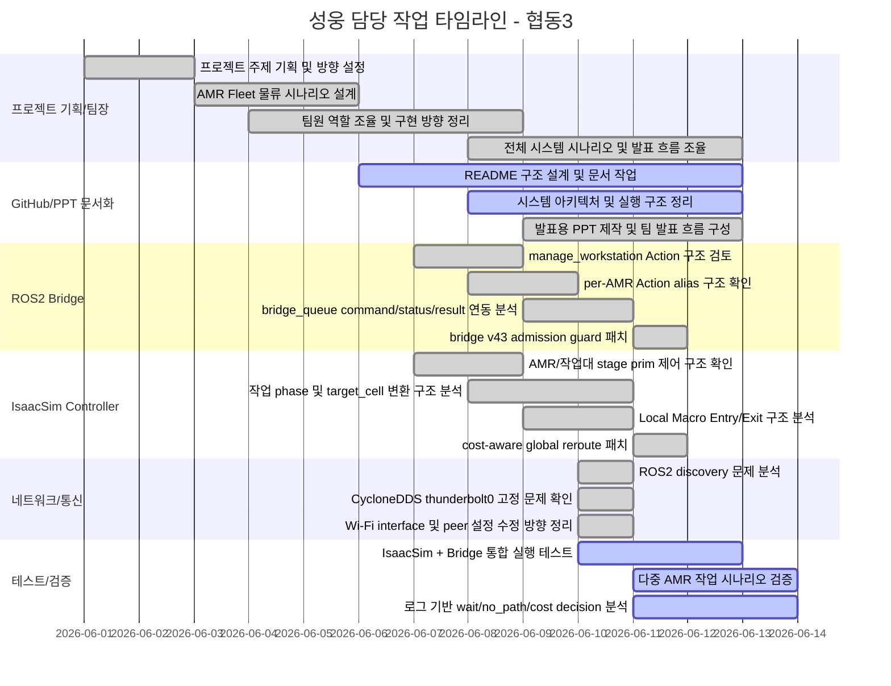

# 📋 성웅 담당 작업 타임라인 및 기여 정리 - 협동3

> **프로젝트명**: 협동3 - IsaacSim 기반 AMR Fleet 물류 자동화 시뮬레이션
> **역할**: 팀장 / 프로젝트 기획 / 전체 시나리오 설계 / 팀원 조율 / GitHub 문서 작업 / PPT 제작 / 시스템 아키텍처 정리 / ROS2·IsaacSim 연동 디버깅 / AMR 주행 로직 개선 / 네트워크 통신 문제 해결
> **주의**: 협동3 프로젝트는 단순 AMR 이동 구현이 아니라, IsaacSim 환경에서 AMR 5대가 작업대를 픽업·운반·배치하는 전체 물류 시나리오를 구성하고, 외부 Control Tower 또는 상대 PC에서 ROS2 Action 명령을 내려 실제 시뮬레이션 AMR이 작업을 수행하도록 통합한 프로젝트임

---

<h2>성웅 담당 작업 타임라인 (프로젝트 기획 및 팀장 역할)</h2>

<table>
  <thead>
    <tr>
      <th nowrap>작업명</th>
      <th nowrap>날짜</th>
      <th nowrap>담당자</th>
      <th nowrap>파트</th>
      <th nowrap>단계</th>
      <th nowrap>완료 여부</th>
    </tr>
  </thead>
  <tbody>
    <tr><td nowrap>협동3 프로젝트 전체 주제 기획</td><td nowrap>6월 초</td><td nowrap>성웅</td><td nowrap>팀장/프로젝트 기획</td><td nowrap>기획</td><td nowrap>완료</td></tr>
    <tr><td nowrap>IsaacSim 기반 AMR Fleet 물류 자동화 시뮬레이션 방향 설정</td><td nowrap>6월 초</td><td nowrap>성웅</td><td nowrap>팀장/시스템 기획</td><td nowrap>기획</td><td nowrap>완료</td></tr>
    <tr><td nowrap>AMR 5대와 작업대 다수를 사용하는 창고 자동화 시나리오 구성</td><td nowrap>6월 초</td><td nowrap>성웅</td><td nowrap>팀장/시나리오 설계</td><td nowrap>운영 시나리오</td><td nowrap>완료</td></tr>
    <tr><td nowrap>실제 창고에서 사용할 수 있는 작업 흐름 기준 정리</td><td nowrap>6월 초</td><td nowrap>성웅</td><td nowrap>팀장/시나리오 설계</td><td nowrap>프로세스 설계</td><td nowrap>완료</td></tr>
    <tr><td nowrap>AMR이 작업대를 픽업하고 SG 또는 stage 구역으로 운반하는 전체 작업 절차 설계</td><td nowrap>6월 초</td><td nowrap>성웅</td><td nowrap>팀장/물류 흐름 설계</td><td nowrap>작업 절차 설계</td><td nowrap>완료</td></tr>
    <tr><td nowrap>팀원별 구현 방향 조율 및 파트별 개발 범위 정리</td><td nowrap>6월 초</td><td nowrap>성웅</td><td nowrap>팀장/통합 관리</td><td nowrap>역할 분담</td><td nowrap>완료</td></tr>
    <tr><td nowrap>상대 PC와 내 PC 간 역할 분리 구조 검토</td><td nowrap>6월 초</td><td nowrap>성웅</td><td nowrap>팀장/통신 구조 설계</td><td nowrap>연동 구조 검토</td><td nowrap>완료</td></tr>
    <tr><td nowrap>내 PC에서 IsaacSim을 실행하고 상대 PC에서 ROS2 명령을 내리는 구조 설계</td><td nowrap>6월 초</td><td nowrap>성웅</td><td nowrap>팀장/시스템 통합</td><td nowrap>운영 구조 설계</td><td nowrap>완료</td></tr>
    <tr><td nowrap>전체 시스템의 동작 흐름, 명령 흐름, 상태 반환 흐름 정리</td><td nowrap>6월 초~중순</td><td nowrap>성웅</td><td nowrap>팀장/시스템 설계</td><td nowrap>아키텍처 정리</td><td nowrap>완료</td></tr>
    <tr><td nowrap>프로젝트 진행 중 발생한 문제 원인 분석 및 수정 우선순위 조율</td><td nowrap>6월 중순</td><td nowrap>성웅</td><td nowrap>팀장/디버깅 조율</td><td nowrap>문제 해결</td><td nowrap>완료</td></tr>
  </tbody>
</table>

---

<h2>성웅 담당 작업 타임라인 (GitHub 문서화 및 PPT 제작)</h2>

<table>
  <thead>
    <tr>
      <th nowrap>작업명</th>
      <th nowrap>날짜</th>
      <th nowrap>담당자</th>
      <th nowrap>파트</th>
      <th nowrap>단계</th>
      <th nowrap>완료 여부</th>
    </tr>
  </thead>
  <tbody>
    <tr><td nowrap>협동3 GitHub README 문서 작성 방향 설정</td><td nowrap>6월 초~중순</td><td nowrap>성웅</td><td nowrap>GitHub/문서화</td><td nowrap>문서 구조 설계</td><td nowrap>완료</td></tr>
    <tr><td nowrap>프로젝트 개요, 시스템 구성, 실행 방법, 주요 기능을 README에 정리</td><td nowrap>6월 중순</td><td nowrap>성웅</td><td nowrap>GitHub/README</td><td nowrap>문서 작성</td><td nowrap>진행</td></tr>
    <tr><td nowrap>ROS2 bridge와 IsaacSim controller 연동 구조 문서화</td><td nowrap>6월 중순</td><td nowrap>성웅</td><td nowrap>GitHub/기술 문서</td><td nowrap>연동 구조 정리</td><td nowrap>진행</td></tr>
    <tr><td nowrap>bridge_queue의 commands/status/results/cancel/done 구조 정리</td><td nowrap>6월 중순</td><td nowrap>성웅</td><td nowrap>GitHub/기술 문서</td><td nowrap>파일 구조 정리</td><td nowrap>진행</td></tr>
    <tr><td nowrap>AMR 작업 phase 구조를 README에 정리</td><td nowrap>6월 중순</td><td nowrap>성웅</td><td nowrap>GitHub/README</td><td nowrap>동작 흐름 정리</td><td nowrap>진행</td></tr>
    <tr><td nowrap>TO_RACK / LIFTING / LOCAL_ENTRY / PLACING / LOCAL_EXIT / RETURN_HOME 단계 정리</td><td nowrap>6월 중순</td><td nowrap>성웅</td><td nowrap>GitHub/README</td><td nowrap>작업 단계 문서화</td><td nowrap>진행</td></tr>
    <tr><td nowrap>시스템 아키텍처와 전체 시나리오를 발표용 PPT 구조로 정리</td><td nowrap>6월 중순</td><td nowrap>성웅</td><td nowrap>PPT/발표자료</td><td nowrap>발표 흐름 설계</td><td nowrap>완료</td></tr>
    <tr><td nowrap>팀 발표용 PPT 제작 및 슬라이드 흐름 구성</td><td nowrap>6월 중순</td><td nowrap>성웅</td><td nowrap>PPT/발표자료</td><td nowrap>자료 제작</td><td nowrap>완료</td></tr>
    <tr><td nowrap>프로젝트 목적, 필요성, 시스템 구성, 구현 방식, 개선 내용을 발표 자료에 반영</td><td nowrap>6월 중순</td><td nowrap>성웅</td><td nowrap>PPT/발표자료</td><td nowrap>내용 구성</td><td nowrap>완료</td></tr>
    <tr><td nowrap>팀원별 발표 내용과 전체 발표 흐름 조율</td><td nowrap>6월 중순</td><td nowrap>성웅</td><td nowrap>팀장/발표 조율</td><td nowrap>발표 준비</td><td nowrap>완료</td></tr>
  </tbody>
</table>

---

<h2>성웅 담당 작업 타임라인 (ROS2 Bridge 및 외부 명령 연동)</h2>

<table>
  <thead>
    <tr>
      <th nowrap>작업명</th>
      <th nowrap>날짜</th>
      <th nowrap>담당자</th>
      <th nowrap>파트</th>
      <th nowrap>단계</th>
      <th nowrap>완료 여부</th>
    </tr>
  </thead>
  <tbody>
    <tr><td nowrap>ROS2 Action 기반 AMR 작업 명령 구조 검토</td><td nowrap>6월 중순</td><td nowrap>성웅</td><td nowrap>ROS2/Bridge</td><td nowrap>통신 구조 검토</td><td nowrap>완료</td></tr>
    <tr><td nowrap>/manage_workstation Action Server 구조 확인</td><td nowrap>6월 중순</td><td nowrap>성웅</td><td nowrap>ROS2/Action</td><td nowrap>인터페이스 확인</td><td nowrap>완료</td></tr>
    <tr><td nowrap>/amr_01/manage_workstation ~ /amr_05/manage_workstation per-AMR Action 구조 확인</td><td nowrap>6월 중순</td><td nowrap>성웅</td><td nowrap>ROS2/Action</td><td nowrap>AMR 지정 명령 확인</td><td nowrap>완료</td></tr>
    <tr><td nowrap>상대 PC가 특정 AMR에게 직접 명령을 내릴 수 있는 구조 검토</td><td nowrap>6월 중순</td><td nowrap>성웅</td><td nowrap>ROS2/Bridge</td><td nowrap>외부 명령 구조</td><td nowrap>완료</td></tr>
    <tr><td nowrap>ROS2 Action goal을 JSON command로 변환하는 bridge 구조 분석</td><td nowrap>6월 중순</td><td nowrap>성웅</td><td nowrap>ROS2/Bridge</td><td nowrap>명령 변환 구조</td><td nowrap>완료</td></tr>
    <tr><td nowrap>command_id 기반 commands/status/results 파일 흐름 확인</td><td nowrap>6월 중순</td><td nowrap>성웅</td><td nowrap>Bridge Queue</td><td nowrap>파일 연동 검토</td><td nowrap>완료</td></tr>
    <tr><td nowrap>bridge가 목적지를 직접 계산하지 않고 IsaacSim controller에 명령을 전달하는 구조 정리</td><td nowrap>6월 중순</td><td nowrap>성웅</td><td nowrap>Bridge/Controller 연동</td><td nowrap>역할 분리 정리</td><td nowrap>완료</td></tr>
    <tr><td nowrap>ROS2 feedback/result가 status/result JSON을 통해 반환되는 구조 확인</td><td nowrap>6월 중순</td><td nowrap>성웅</td><td nowrap>ROS2/Action 결과 처리</td><td nowrap>반환 구조 검토</td><td nowrap>완료</td></tr>
    <tr><td nowrap>bridge 실행 스크립트 run_bridge_gpu.sh 동작 확인</td><td nowrap>6월 중순</td><td nowrap>성웅</td><td nowrap>ROS2/실행환경</td><td nowrap>실행 테스트</td><td nowrap>완료</td></tr>
    <tr><td nowrap>ros2 node list 및 ros2 action list를 통한 bridge 정상 여부 검증</td><td nowrap>6월 중순</td><td nowrap>성웅</td><td nowrap>ROS2/검증</td><td nowrap>통신 검증</td><td nowrap>완료</td></tr>
  </tbody>
</table>

---

<h2>성웅 담당 작업 타임라인 (IsaacSim AMR Controller 및 주행 로직)</h2>

<table>
  <thead>
    <tr>
      <th nowrap>작업명</th>
      <th nowrap>날짜</th>
      <th nowrap>담당자</th>
      <th nowrap>파트</th>
      <th nowrap>단계</th>
      <th nowrap>완료 여부</th>
    </tr>
  </thead>
  <tbody>
    <tr><td nowrap>IsaacSim Script Editor 기반 AMR controller 실행 구조 확인</td><td nowrap>6월 중순</td><td nowrap>성웅</td><td nowrap>IsaacSim/Controller</td><td nowrap>실행 구조 확인</td><td nowrap>완료</td></tr>
    <tr><td nowrap>기존 stage에 배치된 AMR_01~AMR_05 prim 제어 구조 확인</td><td nowrap>6월 중순</td><td nowrap>성웅</td><td nowrap>IsaacSim/Stage</td><td nowrap>객체 제어 검토</td><td nowrap>완료</td></tr>
    <tr><td nowrap>작업대 RACK_01~RACK_10 또는 WS_01~WS_10 제어 구조 확인</td><td nowrap>6월 중순</td><td nowrap>성웅</td><td nowrap>IsaacSim/Stage</td><td nowrap>작업대 제어 검토</td><td nowrap>완료</td></tr>
    <tr><td nowrap>AMR 초기 위치와 작업대 초기 위치 grid cell 기준 정리</td><td nowrap>6월 중순</td><td nowrap>성웅</td><td nowrap>IsaacSim/Grid</td><td nowrap>초기 상태 정리</td><td nowrap>완료</td></tr>
    <tr><td nowrap>target_location이 target_xy와 target_cell로 변환되는 구조 분석</td><td nowrap>6월 중순</td><td nowrap>성웅</td><td nowrap>IsaacSim/좌표 변환</td><td nowrap>좌표계 분석</td><td nowrap>완료</td></tr>
    <tr><td nowrap>1.5m grid spacing 기준 world 좌표와 grid cell 변환 구조 정리</td><td nowrap>6월 중순</td><td nowrap>성웅</td><td nowrap>IsaacSim/Grid</td><td nowrap>좌표계 정리</td><td nowrap>완료</td></tr>
    <tr><td nowrap>TO_RACK / LIFTING / LOCAL_ENTRY / PLACING / LOCAL_EXIT / RETURN_HOME phase 구조 분석</td><td nowrap>6월 중순</td><td nowrap>성웅</td><td nowrap>IsaacSim/상태머신</td><td nowrap>phase 분석</td><td nowrap>완료</td></tr>
    <tr><td nowrap>작업대 운반 중 AMR의 carry 상태 및 rack.carried_by 상태 변화 확인</td><td nowrap>6월 중순</td><td nowrap>성웅</td><td nowrap>IsaacSim/상태관리</td><td nowrap>상태 변화 검토</td><td nowrap>완료</td></tr>
    <tr><td nowrap>SG 진입 구간에서 deterministic local macro route 적용 구조 분석</td><td nowrap>6월 중순</td><td nowrap>성웅</td><td nowrap>IsaacSim/Local Route</td><td nowrap>병목 구간 분석</td><td nowrap>완료</td></tr>
    <tr><td nowrap>작업대 운반 AMR의 4방향 이동 제한과 빈 AMR의 8방향 이동 구조 확인</td><td nowrap>6월 중순</td><td nowrap>성웅</td><td nowrap>IsaacSim/경로계획</td><td nowrap>이동 정책 검토</td><td nowrap>완료</td></tr>
  </tbody>
</table>

---

<h2>성웅 담당 작업 타임라인 (다중 AMR 경로계획 및 충돌 회피)</h2>

<table>
  <thead>
    <tr>
      <th nowrap>작업명</th>
      <th nowrap>날짜</th>
      <th nowrap>담당자</th>
      <th nowrap>파트</th>
      <th nowrap>단계</th>
      <th nowrap>완료 여부</th>
    </tr>
  </thead>
  <tbody>
    <tr><td nowrap>8-way Time A* 기반 AMR 경로계획 구조 분석</td><td nowrap>6월 중순</td><td nowrap>성웅</td><td nowrap>경로계획</td><td nowrap>알고리즘 분석</td><td nowrap>완료</td></tr>
    <tr><td nowrap>Reservation Table 기반 time-indexed cell 예약 구조 확인</td><td nowrap>6월 중순</td><td nowrap>성웅</td><td nowrap>경로계획/충돌회피</td><td nowrap>예약 구조 분석</td><td nowrap>완료</td></tr>
    <tr><td nowrap>edge swap 충돌 방지 구조 검토</td><td nowrap>6월 중순</td><td nowrap>성웅</td><td nowrap>충돌회피</td><td nowrap>안전 로직 검토</td><td nowrap>완료</td></tr>
    <tr><td nowrap>same-direction convoy following 및 tail-release 정책 검토</td><td nowrap>6월 중순</td><td nowrap>성웅</td><td nowrap>충돌회피/교통흐름</td><td nowrap>주행 정책 검토</td><td nowrap>완료</td></tr>
    <tr><td nowrap>작업대 운반 중 rack footprint 및 soft reservation 구조 확인</td><td nowrap>6월 중순</td><td nowrap>성웅</td><td nowrap>충돌회피/작업대 운반</td><td nowrap>안전거리 검토</td><td nowrap>완료</td></tr>
    <tr><td nowrap>AMR이 막혔을 때 wait/no_path가 증가하는 원인 분석</td><td nowrap>6월 중순</td><td nowrap>성웅</td><td nowrap>경로계획/디버깅</td><td nowrap>병목 원인 분석</td><td nowrap>완료</td></tr>
    <tr><td nowrap>경로 없음(no_path)과 arbiter 대기(wait) 상태를 구분하여 분석</td><td nowrap>6월 중순</td><td nowrap>성웅</td><td nowrap>경로계획/로그 분석</td><td nowrap>상태 분석</td><td nowrap>완료</td></tr>
    <tr><td nowrap>LOCAL_ENTRY 구간에서 정적 작업대가 future route를 막는 문제 분석</td><td nowrap>6월 중순</td><td nowrap>성웅</td><td nowrap>경로계획/Local Macro</td><td nowrap>문제 분석</td><td nowrap>완료</td></tr>
    <tr><td nowrap>future route에 있는 static blocker를 사전 감지하도록 local macro route 검토</td><td nowrap>6월 중순</td><td nowrap>성웅</td><td nowrap>경로계획/Local Macro</td><td nowrap>패치 방향 정리</td><td nowrap>완료</td></tr>
    <tr><td nowrap>전체 주행부에 cost-aware reroute 판단을 넣는 구조 검토</td><td nowrap>6월 중순</td><td nowrap>성웅</td><td nowrap>경로계획/최적화</td><td nowrap>개선 방향 설계</td><td nowrap>완료</td></tr>
  </tbody>
</table>

---

<h2>성웅 담당 작업 타임라인 (QR 위치 인식 및 상태 동기화)</h2>

<table>
  <thead>
    <tr>
      <th nowrap>작업명</th>
      <th nowrap>날짜</th>
      <th nowrap>담당자</th>
      <th nowrap>파트</th>
      <th nowrap>단계</th>
      <th nowrap>완료 여부</th>
    </tr>
  </thead>
  <tbody>
    <tr><td nowrap>AMR 하단 카메라 기반 바닥 QR 인식 구조 확인</td><td nowrap>6월 중순</td><td nowrap>성웅</td><td nowrap>QR/위치인식</td><td nowrap>구조 검토</td><td nowrap>완료</td></tr>
    <tr><td nowrap>OpenCV QRCodeDetector 기반 QR 디코딩 흐름 검토</td><td nowrap>6월 중순</td><td nowrap>성웅</td><td nowrap>QR/위치인식</td><td nowrap>인식 로직 확인</td><td nowrap>완료</td></tr>
    <tr><td nowrap>QR ID를 grid cell로 변환하는 구조 분석</td><td nowrap>6월 중순</td><td nowrap>성웅</td><td nowrap>QR/Grid Mapping</td><td nowrap>좌표 변환 검토</td><td nowrap>완료</td></tr>
    <tr><td nowrap>QR MISS 발생 시 fallback 사용 여부 및 hold-last-cell 정책 확인</td><td nowrap>6월 중순</td><td nowrap>성웅</td><td nowrap>QR/디버깅</td><td nowrap>예외 처리 검토</td><td nowrap>완료</td></tr>
    <tr><td nowrap>QR 오인식으로 인한 cell jump 문제를 막기 위한 safety gate 구조 분석</td><td nowrap>6월 중순</td><td nowrap>성웅</td><td nowrap>QR/Safety Gate</td><td nowrap>안전 로직 검토</td><td nowrap>완료</td></tr>
    <tr><td nowrap>AMR 이동 중 QR cell 갱신을 막는 조건 확인</td><td nowrap>6월 중순</td><td nowrap>성웅</td><td nowrap>QR/Safety Gate</td><td nowrap>안전 조건 검토</td><td nowrap>완료</td></tr>
    <tr><td nowrap>LIFTING / PLACING / ROTATING 중 QR 갱신 차단 조건 확인</td><td nowrap>6월 중순</td><td nowrap>성웅</td><td nowrap>QR/Safety Gate</td><td nowrap>상태 기반 차단 검토</td><td nowrap>완료</td></tr>
    <tr><td nowrap>QR 기반 위치와 transform 기반 위치가 다를 때 발생하는 문제 분석</td><td nowrap>6월 중순</td><td nowrap>성웅</td><td nowrap>QR/디버깅</td><td nowrap>위치 동기화 분석</td><td nowrap>완료</td></tr>
    <tr><td nowrap>QR MISS 로그에 AMR state, moving, target, carry 정보를 추가하는 방향 검토</td><td nowrap>6월 중순</td><td nowrap>성웅</td><td nowrap>QR/로그 개선</td><td nowrap>디버깅 로그 개선</td><td nowrap>완료</td></tr>
  </tbody>
</table>

---

<h2>성웅 담당 작업 타임라인 (네트워크 및 CycloneDDS 통신 문제 해결)</h2>

<table>
  <thead>
    <tr>
      <th nowrap>작업명</th>
      <th nowrap>날짜</th>
      <th nowrap>담당자</th>
      <th nowrap>파트</th>
      <th nowrap>단계</th>
      <th nowrap>완료 여부</th>
    </tr>
  </thead>
  <tbody>
    <tr><td nowrap>상대 PC에서 AMR Action Server가 보이지 않는 문제 확인</td><td nowrap>6월 중순</td><td nowrap>성웅</td><td nowrap>ROS2 네트워크</td><td nowrap>문제 확인</td><td nowrap>완료</td></tr>
    <tr><td nowrap>내 PC에서는 /fleet_manager_bridge_node와 manage_workstation action이 정상 표시되는 것 확인</td><td nowrap>6월 중순</td><td nowrap>성웅</td><td nowrap>ROS2 네트워크</td><td nowrap>로컬 검증</td><td nowrap>완료</td></tr>
    <tr><td nowrap>상대 PC에서 action discovery가 되지 않는 원인을 DDS interface 설정 문제로 분석</td><td nowrap>6월 중순</td><td nowrap>성웅</td><td nowrap>CycloneDDS</td><td nowrap>원인 분석</td><td nowrap>완료</td></tr>
    <tr><td nowrap>~/.ros/cyclonedds_thunderbolt.xml 설정 확인</td><td nowrap>6월 중순</td><td nowrap>성웅</td><td nowrap>CycloneDDS</td><td nowrap>설정 확인</td><td nowrap>완료</td></tr>
    <tr><td nowrap>NetworkInterface가 thunderbolt0으로 고정되어 있던 문제 발견</td><td nowrap>6월 중순</td><td nowrap>성웅</td><td nowrap>CycloneDDS</td><td nowrap>문제 원인 확인</td><td nowrap>완료</td></tr>
    <tr><td nowrap>현재 실제 통신망이 Wi-Fi 192.168.10.x 대역임을 확인</td><td nowrap>6월 중순</td><td nowrap>성웅</td><td nowrap>네트워크</td><td nowrap>IP 확인</td><td nowrap>완료</td></tr>
    <tr><td nowrap>Wi-Fi 인터페이스 wlp128s20f3 기준으로 CycloneDDS XML 수정 방향 정리</td><td nowrap>6월 중순</td><td nowrap>성웅</td><td nowrap>CycloneDDS</td><td nowrap>설정 수정</td><td nowrap>완료</td></tr>
    <tr><td nowrap>Peer address를 Thunderbolt 대역에서 Wi-Fi 대역으로 변경하는 구조 정리</td><td nowrap>6월 중순</td><td nowrap>성웅</td><td nowrap>CycloneDDS</td><td nowrap>Peer 설정 수정</td><td nowrap>완료</td></tr>
    <tr><td nowrap>ROS_DOMAIN_ID=119, rmw_cyclonedds_cpp, CYCLONEDDS_URI 환경변수 확인</td><td nowrap>6월 중순</td><td nowrap>성웅</td><td nowrap>ROS2 환경설정</td><td nowrap>환경변수 검증</td><td nowrap>완료</td></tr>
    <tr><td nowrap>bridge 재시작 후 ros2 action list로 discovery 재검증하는 절차 정리</td><td nowrap>6월 중순</td><td nowrap>성웅</td><td nowrap>ROS2 네트워크</td><td nowrap>검증 절차 정리</td><td nowrap>완료</td></tr>
  </tbody>
</table>

---

<h2>성웅 담당 작업 타임라인 (중복 명령 및 목적지 충돌 문제 해결)</h2>

<table>
  <thead>
    <tr>
      <th nowrap>작업명</th>
      <th nowrap>날짜</th>
      <th nowrap>담당자</th>
      <th nowrap>파트</th>
      <th nowrap>단계</th>
      <th nowrap>완료 여부</th>
    </tr>
  </thead>
  <tbody>
    <tr><td nowrap>WS05와 WS06이 같은 target_location으로 명령을 받은 문제 분석</td><td nowrap>6월 중순</td><td nowrap>성웅</td><td nowrap>명령 충돌/디버깅</td><td nowrap>로그 분석</td><td nowrap>완료</td></tr>
    <tr><td nowrap>sg2_in_03_B가 target_cell=(4,-5)로 중복 배정된 문제 확인</td><td nowrap>6월 중순</td><td nowrap>성웅</td><td nowrap>명령 충돌/디버깅</td><td nowrap>원인 분석</td><td nowrap>완료</td></tr>
    <tr><td nowrap>AMR_04가 먼저 WS05를 배치한 후 AMR_03이 WS06을 들고 같은 cell에 진입하려는 문제 확인</td><td nowrap>6월 중순</td><td nowrap>성웅</td><td nowrap>다중 AMR 디버깅</td><td nowrap>상태 분석</td><td nowrap>완료</td></tr>
    <tr><td nowrap>해당 문제가 경로계획 문제가 아니라 명령 충돌 문제임을 판단</td><td nowrap>6월 중순</td><td nowrap>성웅</td><td nowrap>문제 원인 분석</td><td nowrap>원인 분류</td><td nowrap>완료</td></tr>
    <tr><td nowrap>같은 workstation_id 중복 명령 차단 필요성 도출</td><td nowrap>6월 중순</td><td nowrap>성웅</td><td nowrap>Bridge Guard</td><td nowrap>개선 방향 도출</td><td nowrap>완료</td></tr>
    <tr><td nowrap>같은 target_location 또는 target_cell 중복 명령 차단 필요성 도출</td><td nowrap>6월 중순</td><td nowrap>성웅</td><td nowrap>Bridge Guard</td><td nowrap>개선 방향 도출</td><td nowrap>완료</td></tr>
    <tr><td nowrap>같은 preferred AMR에 중복 명령이 들어오는 경우 차단 필요성 도출</td><td nowrap>6월 중순</td><td nowrap>성웅</td><td nowrap>Bridge Guard</td><td nowrap>개선 방향 도출</td><td nowrap>완료</td></tr>
    <tr><td nowrap>fleet_manager_bridge_node_gpu_v43_guarded_actions.py admission guard 패치 적용</td><td nowrap>6월 중순</td><td nowrap>성웅</td><td nowrap>ROS2 Bridge</td><td nowrap>패치 적용</td><td nowrap>완료</td></tr>
    <tr><td nowrap>DUPLICATE_WORKSTATION / DUPLICATE_TARGET / DUPLICATE_AMR reject 구조 정리</td><td nowrap>6월 중순</td><td nowrap>성웅</td><td nowrap>Bridge Guard</td><td nowrap>예외 처리 정리</td><td nowrap>완료</td></tr>
    <tr><td nowrap>중복 명령 reject 시 action result에 실패 결과를 반환하는 구조 확인</td><td nowrap>6월 중순</td><td nowrap>성웅</td><td nowrap>ROS2 Action</td><td nowrap>결과 처리 검토</td><td nowrap>완료</td></tr>
  </tbody>
</table>

---

<h2>성웅 담당 작업 타임라인 (Cost-aware Reroute 주행 최적화)</h2>

<table>
  <thead>
    <tr>
      <th nowrap>작업명</th>
      <th nowrap>날짜</th>
      <th nowrap>담당자</th>
      <th nowrap>파트</th>
      <th nowrap>단계</th>
      <th nowrap>완료 여부</th>
    </tr>
  </thead>
  <tbody>
    <tr><td nowrap>기존 AMR 주행에서 기다림과 우회 판단이 부족한 문제 인식</td><td nowrap>6월 중순</td><td nowrap>성웅</td><td nowrap>경로계획/최적화</td><td nowrap>문제 인식</td><td nowrap>완료</td></tr>
    <tr><td nowrap>AMR이 막혔을 때 wait_cost와 detour_cost를 비교하는 구조 필요성 도출</td><td nowrap>6월 중순</td><td nowrap>성웅</td><td nowrap>경로계획/Cost Planner</td><td nowrap>개선 방향 도출</td><td nowrap>완료</td></tr>
    <tr><td nowrap>LOCAL_ENTRY만이 아니라 전체 주행부에 cost 판단을 넣는 구조로 방향 수정</td><td nowrap>6월 중순</td><td nowrap>성웅</td><td nowrap>경로계획/전체 적용</td><td nowrap>설계 변경</td><td nowrap>완료</td></tr>
    <tr><td nowrap>각 phase에 개별 적용하지 않고 공통 주행 판단부에 cost planner를 넣는 방식 결정</td><td nowrap>6월 중순</td><td nowrap>성웅</td><td nowrap>경로계획/구조 설계</td><td nowrap>공통 레이어 설계</td><td nowrap>완료</td></tr>
    <tr><td nowrap>TO_RACK / LOCAL_ENTRY / TO_TARGET / LOCAL_EXIT / RETURN_HOME 전체에 적용되는 구조 검토</td><td nowrap>6월 중순</td><td nowrap>성웅</td><td nowrap>경로계획/전체 적용</td><td nowrap>적용 범위 검토</td><td nowrap>완료</td></tr>
    <tr><td nowrap>global arbiter가 첫 이동을 reject한 경우 detour A*를 다시 계산하는 구조 설계</td><td nowrap>6월 중순</td><td nowrap>성웅</td><td nowrap>Cost Planner</td><td nowrap>우회 판단 설계</td><td nowrap>완료</td></tr>
    <tr><td nowrap>rejected first cell을 temporary blocked cell로 두고 우회 경로를 재탐색하는 방식 적용</td><td nowrap>6월 중순</td><td nowrap>성웅</td><td nowrap>Cost Planner</td><td nowrap>패치 적용</td><td nowrap>완료</td></tr>
    <tr><td nowrap>작업대 운반 중인 AMR은 우회에 더 보수적인 비용을 적용하도록 설정</td><td nowrap>6월 중순</td><td nowrap>성웅</td><td nowrap>Cost Planner</td><td nowrap>carry penalty 적용</td><td nowrap>완료</td></tr>
    <tr><td nowrap>COST_DECISION 로그로 WAIT/REROUTE 판단 결과를 확인할 수 있도록 정리</td><td nowrap>6월 중순</td><td nowrap>성웅</td><td nowrap>디버깅 로그</td><td nowrap>검증 로그 추가</td><td nowrap>완료</td></tr>
    <tr><td nowrap>amr_live_existing_stage_true8_qr_camera_controller_gpu_v42_cost_aware_global.py 패치 적용</td><td nowrap>6월 중순</td><td nowrap>성웅</td><td nowrap>IsaacSim Controller</td><td nowrap>주행 최적화 패치</td><td nowrap>완료</td></tr>
  </tbody>
</table>

---

<h2>성웅 담당 작업 타임라인 (실행 테스트 및 검증)</h2>

<table>
  <thead>
    <tr>
      <th nowrap>작업명</th>
      <th nowrap>날짜</th>
      <th nowrap>담당자</th>
      <th nowrap>파트</th>
      <th nowrap>단계</th>
      <th nowrap>완료 여부</th>
    </tr>
  </thead>
  <tbody>
    <tr><td nowrap>IsaacSim Script Editor에서 AMR controller 실행 테스트</td><td nowrap>6월 중순</td><td nowrap>성웅</td><td nowrap>IsaacSim 실행</td><td nowrap>실행 검증</td><td nowrap>완료</td></tr>
    <tr><td nowrap>bridge 실행 후 ROS2 action server 목록 확인</td><td nowrap>6월 중순</td><td nowrap>성웅</td><td nowrap>ROS2 실행</td><td nowrap>실행 검증</td><td nowrap>완료</td></tr>
    <tr><td nowrap>business open sequence 실행을 통한 다중 AMR 작업 테스트</td><td nowrap>6월 중순</td><td nowrap>성웅</td><td nowrap>시나리오 테스트</td><td nowrap>통합 테스트</td><td nowrap>진행</td></tr>
    <tr><td nowrap>current_run_full_log.txt 기반 tick별 AMR 상태 분석</td><td nowrap>6월 중순</td><td nowrap>성웅</td><td nowrap>로그 분석</td><td nowrap>상태 검증</td><td nowrap>진행</td></tr>
    <tr><td nowrap>AMR별 state, cell, target, carry, wait, no_path 상태 확인</td><td nowrap>6월 중순</td><td nowrap>성웅</td><td nowrap>로그 분석</td><td nowrap>주행 상태 검증</td><td nowrap>진행</td></tr>
    <tr><td nowrap>작업대가 목표 SG 또는 stage 위치에 정상 배치되는지 확인</td><td nowrap>6월 중순</td><td nowrap>성웅</td><td nowrap>시나리오 검증</td><td nowrap>작업 결과 확인</td><td nowrap>진행</td></tr>
    <tr><td nowrap>중복 명령이 들어왔을 때 bridge에서 reject되는지 확인</td><td nowrap>6월 중순</td><td nowrap>성웅</td><td nowrap>Bridge Guard 검증</td><td nowrap>예외 처리 검증</td><td nowrap>진행</td></tr>
    <tr><td nowrap>AMR이 막혔을 때 COST_DECISION 로그가 출력되는지 확인</td><td nowrap>6월 중순</td><td nowrap>성웅</td><td nowrap>Cost Planner 검증</td><td nowrap>로그 검증</td><td nowrap>진행</td></tr>
    <tr><td nowrap>ROS2 Action feedback/result가 상대 PC에 정상 반환되는지 확인</td><td nowrap>6월 중순</td><td nowrap>성웅</td><td nowrap>통신 검증</td><td nowrap>결과 반환 확인</td><td nowrap>진행</td></tr>
  </tbody>
</table>

---

## 📊 타임라인

---

## 🔑 핵심 전환점

| #  | 전환점                          | 관련 내용                                                                         | 날짜      |
| -- | ---------------------------- | ----------------------------------------------------------------------------- | ------- |
| 1  | 프로젝트 방향 설정                   | IsaacSim 기반 AMR Fleet 물류 자동화 시뮬레이션으로 기획                                       | 6월 초    |
| 2  | 팀장 역할 확정                     | 전체 시나리오 설계, 팀원 조율, 구현 방향 결정, GitHub 문서화, PPT 제작 담당                            | 6월 초    |
| 3  | 외부 명령 연동 구조 결정               | 상대 PC 또는 Control Tower에서 ROS2 Action으로 AMR 작업 명령을 내리는 구조로 설계                  | 6월 초~중순 |
| 4  | bridge_queue 구조 확정           | commands/status/results JSON 파일을 통해 ROS2 bridge와 IsaacSim controller를 분리      | 6월 중순   |
| 5  | per-AMR Action 구조 적용         | `/amr_01/manage_workstation` ~ `/amr_05/manage_workstation`으로 특정 AMR 지정 명령 가능 | 6월 중순   |
| 6  | QR 기반 위치 인식 구조 검토            | AMR 하단 카메라가 바닥 QR을 읽어 grid cell을 갱신하는 구조 확인                                   | 6월 중순   |
| 7  | Local Macro Route 필요성 확인     | SG 진입부에서 일반 A*만으로는 불안정하여 deterministic local route 구조 사용                      | 6월 중순   |
| 8  | 중복 목적지 문제 발견                 | WS05와 WS06이 같은 `sg2_in_03_B`로 들어가며 같은 target_cell에 배치되는 문제 확인                 | 6월 중순   |
| 9  | bridge admission guard 적용    | 같은 workstation, 같은 target, 같은 preferred AMR 중복 명령을 bridge에서 사전 차단             | 6월 중순   |
| 10 | wait vs detour 문제 인식         | AMR이 막혔을 때 기다림과 우회 중 어느 쪽이 유리한지 판단하는 cost 구조 필요성 도출                           | 6월 중순   |
| 11 | cost-aware global reroute 적용 | 전체 주행 공통부에 WAIT/REROUTE cost 판단 구조 추가                                         | 6월 중순   |
| 12 | CycloneDDS 통신 문제 해결          | Thunderbolt 인터페이스 고정 문제를 Wi-Fi 인터페이스 기준으로 수정                                  | 6월 중순   |

---

## 🧩 담당 역할 요약

성웅은 협동3 프로젝트에서 팀장 역할을 맡아 전체 프로젝트 기획, AMR Fleet 운영 시나리오 설계, 팀원별 구현 방향 조율, GitHub README 문서 작업, PPT 제작 및 발표 흐름 구성을 담당하였다.

이번 프로젝트는 단순히 IsaacSim에서 AMR을 움직이는 테스트가 아니라, 외부 PC에서 ROS2 Action 명령을 내리고, 해당 명령이 bridge를 거쳐 IsaacSim controller로 전달되며, AMR이 작업대를 픽업·운반·배치한 뒤 결과를 다시 반환하는 전체 시스템을 구성하는 방식으로 진행되었다.

성웅은 프로젝트 초기에 전체 시스템의 방향을 AMR 기반 물류 자동화 시뮬레이션으로 설정하고, 실제 창고에서 사용할 수 있는 작업 흐름을 기준으로 AMR 5대와 작업대 다수를 사용하는 시나리오를 구성하였다. 이후 팀원들과 구현 방향을 조율하면서 어떤 PC에서 IsaacSim을 실행하고, 어떤 PC에서 ROS2 명령을 내릴지, bridge와 controller의 역할을 어떻게 나눌지 정리하였다.

기술적으로는 ROS2 bridge 구조, per-AMR Action Server 구조, bridge_queue 기반 JSON 명령 흐름, IsaacSim controller의 작업 phase, QR 기반 위치 인식, Time A*와 reservation table 기반 경로계획, Local Macro Route 기반 SG 진입 구조를 분석하고 디버깅하였다.

또한 다중 AMR 작업 중 발생한 중복 목적지 문제를 분석하여, 같은 workstation_id 또는 같은 target_location으로 중복 명령이 들어올 경우 bridge 단계에서 사전에 차단하는 admission guard 구조를 적용하였다. 이로 인해 서로 다른 작업대가 같은 목적지 cell에 배치되려는 문제를 방지할 수 있게 되었다.

추가로 AMR이 막혔을 때 단순히 기다리는 기존 방식의 한계를 확인하고, 기다리는 비용과 우회 비용을 비교하는 cost-aware global reroute 구조를 controller에 적용하였다. 이 패치는 특정 phase에만 적용한 것이 아니라, TO_RACK, LOCAL_ENTRY, TO_TARGET, LOCAL_EXIT, RETURN_HOME 등 전체 주행 흐름이 공통으로 거치는 주행 판단부에 적용하였다.

문서화 측면에서는 GitHub README에 들어갈 프로젝트 개요, 시스템 구조, 실행 방법, 주요 기능, 문제 해결 과정, 패치 내용, 검증 방법을 정리하였고, 발표용 PPT에서는 프로젝트 목적, 전체 시나리오, 시스템 아키텍처, ROS2-IsaacSim 연동 구조, 주행 로직 개선 내용을 시각적으로 구성하였다.

---

## ✅ 최종 정리

성웅의 협동3 프로젝트 기여는 단일 코드 수정에 한정되지 않는다. 프로젝트의 전체 방향을 기획하고, 실제 창고 물류 자동화를 가정한 AMR Fleet 시나리오를 설계했으며, 팀원별 구현 방향을 조율하고, GitHub 문서화와 PPT 제작까지 담당한 팀장 역할을 수행하였다.

기술적으로는 ROS2 Action 기반 외부 명령 구조, IsaacSim controller 기반 AMR 주행 구조, bridge_queue 기반 JSON 연동 구조, CycloneDDS 네트워크 설정, QR 기반 위치 인식, Time A* 경로계획, Local Macro Route, admission guard, cost-aware reroute까지 프로젝트의 핵심 연결부를 분석하고 개선하였다.

특히 중복 목적지로 인해 AMR이 멈추는 문제를 단순 경로계획 문제가 아니라 명령 충돌 문제로 분류하고, bridge 단계에서 중복 workstation, 중복 target, 중복 AMR 명령을 차단하도록 개선한 점이 주요 성과이다. 또한 AMR이 막혔을 때 무조건 기다리는 방식에서 벗어나, 기다림과 우회 비용을 비교하는 cost-aware global reroute 구조를 추가하여 다중 AMR 주행의 효율성을 높였다.

결과적으로 협동3 프로젝트에서 성웅은 팀장으로서 기획, 시나리오 설계, 팀 조율, 문서화, 발표 준비를 담당했고, 기술적으로는 ROS2와 IsaacSim을 연결하는 핵심 구조와 다중 AMR 주행 안정성 개선을 주도하였다.
