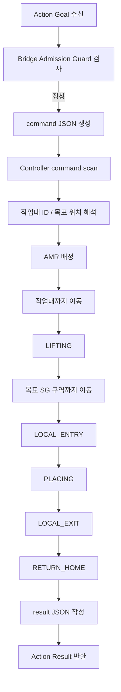
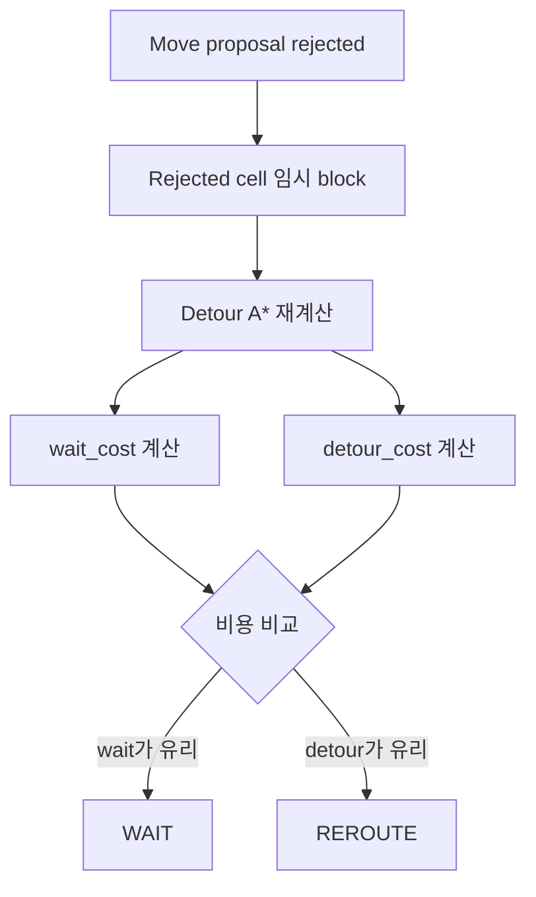

# feature_operation.md

# 협동3 AMR Fleet 주요 기능 및 기능별 실행 흐름

## 1. 주요 기능 목록

| 기능 | 설명 | 담당 파일 |
|---|---|---|
| ROS2 Action Bridge | 외부 명령을 ROS2 Action으로 수신 | `fleet_manager_bridge_node_gpu_v43_guarded_actions.py` |
| Admission Guard | 중복 workstation / target / AMR 명령 차단 | `fleet_manager_bridge_node_gpu_v43_guarded_actions.py` |
| Command Queue | Bridge와 Controller 사이 JSON 파일 교환 | `bridge_queue/` |
| Time A* | 시간축을 고려한 경로계획 | Controller v42 |
| Reservation Table | AMR 미래 위치 예약 | Controller v42 |
| Global Arbiter | 다중 AMR 이동 후보 승인/보류 | Controller v42 |
| Cost-aware Reroute | WAIT/REROUTE 비용 비교 | Controller v42 |
| Local Macro Route | SG 진입부 안정화 경로 | Controller v42 |
| QR 기반 위치 보정 | Downward camera / QR 기반 위치 인식 | Controller v42 |
| Redis 상태 발행 | AMR 상태를 Redis로 publish | Controller v42 |

---

## 2. 정상 작업 수행 흐름



---

## 3. 기능 1: ROS2 Action Bridge

### 목적

외부 PC 또는 Control Tower가 직접 IsaacSim 내부 코드를 호출하지 않고, ROS2 Action으로 명령을 보낼 수 있게 한다.

### Action 이름

```text
/manage_workstation
/amr_01/manage_workstation
/amr_02/manage_workstation
/amr_03/manage_workstation
/amr_04/manage_workstation
/amr_05/manage_workstation
```

### 실행 확인

```bash
ros2 action list | grep manage_workstation
```

---

## 4. 기능 2: Admission Guard

### 목적

경로계획으로 해결할 수 없는 잘못된 명령을 사전에 차단한다.

### 차단 조건

```text
1. 같은 workstation_id가 이미 active
2. 같은 target_location이 이미 active
3. 같은 target_qr_id가 이미 active
4. 같은 target_x, target_y가 이미 active
5. preferred AMR이 이미 active
```

### 실제 문제 예시

```text
CMD_fa1baa6f3e0b:
WS05 → sg2_in_03_B

CMD_3bdcdced7901:
WS06 → sg2_in_03_B
```

두 작업대가 같은 target으로 들어가면 AMR_03이 최종 slot 앞에서 멈추게 된다.

### 개선 후

```text
CMD_fa1baa6f3e0b: ACCEPT
CMD_3bdcdced7901: REJECT / DUPLICATE_TARGET
```

---

## 5. 기능 3: Time A* 경로계획

### 목적

AMR이 목표 cell까지 이동할 수 있는 경로를 계산한다.

### 일반 A*와 차이

일반 A*:

```text
cell_x, cell_y 기준
```

Time A*:

```text
cell_x, cell_y, time_step 기준
```

즉, 같은 cell이라도 시간이 다르면 다른 상태로 본다.

### 장점

```text
- 다른 AMR의 미래 위치를 피할 수 있음
- 동시에 움직이는 AMR의 충돌을 줄임
- reservation table과 결합 가능
```

---

## 6. 기능 4: Reservation Table

### 목적

각 AMR이 앞으로 지나갈 cell을 시간 단위로 예약한다.

예시:

```text
AMR_01:
t+0 = (-4,-6)
t+1 = (-3,-6)
t+2 = (-2,-6)

AMR_02:
t+0 = (-4,-5)
t+1 = (-3,-5)
t+2 = (-2,-5)
```

다른 AMR은 같은 시간에 같은 cell을 예약하지 못한다.

---

## 7. 기능 5: Global Arbiter

### 목적

각 AMR이 계산한 다음 이동 후보를 한 번 더 검토해 최종 승인한다.

### 검사 항목

```text
- 같은 cell로 들어가는지
- 서로 위치를 교환하는 edge swap인지
- 작업대 footprint가 겹치는지
- tail-release가 가능한지
- carrying AMR이 우선인지
- return-home AMR이 양보해야 하는지
```

### 로그 해석

```text
wait 증가 + no_path=0
```

의미:

```text
경로는 존재하지만 현재 tick에서 이동이 보류된 상태
```

즉 planner 실패가 아니라 arbiter의 충돌 회피 판단이다.

---

## 8. 기능 6: Cost-aware Reroute

### 목적

기존에는 막히면 기다리는 비중이 컸다.  
v42에서는 기다릴지 우회할지를 비용으로 비교한다.

### 처리 흐름



### 비용 개념

```text
wait_cost:
기다리는 시간 비용

detour_cost:
우회로 인해 늘어나는 거리 / 회전 / 운반 부담 비용
```

### 주의

중복 목적지 문제는 cost-aware reroute 대상이 아니다.

```text
중복 target 문제:
Bridge Admission Guard에서 차단

일반 병목 문제:
Cost-aware Reroute로 WAIT/REROUTE 판단
```

---

## 9. 기능 7: Local Macro Route

### 목적

SG 입구처럼 좁고 위험한 구역에서 안정적인 진입을 보장한다.

### 기존 문제

```text
- 일반 A*가 대각선 진입을 선택할 수 있음
- 작업대 footprint가 SG 입구에서 걸릴 수 있음
- 특정 static workstation이 route를 막을 수 있음
```

### 개선

```text
LOCAL_ENTRY route를 정해진 cell sequence로 구성
future route에 static blocker가 있는지 검사
가능한 route만 선택
```

### 실제 문제 예시

```text
AMR_02:
cell=(-1,-1)
target=(-1,0)
carry=WS05

하지만 (-1,0)에 WS07 존재
→ LOCAL_ENTRY 진행 불가
→ wait/no_path 증가
```

---

## 10. 기능 8: QR 기반 위치 보정

### 목적

IsaacSim 내부 AMR의 위치와 QR cell 정보를 맞춘다.

### 구성

```text
AMR 하단 카메라
QR 인식
cell 변환
safe gate 검사
위치 보정
```

### 주요 검사

```text
- QR detection 안정성
- cell jump 제한
- world distance 제한
- stale QR 방지
```

---

## 11. 기능 9: Redis 상태 발행

### 목적

Control Tower 또는 외부 모니터링 시스템에서 AMR 상태를 볼 수 있게 한다.

### 발행 정보

```text
AMR state
current_qr_id
target_qr_id
carrying_workstation_id
battery
available
```

### 기본 주기

```text
0.20 sec
약 5Hz
```

---

## 12. 발표용 핵심 문장

### Time A*

```text
기본 경로계획은 Time A* 기반이며, 단순 최단 경로가 아니라 시간별 cell 점유까지 고려해 다중 AMR 충돌을 줄였습니다.
```

### Global Arbiter

```text
각 AMR의 이동 후보는 바로 실행되지 않고 Global Arbiter에서 충돌 가능성을 검사한 뒤 승인됩니다.
```

### Cost-aware Reroute

```text
개선 후에는 막혔을 때 무조건 기다리는 것이 아니라 wait_cost와 detour_cost를 비교해 WAIT 또는 REROUTE를 선택하도록 했습니다.
```

### Bridge Guard

```text
같은 목적지로 두 작업대가 들어가는 문제는 경로계획으로 해결할 수 없으므로, bridge 단계에서 중복 target과 중복 workstation을 차단했습니다.
```
