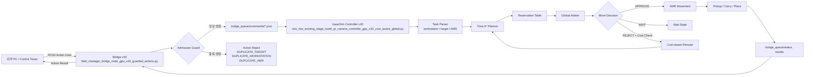
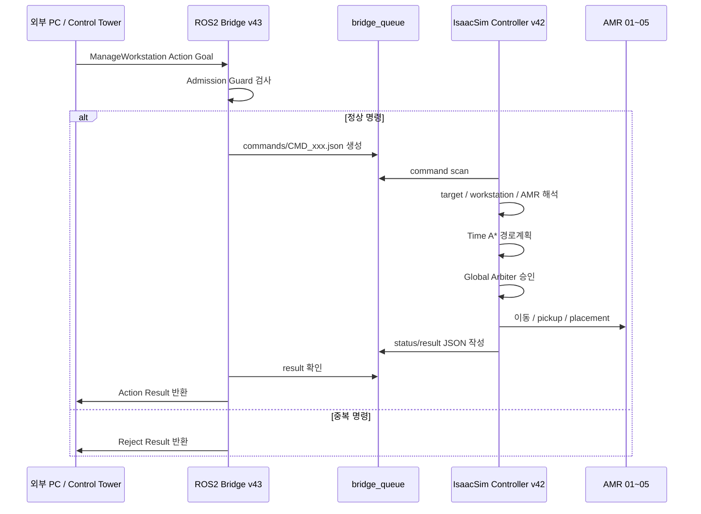
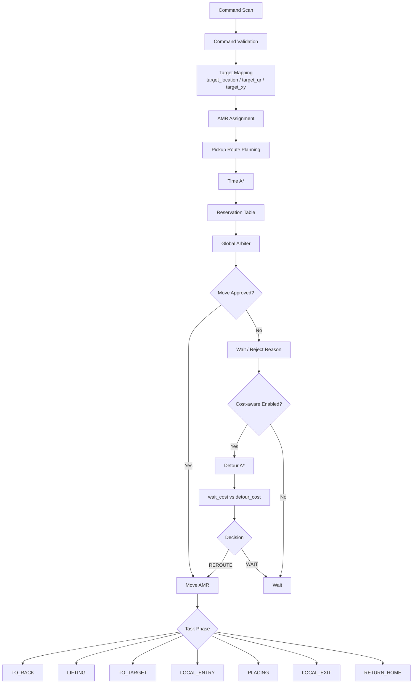

# system_design.md

# 협동3 AMR Fleet 시스템 설계

## 1. 시스템 목적

협동3 프로젝트는 IsaacSim 환경에서 5대의 AMR이 여러 작업대를 운반하고, SG 입구 및 출구 구역으로 작업대를 배치하는 다중 AMR Fleet 제어 시스템이다.

핵심 목표:

```text
1. AMR 5대 동시 운용
2. 작업대 pickup / carry / place / return-home 수행
3. Time A* 기반 경로계획
4. Reservation Table 기반 시간 충돌 방지
5. Global Arbiter 기반 이동 승인
6. Cost-aware Reroute 기반 경로 효율 개선
7. Bridge Admission Guard 기반 중복 명령 사전 차단
8. ROS2 Action 기반 외부 PC / Control Tower 연동
```

---

## 2. 전체 아키텍처



---

## 3. 데이터 흐름



---

## 4. Bridge Queue 구조

```text
bridge_queue/
├── commands/   # Bridge가 생성한 명령 JSON
├── status/     # Controller가 갱신하는 진행 상태
├── results/    # Controller가 작성하는 최종 결과
├── cancel/     # Action cancel 요청
└── done/       # 완료된 command marker
```

---

## 5. 주요 파일 역할

| 파일 | 역할 |
|---|---|
| `fleet_manager_bridge_node_gpu_v43_guarded_actions.py` | ROS2 Action Server, command JSON 생성, admission guard 수행 |
| `amr_live_existing_stage_true8_qr_camera_controller_gpu_v42_cost_aware_global.py` | IsaacSim 내부 AMR 제어, 경로계획, Global Arbiter, Cost-aware Reroute 수행 |
| `run_bridge_gpu.sh` | Bridge 실행 스크립트 |
| `bridge_queue/commands/*.json` | Bridge → Controller 명령 전달 |
| `bridge_queue/status/*.json` | Controller → Bridge 진행 상태 |
| `bridge_queue/results/*.json` | Controller → Bridge 최종 결과 |

---

## 6. Controller 내부 구조



---

## 7. 경로계획 구조

### 7.1 Time A*

일반 A*가 아니라 시간 개념이 포함된 Time A*를 사용한다.

```text
state = (cell_x, cell_y, time_step)
```

고려 항목:

```text
- 현재 cell
- 목표 cell
- 이동 시간 step
- 다른 AMR의 future reservation
- 작업대 운반 여부
- footprint / safety zone
- edge swap 가능성
```

### 7.2 이동 방식

```text
빈 AMR:
8방향 이동 가능

작업대 운반 AMR:
작업대 footprint 때문에 4방향 중심 이동
```

### 7.3 Reservation Table

```text
각 AMR이 미래에 점유할 cell을 시간 단위로 예약
다른 AMR은 해당 시간의 예약 cell을 피해서 경로계획
```

---

## 8. Global Arbiter 설계

Global Arbiter는 각 AMR이 계산한 다음 이동 후보를 즉시 실행하지 않고, 한 번 더 검토한다.

검사 항목:

```text
1. 같은 cell 동시 점유 여부
2. edge swap 여부
3. 작업대 footprint 충돌 여부
4. tail-release 가능 여부
5. carrying AMR 우선순위
6. return-home AMR 양보 여부
7. SG 진입 병목 충돌 여부
```

의미:

```text
A* 경로가 존재해도 현재 tick에서 위험하면 이동을 보류한다.
따라서 wait 증가와 no_path 증가는 구분해서 봐야 한다.
```

---

## 9. Cost-aware Global Reroute 설계

기존 구조는 안전하지만 막히면 wait가 누적되는 문제가 있었다.

개선 후 구조:

```text
1. Global Arbiter가 첫 이동을 reject
2. rejected cell을 temporary blocked cell로 설정
3. Detour A* 재계산
4. wait_cost 계산
5. detour_cost 계산
6. 더 유리한 선택을 수행
```

결정:

```text
wait_cost <= detour_cost:
WAIT

detour_cost < wait_cost:
REROUTE
```

주의:

```text
중복 목적지처럼 물리적으로 불가능한 명령은 cost-aware reroute로 해결할 수 없다.
이 경우 Bridge Admission Guard에서 먼저 reject해야 한다.
```

---

## 10. Local Macro Route 설계

SG 진입부는 좁은 병목 구역이다.

일반 A*만 사용하면 다음 문제가 생길 수 있다.

```text
- 대각선 진입
- 작업대 footprint 간섭
- 좁은 corridor에서 route 꼬임
- static rack / workstation blocker 미검출
```

따라서 SG 진입부는 deterministic local macro route를 사용한다.

```text
LOCAL_ENTRY
→ 정해진 cell sequence 확인
→ future route static blocker 검사
→ cell-by-cell 진입
→ PLACING
```

---

## 11. Bridge Admission Guard 설계

Bridge v43는 controller에 명령을 보내기 전 다음 중복을 검사한다.

```text
1. DUPLICATE_WORKSTATION
   같은 workstation_id가 이미 active 상태

2. DUPLICATE_TARGET
   같은 target_location / target_qr_id / target_x,y가 이미 active 상태

3. DUPLICATE_AMR
   preferred AMR이 이미 active 상태
```

예시:

```text
CMD_1: WS05 → sg2_in_03_B
CMD_2: WS06 → sg2_in_03_B

결과:
CMD_1 ACCEPT
CMD_2 REJECT: DUPLICATE_TARGET
```

---

## 12. 시스템 설계 요약

```text
Bridge v43:
잘못된 명령을 사전에 차단하는 명령 안정성 계층

Controller v42:
정상 명령을 받은 뒤 다중 AMR 경로계획과 주행 효율을 판단하는 제어 계층

Global Arbiter:
모든 AMR의 이동 후보를 한 tick 단위로 승인/보류하는 충돌 회피 계층

Cost-aware Reroute:
대기와 우회 중 더 효율적인 선택을 하는 경로 효율 계층
```
